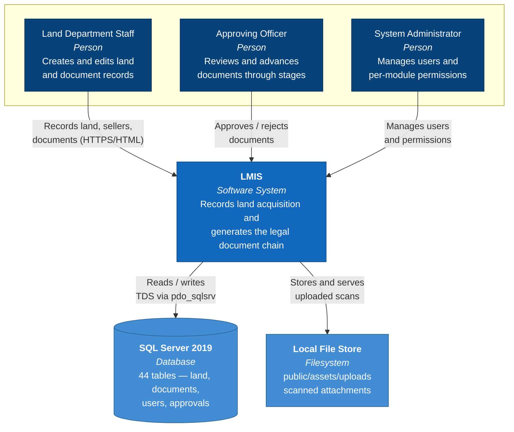
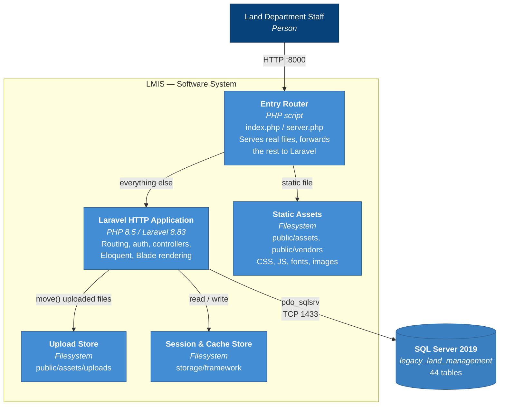

# 01 — System Overview

**System:** Land Management Information System (LMIS)
**Repository:** `C:\Users\Adnan Ahmed\Pictures\LMIS`
**Document date:** 2026-08-12
**Status of this document:** Reflects the system as verified running locally on 2026-08-12.

---

## 1. What This System Is

LMIS is a **Laravel monolith** that records and manages the land-acquisition
document lifecycle for the client organisation. It is a document-centric back-office application:
land providers and sellers are registered, land parcels are recorded, and a
chain of legal documents (purchase, possession, conveyance, agreements,
affidavits, undertakings, indemnity bonds, registry documents, exemption
forms) is produced and routed through an approval workflow.

It is an **internal, authenticated-only** system. There is no public-facing
surface: every functional route sits behind the `auth` middleware.

---

## 2. Technology Stack (as verified)

| Layer | Technology | Version | Note |
|---|---|---|---|
| Language | PHP | 8.5.9 ZTS x64 | Installed at `C:\PHP` |
| Framework | Laravel | 8.83.27 | `composer.json` declares `^8.75` |
| Auth scaffold | Laravel Breeze | ^1.10 | Session guard, bcrypt hashes |
| Database | Microsoft SQL Server | 2019 Standard, 15.0.2000.5 | Instance `MSSQLSERVER`, TCP 1433 |
| DB driver | Microsoft Drivers for PHP | 5.13.2 | `sqlsrv` + `pdo_sqlsrv` |
| ODBC | ODBC Driver 17 & 18 for SQL Server | — | Both present |
| Views | Blade | — | 109 `.blade.php` files |
| Front-end assets | Static (Falcon-style theme) | — | Served from `public/` |
| Web server (local) | PHP built-in server via `artisan serve` | — | Router: `server.php` |

**Declared PHP constraint vs reality:** `composer.json` declares
`"php": "^7.3|^8.0"`. The code runs on 8.5.9, but Laravel 8 predates PHP 8.5
and emits deprecation notices. See [05-DECISIONS.md](05-DECISIONS.md) ADR-002.

---

## 3. Codebase Scale

| Artifact | Count |
|---|---|
| Eloquent models | 42 |
| Controllers (application) | 26 |
| Controllers (Breeze auth) | 8 |
| `Route::` declarations in `web.php` | 58 |
| Resource controllers | 23 |
| Blade views | 109 |
| Database tables | 44 |
| Migration files | 51 |
| Migration rows recorded | 57 |

---

## 4. C4 Level 1 — System Context



**Boundary note:** there are no outbound integrations. Mail is configured
(`MAIL_MAILER=smtp` pointing at `mailhog`) but no mail is dispatched by any
verified route. Queue is `sync`, cache and session are `file`.

---

## 5. C4 Level 2 — Container



### Why the Entry Router exists

The application is deployed with the **project root as document root** (the
original XAMPP arrangement), not `public/`. Blade templates address assets as
`asset('public/assets/...')`, which produces URLs containing `/public/`.
`php artisan serve` chdirs into `public/`, so those URLs cannot resolve without
a router that reaches back to the project root. `server.php` performs that
role and simultaneously denies access to source and configuration.

See [05-DECISIONS.md](05-DECISIONS.md) ADR-004.

---

## 6. Request Lifecycle

```
Browser
  └─> :8000  ─────────────────> server.php  (router)
                                   │
                    ┌──────────────┼───────────────┐
                    │              │               │
              blocked path    real file       everything else
              (.env, /app,   (/public/...)          │
               /config…)          │                 v
                    │             v          public/index.php
                 404 ──────  streamed with          │
                             MIME type              v
                                              Laravel Kernel
                                                    │
                              middleware: TrustProxies → HandleCors →
                              PreventRequestsDuringMaintenance → ValidatePostSize →
                              TrimStrings → ConvertEmptyStringsToNull →
                              EncryptCookies → StartSession →
                              ShareErrorsFromSession → VerifyCsrfToken → auth
                                                    │
                                                    v
                                            Controller → Eloquent
                                                    │
                                                    v
                                          SQL Server (pdo_sqlsrv)
                                                    │
                                                    v
                                             Blade → HTML
```

---

## 7. Glossary

| Term | Meaning in this system |
|---|---|
| **LO** | Land Owner — appears as `*_lo_rows` child tables |
| **LP** | Land Provider — the party supplying land (`land_providers`) |
| **Fard** | Land record extract; `conveyance_land_fard_rows` |
| **Conveyance Deed** | The instrument transferring land title (`conveyances`) |
| **Intimation Letter** | Notice issued to a party (`intimation_letters`) |
| **Exemption Form / Inventory** | Exemption claim and its itemised inventory |
| **Challan** | Payment voucher (`challan_fees`, `challan_form_headers`) |
| **Mutation** | Change of title record in revenue rolls; stored as an attachment |
| **Approval Tree / Stage** | Configurable multi-step document approval chain |
| **`isDeleted`** | Soft-delete flag used across nearly every table (`0` = live) |
| **`createdBy`** | User id that created the row; `0` where unattributed |
| **Header / Row tables** | Parent-child pattern: `X` holds the document, `X_rows` its line items |

---

## 8. Cross-Cutting Conventions Observed

- **Soft deletes are manual.** Tables carry an `isDeleted` column and queries
  filter `where('isDeleted', 0)`. Laravel's `SoftDeletes` trait is not used.
- **Permissions are columns, not rows.** The `users` table carries one
  `tinyint` column per module action (`*_list`, `*_add`, `*_edit`,
  `*_delete`, `*_print`) — roughly 100 permission columns — plus `is_admin`.
  Controllers check `auth()->user()->x_edit == 1 || auth()->user()->is_admin == 1`.
  A `permissions` table exists but the verified controllers read the user columns.
- **No raw SQL in application code.** Confirmed by search: `app/` contains zero
  occurrences of `DB::raw`, `whereRaw`, `selectRaw`, `DB::select` or
  `DB::statement`. This is why the database migration was portable.
- **Uploads are public.** All attachments are moved to
  `public_path('assets/uploads')` and served as static files.

---

## 9. Related Documents

| Document | Purpose |
|---|---|
| [02-ASSESSMENT.md](02-ASSESSMENT.md) | State the system was found in, and risks |
| [03-MIGRATION-RECORD.md](03-MIGRATION-RECORD.md) | Everything changed, step by step |
| [04-MODULE-ARCHITECTURE.md](04-MODULE-ARCHITECTURE.md) | C4 Level 3 and module map |
| [05-DECISIONS.md](05-DECISIONS.md) | Architecture Decision Records |
| [06-WORK-INVENTORY.md](06-WORK-INVENTORY.md) | Requirements and remaining work |
| [WORK-LOG.md](WORK-LOG.md) | Chronological session log |
