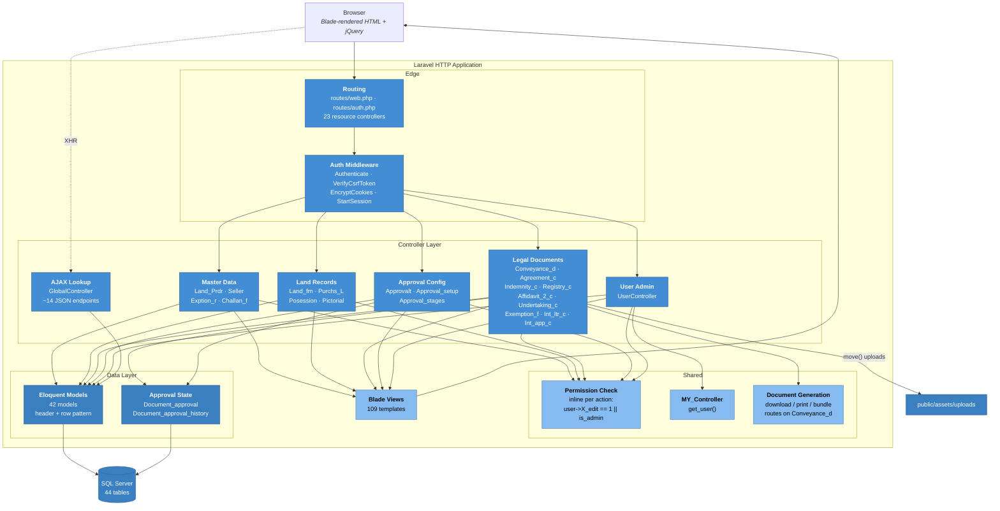

# 04 — Module Architecture (C4 Level 3)

**Scope:** Internal structure of the Laravel HTTP Application container from
[01-SYSTEM-OVERVIEW.md](01-SYSTEM-OVERVIEW.md) §5.

---

## 1. C4 Level 3 — Components



---

## 2. Module Map

| Module | Route prefix | Controller | Primary table(s) |
|---|---|---|---|
| Land Providers | `land_provider` | `Land_Prdr` | `land_providers` |
| Seller Profiles | `seller_profile` | `Seller` | `seller_profiles`, `sellere_profile_land_rows` |
| Exemption Rates | `exemption_rate` | `Exption_r` | `exemption_rates` |
| Challan Fees | `challan_fee` | `Challan_f` | `challan_fees` |
| Challan Form | `challan_form` | `Challan_form` | `challan_form_headers`, `challan_form_footers` |
| Land Form | `land_form` | `Land_fm` | `land_forms`, `land_form_rows`, `land_detail_rows` |
| Purchase of Land | `purchase_of_land` | `Purchs_L` | `purchase_of_lands`, `purchase_of_land_rows`, `purchase_of_land_lo_rows`, `purchase_of_land_attachments` |
| Possession Certificate | `possession_certificate` | `Posession` | `possession_certificates`, `posession_of_land_rows`, `posession_of_land_lo_rows`, `possession_attachments` |
| Pictorial View | `pictorial_view` | `Pictorial` | `pictorial_views` |
| Conveyance Deed | `conveyance` | `Conveyance_d` | `conveyances`, `conveyance_rows`, `conveyance_land_fard_rows` |
| Sale Agreement | `agreement` | `Agreement_c` | `agreements` |
| Indemnity Bond | `indemnity_bond` | `Indemnity_c` | `indemnity_bonds` |
| Registry Document | `registry_document` | `Registry_c` | `registry_documents` |
| Affidavit 2 | `affidavit_2` | `Affidavit_2_c` | `affidavit_2s` |
| Undertaking | `undertaking` | `Undertaking_c` | `undertakings` |
| Exemption Form | `exemption_form` | `Exemption_f` | `exemption_forms`, `exemption_form_rows` |
| Exemption Inventory | `exemption_inventory` | `Exemption_inventory_c` | `exemption_inventory_approvals`, `exemption_inventory_rows` |
| Intimation Letter | `intimation_letter` | `Int_ltr_c` | `intimation_letters`, `intimation_letter_rows` |
| Intimation Application | `intimation_application` | `Int_app_c` | `int_applications` |
| Approval Tree | `approval_tree` | `Approvalt` | `approval_trees` |
| Approval Setup | `approval_setup` | `Approval_setup` | `approval_setup_headers`, `approval_setup_lines` |
| Approval Stages | `approval_stage` | `Approval_stages` | `approval_stages` |
| Users | `users` | `UserController` | `users` |

**Cross-cutting:** `document_approvals` and `document_approval_histories` are
written by the document modules, keyed by `document_name` + `document_id` — a
polymorphic association expressed as plain columns rather than Laravel's
`morphTo`.

---

## 3. Dominant Design Pattern — Header/Row

Nearly every document module follows the same shape:

```
X                 header — one row per document (doc_no, date, status, isDeleted)
X_rows            line items — many per header
X_lo_rows         land-owner detail lines (where applicable)
X_attachments     uploaded scans (where applicable)
document_approvals            approval state, keyed by (document_name, document_id)
document_approval_histories   audit trail of stage transitions
```

Controllers load the header, then attach children explicitly rather than
through Eloquent relationships. Observed in `Exemption_inventory_c::edit`:

```php
$record = $exemption_inventory;
$record->rows = Exemption_inventory_row::where('exemption_inventory_id', $record->id)->get();
$record->approvals = Document_approval::where('document_name', 'Exemption Inventory')
    ->where('document_id', $record->id)->get();
```

**Architectural consequence:** relationships live in controller code, not in the
models. This is the single largest structural debt in the codebase — it
prevents eager loading, makes N+1 queries the default, and means the same join
logic is restated in every controller that needs it. See
[06-WORK-INVENTORY.md](06-WORK-INVENTORY.md) Phase 4.

---

## 4. Primary Data Flows

### 4.1 Document creation

```
1. Browser        → GET /{module}/create      : controller checks user->{module}_add
2. Controller     → Blade                     : renders form + dropdown seed data
3. Browser        → XHR GlobalController      : cascading lookups (seller, land, rates)
                                                returns JSON
4. Browser        → POST /{module}            : form fields + file uploads
5. Controller     → validation                : Laravel request validation
6. Controller     → public/assets/uploads     : $file->move(public_path('assets/uploads'), $name)
7. Controller     → Eloquent                  : insert header, then loop-insert rows
8. Controller     → document_approvals        : seed approval state from approval_setup
9. Controller     → redirect                  : back to module index
```

**Note on step 6/7 ordering:** files are moved to their final location *before*
the database write, and the writes are not wrapped in a transaction. A failure
partway through leaves orphaned files and possibly a header without its rows.
Recorded as a finding in [06-WORK-INVENTORY.md](06-WORK-INVENTORY.md) task 4.3.

### 4.2 Authentication

```
1. GET /login                → Breeze AuthenticatedSessionController::create
2. POST /login               → credential check against users.password (bcrypt)
3. Session guard             → session id in encrypted cookie, file-backed session
4. Redirect                  → /dashboard → /land_provider
5. Every later request       → auth middleware → per-action permission column check
```

Verified end-to-end on 2026-08-12.

### 4.3 Permission evaluation

There is no policy or gate layer. Each controller action begins with an inline
check:

```php
if (auth()->user()->exemption_inventory_edit == 1 || auth()->user()->is_admin == 1) {
```

The `users` table therefore carries roughly 100 `tinyint` permission columns —
five actions (`list`, `add`, `edit`, `delete`, `print`) across ~20 modules.

**Consequence:** adding a module means an `ALTER TABLE users` plus edits to
every affected view and controller. A `permissions` table exists in the schema
but the verified controllers do not read from it.

---

## 5. Component Inventory

| ID | Component | Type | Responsibility | Depends on |
|---|---|---|---|---|
| COMP-1 | Entry Router | PHP script | Static files, path denial, forward to Laravel | — |
| COMP-2 | Routing | Framework | Map URLs to controllers | COMP-1 |
| COMP-3 | Auth Middleware | Framework | Session, CSRF, cookie encryption, auth gate | COMP-2 |
| COMP-4 | Module Controllers | Application | CRUD + permission checks per module | COMP-3, COMP-7 |
| COMP-5 | GlobalController | Application | JSON lookups for cascading form fields | COMP-7 |
| COMP-6 | Document Generation | Application | Download/print/bundle document outputs | COMP-7 |
| COMP-7 | Eloquent Models | Data | Table mapping; 42 models | COMP-9 |
| COMP-8 | Blade Views | Presentation | 109 templates | COMP-4 |
| COMP-9 | SQL Server | Database | Persistence, 44 tables | — |
| COMP-10 | Upload Store | Filesystem | Scanned attachments under `public/` | — |

---

## 6. Architectural Observations

Recorded as observations, not instructions — remediation is scoped in
[06-WORK-INVENTORY.md](06-WORK-INVENTORY.md).

| # | Observation | Impact |
|---|---|---|
| A1 | Relationships live in controllers, not models | N+1 queries; duplicated join logic; no eager loading |
| A2 | Permissions are ~100 columns on `users` | Schema change required to add a module |
| A3 | Multi-table writes are untransacted | Partial writes possible on failure |
| A4 | Uploads served without authorisation | Any URL holder can read land documents |
| A5 | Soft delete is a manual `isDeleted` filter | A forgotten `where` silently exposes deleted rows |
| A6 | Polymorphic approvals via plain columns | No referential integrity on `document_id` |
| A7 | Only 4 foreign keys across 44 tables | Referential integrity is enforced by convention, not the database |

**A7 in context:** the dump defined foreign keys on only `conveyance_rows` and
three other relationships. The header/row structure is otherwise unconstrained
at the database level, so orphaned child rows are possible.
