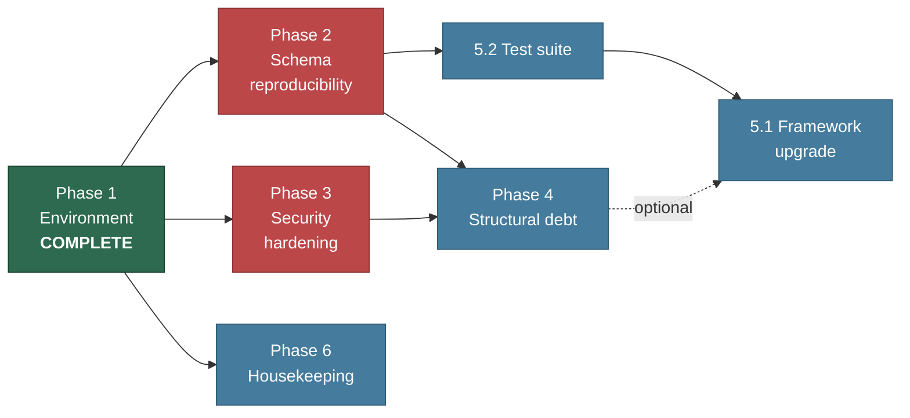

# 06 — Requirements & Work Inventory

Two parts: the requirements this environment work was measured against
(§1, all met), and the inventory of work that remains (§2 onward).

---

## 1. Requirements — Local Operation

These are the requirements the 2026-08-12 work was verified against. All are
**met**; the evidence column cites the check that proves it.

### REQ-1 — Runnable PHP environment

**User story:** As a developer, I want a correctly configured PHP runtime, so
that the framework and its dependencies load.

| # | Acceptance criterion | Status | Evidence |
|---|---|---|---|
| 1.1 | THE runtime SHALL load a `php.ini` | Met | `php --ini` → `C:\PHP\php.ini` |
| 1.2 | THE runtime SHALL provide Mbstring, Fileinfo, OpenSSL, cURL, GD, Zip, Intl | Met | Present in `php -m` |
| 1.3 | THE runtime SHALL NOT emit deprecation notices into HTTP responses | Met | `display_errors = Off`; 106 page loads clean |
| 1.4 | THE runtime SHALL allow uploads of at least 32 MB | Met | `upload_max_filesize = 64M`, `post_max_size = 64M` |

### REQ-2 — SQL Server connectivity

**User story:** As a developer, I want Laravel to talk to SQL Server, so that
the application persists data.

| # | Acceptance criterion | Status | Evidence |
|---|---|---|---|
| 2.1 | THE runtime SHALL expose a `sqlsrv` PDO driver matching PHP 8.5 ZTS x64 | Met | `PDO::getAvailableDrivers()` includes `sqlsrv` |
| 2.2 | THE application SHALL connect using a dedicated login | Met | `SUSER_NAME()` = `lmis_app` |
| 2.3 | THE connection SHALL succeed against a self-signed certificate | Met | `trust_server_certificate` wired to env |
| 2.4 | IF credentials are wrong, THEN connection SHALL fail without exposing the password | Met | Password not echoed in error paths |

### REQ-3 — Data migrated with fidelity

**User story:** As a land officer, I want all existing records available, so
that no work is lost in the platform change.

| # | Acceptance criterion | Status | Evidence |
|---|---|---|---|
| 3.1 | THE migration SHALL transfer all 44 tables | Met | 44 tables present |
| 3.2 | THE migration SHALL transfer all 345 rows | Met | Converter 345 = database 345 |
| 3.3 | THE migration SHALL preserve identity values so existing ids remain valid | Met | `IDENTITY_INSERT` + `DBCC CHECKIDENT` reseed |
| 3.4 | THE migration SHALL preserve MySQL NULL semantics in unique indexes | Met | Filtered indexes; ADR-005 |
| 3.5 | THE migration SHALL NOT alter stored password hashes | Met | Pre-existing bcrypt hashes still authenticate |
| 3.6 | THE migration SHALL leave the original dump unmodified | Met | Source file untouched |

### REQ-4 — Application serves correctly

**User story:** As a land officer, I want to open the system in my browser, so
that I can do my work.

| # | Acceptance criterion | Status | Evidence |
|---|---|---|---|
| 4.1 | THE server SHALL return 200 for the login page | Met | `/login` → 200 |
| 4.2 | THE server SHALL serve every referenced static asset | Met | 28/28 → 200 |
| 4.3 | THE server SHALL return 200 for every authenticated module page | Met | 48/48 |
| 4.4 | THE server SHALL return 200 for record edit/show pages | Met | 58/58 |
| 4.5 | THE server SHALL NOT serve `.env`, `/config`, `/app`, `/vendor`, `/storage` | Met | `/.env`, `/config/database.php` → 404 |
| 4.6 | WHEN valid credentials are posted, THE system SHALL establish a session | Met | 302 → `/dashboard` → `/land_provider` |

### REQ-5 — Verification leaves no residue

**User story:** As the system owner, I want testing not to pollute my data.

| # | Acceptance criterion | Status | Evidence |
|---|---|---|---|
| 5.1 | Test accounts SHALL be removed after use | Met | `try/finally`; 0 rows matching `%smoketest%` |
| 5.2 | Existing accounts SHALL NOT be modified during testing | Met | User count 12 before and after |
| 5.3 | Deliberate data changes SHALL be recorded | Met | Admin reset documented, 03 §8 |

---

## 2. Project Boundaries

| Category | Contents |
|---|---|
| **Delivered** | PHP configuration; SQL Server drivers; database + login; dump conversion and import; Laravel reconfiguration; dev-server router; verification; documentation |
| **Explicitly out of scope** | Framework upgrade; refactoring controllers or models; changing the permission model; UI work; production deployment; securing the upload store |
| **Constraints** | Laravel 8.83 on PHP 8.5; SQL Server 2019 Standard; Windows 11; no application-code changes beyond one config line and one new router |
| **Assumptions** | `MSSQLSERVER` service runs; `C:\PHP` stays on `PATH`; the dump is the authoritative dataset |

---

## 3. Implementation Plan

Phase 1 is complete. Phases 2–5 are proposed, ordered by risk reduction. Effort
figures are rough estimates for planning only.

### Phase 1 — Local environment (COMPLETE)

- [x] **1.1 Configure PHP**
  - Create `php.ini`; enable 13 extensions; set limits and timezone
  - _Requirements: REQ-1.1, 1.2, 1.3, 1.4_

- [x] **1.2 Install SQL Server drivers**
  - Fetch drivers 5.13.2; install 8.5 TS x64 DLLs; register in `php.ini`
  - _Requirements: REQ-2.1_ · _Depends on 1.1_

- [x] **1.3 Provision the database**
  - Create `legacy_land_management`; create `lmis_app`; grant `db_owner`
  - _Requirements: REQ-2.2_

- [x] **1.4 Build the MySQL→T-SQL converter**
  - Statement splitter; two-pass table model; type map; literal re-encoding
  - _Requirements: REQ-3.1, 3.3, 3.4, 3.6_

- [x] **1.5 Import schema and data**
  - 84 batches, 0 failures, 44 tables, 345 rows
  - _Requirements: REQ-3.1, 3.2, 3.5_ · _Depends on 1.3, 1.4_

- [x] **1.6 Repoint Laravel**
  - `.env` to `sqlsrv`; wire `trust_server_certificate`
  - _Requirements: REQ-2.3_ · _Depends on 1.2, 1.5_

- [x] **1.7 Fix asset and routing layer**
  - Author `server.php`: blocklist, dual-layout file serving, forward
  - _Requirements: REQ-4.1, 4.2, 4.5_

- [x] **1.8 Verify end to end**
  - 48 module routes, 58 record routes, 28 assets, blocked paths, login
  - _Requirements: REQ-4.3, 4.4, 4.6, REQ-5_ · _Depends on 1.6, 1.7_

- [x] **1.9 Document**
  - `docs/01`–`06`, `WORK-LOG.md`
  - _Requirements: REQ-5.3_

---

### Phase 2 — Restore schema reproducibility (HIGH PRIORITY)

Addresses risk **R1**. Until this is done the schema exists only as a generated
script, and `migrate:fresh` fails.

- [ ] **2.1 Port the three MySQL-only migrations to dialect-neutral code**
  - `2026_02_10_000000_modify_lp_name_column`
  - `2026_03_15_230046_fix_conveyance_rows_foreign_key`
  - `2026_03_17_071000_fix_conveyance_rows_deed_id_data_type`
  - Replace `DB::statement` with Schema builder calls; use
    `Schema::disableForeignKeyConstraints()` instead of `SET FOREIGN_KEY_CHECKS`;
    `$table->json()` instead of raw `JSON`; drop `AFTER` positioning
  - _Estimate: 3–4 h_ · _Verify: `migrate:fresh` on a scratch database produces
    44 tables_

- [ ] **2.2 Reconcile migrations against the imported schema**
  - 51 files vs 57 recorded rows — identify the 6 unmatched entries
  - Confirm a `migrate:fresh` schema matches the imported one column-for-column
  - _Estimate: 2–3 h_ · _Depends on 2.1_

- [ ] **2.3 Add a seeder for reference data**
  - Approval stages/trees, exemption rates, challan fees, one admin user
  - Lets a fresh developer reach a working login without the production dump
  - _Estimate: 2 h_ · _Depends on 2.2_

- [ ] **2.4 Document the rebuild path**
  - Update [03-MIGRATION-RECORD.md](03-MIGRATION-RECORD.md) §12 once
    `migrate:fresh` is trustworthy
  - _Estimate: 30 m_ · _Depends on 2.3_

---

### Phase 3 — Security hardening

Addresses **R3, R4, R6**. Required before any exposure beyond localhost.

- [ ] **3.1 Protect the upload store** *(R6)*
  - Uploads in `public/assets/uploads` are served to anyone with the URL.
    Move to `storage/app/private` behind an authenticated controller, or place
    an authorisation check in front of the path
  - _Estimate: 1–2 d — touches every upload and display site_

- [ ] **3.2 Environment separation** *(R3)*
  - `APP_DEBUG=false` outside local; confirm no stack traces reach users
  - _Estimate: 1 h_

- [ ] **3.3 Reduce database privileges** *(R4)*
  - Replace `db_owner` with `db_datareader` + `db_datawriter` and explicit
    grants; rotate the password; set `CHECK_POLICY = ON`
  - _Estimate: 2 h_

- [ ] **3.4 Rotate the administrator credential**
  - `Admin@12345` was set to restore access and is recorded in these docs —
    it must not survive into shared use
  - _Estimate: 5 m_

- [ ] **3.5 Review the permission model for gaps**
  - Verify every controller action checks a permission; the inline
    `== 1 || is_admin` pattern makes omissions easy and invisible
  - _Estimate: 1 d_

---

### Phase 4 — Structural debt

Addresses observations **A1–A7** in
[04-MODULE-ARCHITECTURE.md](04-MODULE-ARCHITECTURE.md). Optional; sequence
after Phases 2–3.

- [ ] **4.1 Declare Eloquent relationships on models** *(A1)*
  - Replace controller-side `where('x_id', $id)->get()` with `hasMany`/`belongsTo`
  - Enables eager loading and removes duplicated join logic
  - _Estimate: 3–5 d across 42 models_

- [ ] **4.2 Introduce a policy layer** *(A2)*
  - Move the ~100 permission columns behind Laravel policies or gates
  - Prerequisite for adding modules without `ALTER TABLE users`
  - _Estimate: 1–2 w_

- [ ] **4.3 Wrap multi-table writes in transactions** *(A3)*
  - Header + rows + attachments + approval seed must commit atomically
  - Move file writes after the successful commit
  - _Estimate: 2–3 d_

- [ ] **4.4 Add foreign keys** *(A6, A7)*
  - Only 4 exist across 44 tables; header/row links are unconstrained
  - Requires an orphan audit first — existing data may already violate them
  - _Estimate: 2–3 d including cleanup_

- [ ] **4.5 Adopt Laravel soft deletes** *(A5)*
  - Replace manual `isDeleted` filtering with the `SoftDeletes` trait so a
    forgotten `where` cannot expose deleted rows
  - _Estimate: 2–3 d_

---

### Phase 5 — Platform currency

Addresses **R2**. Largest effort; plan independently.

- [ ] **5.1 Upgrade Laravel 8 → 9 → 10 → 11**
  - Step through majors; Laravel 8 lost security support in January 2023
  - _Estimate: 2–4 w_ · _Depends on Phase 2 (working migrations) and a test suite_

- [ ] **5.2 Build a regression test suite**
  - `tests/` is the untouched Laravel skeleton. The 106-request smoke crawl used
    during migration is a usable starting specification
  - _Estimate: 1–2 w_ · **Should precede 5.1**

- [ ] **5.3 Clear the deprecation backlog**
  - Once on a current Laravel, re-enable `E_DEPRECATED` and fix what surfaces
  - _Estimate: 3–5 d_ · _Depends on 5.1_

---

### Phase 6 — Housekeeping

- [ ] **6.1 Remove editor litter from version control** *(R8)*
  - `~$*.docx`, `~WRL*.tmp` in the project root; add to `.gitignore`
  - _Estimate: 15 m_

- [ ] **6.2 Truncate and rotate the log**
  - `storage/logs/laravel.log` arrived at 27 MB with entries from the previous
    XAMPP deployment; switch `LOG_CHANNEL` to `daily`
  - _Estimate: 15 m_

- [ ] **6.3 Resolve the duplicate user record** *(R9)*
  - `users` 10 and 11 share the same login e-mail address; decide which is canonical and
    whether `email` should carry a unique index
  - _Estimate: 30 m_

---

## 4. Dependency Graph

---

## 5. Recommended Order

| Priority | Item | Why |
|---|---|---|
| 1 | **2.1** Port the three migrations | The schema is currently reproducible only from a generated script |
| 2 | **3.4** Rotate the admin password | A known credential is written down in these docs |
| 3 | **3.2** `APP_DEBUG=false` for non-local | One line; prevents environment disclosure |
| 4 | **5.2** Test suite | Everything after this is safer with it, and riskier without |
| 5 | **3.1** Protect uploads | Largest genuine security exposure, but a real refactor |
| 6 | Phase 4 | Structural quality; no external deadline |
