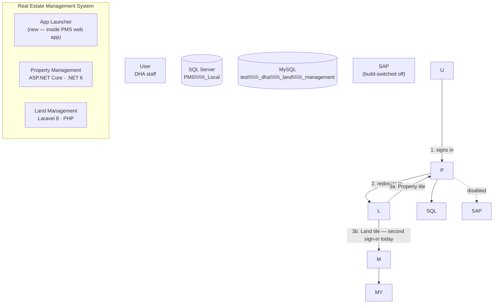
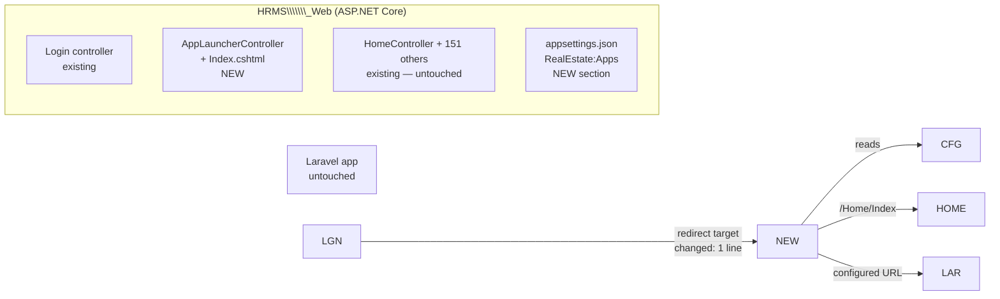

# PMS — Work Log

Complete record of what was added, changed, discovered and decided, session by session.
Newest first.

`PROJECT.md` says where the work stands *now*. This file says how it got there, and is the place
to look when you need to know why a file changed or how to undo it.

**There is no version control on this repository** — git is not installed (`#13`). Until it is,
this file is the only change history that exists. Every entry names the file and how to reverse it.

\---

## Session 3 — 2026-08-05

**One piece of work, no code.** You asked for an Odoo-style app chooser after login, joining the
Land Management application to PMS under the name **Real Estate Management System**, and nothing
else changed. Planning only — the gate holds.

**Net result:** the task turned out to be a different shape than it looked. Both codebases were
measured, the integration options were weighed, and a minimal reversible design is written and
waiting on your review.

### 3.1 The finding

`C:\\Users\\Adnan Ahmed\\Pictures\\test\_Land\_mgt` is **not another .NET solution.** It is a **Laravel 8
/ PHP application on MySQL**, measured from source:

||Property Management|Land Management|
|-|-|-|
|Stack|ASP.NET Core MVC, .NET 6|Laravel 8, PHP 7.3/8.0|
|Database|SQL Server `PMS\_Local`|MySQL `test\_dha\_land\_management`|
|Identity|`PMSUser`, HMACSHA512, session + 3 JWT schemes|`users`, Laravel Breeze session|
|Permissions|`PermissionForms` + `UserPermissionMapping`; key **is** the menu label|**\~90 boolean columns on `users`**, one per form×action|
|Approval|Approval module, 5 screens|`approval\_tree` / `approval\_stage` / `approval\_setup` — **a second, independent engine**|
|Layout|`\_Layout.cshtml` **249 KB**|`main.blade.php` **277 KB**|
|Scale|152 controllers · 209 forms · 439 tables · 316 migrations|34 controllers · 42 models · 109 views · 51 migrations · 23 route resources|

Two things worth carrying forward beyond this task. **Both products have the same disease** — a
quarter-megabyte hard-coded layout carrying the entire menu. And **both built their own approval
engine.** If the two ever genuinely merge, that duplication is the real cost, not the menu.

So "combine" cannot mean one codebase here. A port is 34 controllers, 42 models and 109 views — a
second re-engineering programme. What was planned instead is a shell that makes them one product
*to the user*.

### 3.2 Added

|File|Size|What it is|
|-|-|-|
|`docs/modules/rems-app-launcher.md`|16 KB|The deliverable. Both systems measured side by side, C4 context and container diagrams, 7 requirements with acceptance criteria, 4 options weighed, **ADR-001/002/003**, component and configuration design, file-by-file change list with reversals, scope boundaries, 5 risks, 8 tasks, a manual verification script, and **5 open questions**|

### 3.3 Changed

|File|Change|Reversal|
|-|-|-|
|`PROJECT.md`|New `§4` active item (`#138`–`#147`); old `§4` demoted to `§4c` parked; `#119` `doing`→`blocked`; **D15–D19 locked**; issues I7, I8; I1 now gates `#147` too; dependency rows; documents row; log entries|Restore `#119` to `doing`, delete the added rows|
|`AGENTS.md`|New section **Related system, outside this tree** — names the Land repository, its stack, and states it is not owned by this doc and must not be edited from here|Delete the section|
|`docs/WORK-LOG.md`|This entry|Delete it|

**No solution code was changed this session.** The four files listed in `PROJECT.md` §4b remain the
only code changes in the repository.

### 3.4 Discovered

* **PHP, Composer and MySQL are not installed on this machine**, and there is no XAMPP, WAMP or
Laragon. The Land application **cannot run here at all**. Raised as issue **I7**. The launcher is
designed so this does not block it: an app with no configured URL renders as a disabled tile with
the reason shown, rather than a dead link.
* **`test\_Land\_mgt\\.env` is committed** to that repository, carrying `APP\_KEY` and database
settings. The same leak class as **I2**, in the other repository. Raised as **I8**; out of scope
for this task, recorded so it is not lost.
* **Git is still not installed** (`#13`, I1) — confirmed again this session, in both folders.
* The post-login redirect is a **single line of JavaScript**: `Views/Login/Index.cshtml:690`,
`url = "/Home/Index"`. That one line is the entire insertion point for the launcher.

### 3.5 Decided — D15–D19, locked the same day

You answered all five questions in session, so the gate opened and closed within the session.

|#|Decision|Why|
|-|-|-|
|D15|Launcher as an additive shim inside `HRMS\_Web`; the app list held as **configuration**, Land reached by URL|The stacks share nothing. A front door is buildable now; a merge is not. **Q1 confirmed one front door, not one codebase.** Config-as-data also honours locked **D13** and feeds `#125` rather than being thrown away by it|
|D16|**PMS is the identity authority.** Land account linking deferred; **no credential is ever copied, synchronised or forwarded**|`PMSUser` and Laravel `users` are unrelated tables in different engines with different hashes. **Q2 accepted the second sign-in for now.** SSO is a real design task, not a lookup — a weak handoff would be an auth bypass, so it gets its own gate|
|D17|Rebrand on the **launcher page only**; both 250 KB layouts otherwise untouched|`#125` replaces the PMS layout anyway; renaming it twice is waste|
|D18|One **"Switch app" anchor** may be added to `\_Layout.cshtml`; the 249 KB menu block stays untouched|**Q3.** Without it the launcher is a screen you pass once per login, not a place you return to. Takes the task from one changed line to two|
|D19|The two repositories **merge into one**, `RealEstate/{property,land}` — **blocked on `#13`**|**Q4.** Matches the single-product framing. Raised as `#147` with **ADR-004**. Independent of the launcher, which reaches Land by URL, not by file path, so the merge changes nothing about how it works|

**Q5** — whether to skip the launcher for users who can see only one app — was not put to you; I
took it. **No.** You asked for a selection panel; auto-skipping undermines the feature and hides the
second app from anyone whose permissions later change.

### 3.6 Where it stopped

At the gate, as the method requires — but the gate moved. `#138` (your review) and `#139` (the five
questions) both closed this session. `#140`–`#146` are specified, sequenced and **not started.**
Nothing will be built until you say go.

Two consequences of your answers, recorded so they are not lost:

* **`#146` was added** — the switch-app anchor. The task is now **seven files and two changed lines
of behaviour**, not six and one.
* **`#147` was added and is blocked.** The repository merge you asked for cannot begin until git is
installed (`#13`, I1). That issue now gates three tasks, not two.

The honest summary of what was planned: **it makes them look like one product; it does not make
them one product.** \~1.5 days, fully reversible.

\---

## Session 2 — 2026-08-04

**Two pieces of work.** First, the module and navigation architecture: every form in the system
located, measured and assigned a home. Second, at your request, getting the application to
actually run on this machine — which it had never done.

**Net result:** the structure of the whole front end is designed and documented, and the
application is live at `http://localhost:5217` for the first time.

### 2.1 Added

|File|Size|What it is|
|-|-|-|
|`docs/05-MODULE-ARCHITECTURE.md`|42 KB|The main deliverable. Current-state navigation audit, the target 12-module taxonomy, the shell design, the registry data model, naming standard, extensibility rules, and **all 209 forms mapped** to a module, sub-area and item type|
|`HRMS\_Web/Extensions/SapIntegrationStub.cs`|3 KB|Local stand-in for `SapIntegrationController`. The 13 methods the other nine controllers call, each returning an explicit "SAP not available" result — never a fake success. Compiled only when `SapIntegration != true`|
|`docs/WORK-LOG.md`|—|This file|
|`tools/AGENTS.md`|2 KB|DOX contract for the new `tools/` boundary — first child AGENTS.md in the repository|

**Also created — `tools/local-run/`, kept in the repository so the local environment is
reproducible:**

|File|Size|Purpose|
|-|-|-|
|`seed-local.sql`|88 KB|Creates the `admin` / `admin` user and all 222 permission rows. Re-runnable — it clears the three tables first. **Local database only**|
|`patch-schema-drift.sql`|9 KB|The 118 `ALTER TABLE` statements that added `LastModifiedUserName` to 235 tables|
|`HRMS\_Web.csproj.original`|6 KB|Untouched copy of the project file as it was before today|
|`legacy-menu-tree.txt`|11 KB|The full 251-line menu tree parsed out of `\_Layout.cshtml` — the evidence behind the N1–N16 defects|

**Not in the repository, deliberately:** `appsettings.original.json` holds the original
connection string *including the live `sa` password*, so it stays in the session scratchpad and
will disappear with it. Copy it somewhere private if you want it. For reference, the original
pointed at server `WIN-CM05CUDDJMV`, database `DHA\_Live`, user `sa` — the password is unchanged
and still needs rotating (`#15`).

**Also created, outside the repository:** the `PMS\_Local` database on your local SQL Server —
439 tables built from the 316 migrations, then patched and seeded by the two scripts above.

**Installed on this machine:** `dotnet-ef` 6.0.10 as a global tool. Required to build the
database from migrations. Remove with `dotnet tool uninstall --global dotnet-ef`.

### 2.2 Changed

**Documentation**

|File|Change|
|-|-|
|`PROJECT.md`|`Now` → `#119`. Counts → 7 of 133. §4 replaced with the architecture workstream; Block moved to §4a *Parked*; new §4b *Running locally*. Decisions **D10–D14** added. Five navigation metrics added. Issue I3 closed, I4 rewritten, **I6 opened**. Three log entries. Tasks `#117`–`#137` added|
|`AGENTS.md`|`docs/05-MODULE-ARCHITECTURE.md` added to the project documentation list|
|`docs/01-SYSTEM-OVERVIEW.md`|New §3 subsection: *Navigation and the permission catalogue are the same string*|
|`docs/02-ASSESSMENT.md`|**B7** — the permission key is the menu label. **D5b** — the migrations do not reproduce the model. **D5c** — the project cannot be built by `dotnet build`|
|`docs/03-REENGINEERING-PLAN.md`|Three rows added to *Decisions locked* (navigation model, module structure, form registry). Phase 6 now specifies a registry-driven shell and forbids retiring the old menu before the permission migration verifies|
|`docs/04-WORK-INVENTORY.md`|New section *Two groupings, and why they differ* — 16 rebuild modules vs 12 shell modules. Totals recounted: 277 `.cshtml` → **209 real forms**|
|`docs/roadmap.html`|Masthead, stat strip, a new *Active item* section with the shell diagram and the twelve-module table, Block section retitled *Parked*, D10–D14, *Waiting on you*, footer, five metric rows. Tag balance verified|

**Solution code** — four files, the first code changes in this project. All reversible, all
marked in place.

|File|Change|How to reverse|
|-|-|-|
|`HRMS\_Web/HRMS\_Web.csproj`|Added a `SapIntegration` property, default `false`. When off, the three SAP extension files and `SapIntegrationController` are excluded from compilation and the stub compiles instead; the two `<COMReference>` items are skipped. When `true`, original behaviour exactly|`msbuild /p:SapIntegration=true`, or restore `HRMS\_Web.csproj.original`|
|`HRMS\_Web/Extensions/SapIntegrationStub.cs`|New file (see 2.1)|Delete it and build with `SapIntegration=true`|
|`HRMS\_Web/Controllers/api/FilterController.cs`|Two `#if !SAP\_INTEGRATION` guards in `GetFixedArrearsAndAdvanceByRegistrationNo` and `GetFixedHistoryByRegistrationNo`. Each returns exactly what that method's own `catch` block already returned when SAP was unreachable|Build with `SapIntegration=true` — the original code path is still in the file, untouched|
|`HRMS\_Web/appsettings.json`|`DefaultConnection` → `Server=.;Database=PMS\_Local;Trusted\_Connection=True;TrustServerCertificate=True;MultipleActiveResultSets=True;`|Restore `appsettings.original.json`|

**Local database, changed outside the repo:** 118 `ALTER TABLE` statements added
`LastModifiedUserName` to 235 tables that the migrations had created without it. Reverse by
dropping `PMS\_Local` and re-running `dotnet ef database update`.

### 2.3 Removed

**Nothing.** No file was deleted, no code was removed, no menu item was taken away. Because
there is no git here, everything that would normally be a deletion was made a build switch or a
`#if` instead. Every original line is still on disk.

### 2.4 Discovered

**Navigation — 16 defects, all verified against the running code**

|#|Defect|
|-|-|
|N1|Master data buried under a transaction menu — Phase, Block, Force, Rank, Category, UOM, Prefix, Postfix, Quota, Almt all live under `Transfer \& Records`|
|N2|`Transfer \& Records` contains a child menu called `Transfer \& Record`|
|N3|`Operation Forms` is 30 flat items spanning five domains|
|N4|`Administration → Reports → MemberReports` is fake — it lists Floor, Features, Finishes, Sector: the *setup* items pasted in. Two sibling branches are the same paste|
|N5|"Transfer Set Receiving" opens `Home/SitePlan` — wrong target shipped|
|N6|"Drawing Scrutiny Charges" opens `Home/DemarcationRequest` — label/target mismatch|
|N7|Two "Finger Uploader" links call `Uploader/FingerUploader`; `UploaderController` has only `Index()`. Both are 404s|
|N8|`Calendar Setup` contains SAP Billing and GL Determination|
|N9|Two groups render with no children|
|N10|Six single-item top-level menus|
|N11|The dealer domain is spread across six different menus|
|N12|Meter Type / Phase / Status / Reading Officer sit beside the meter bill generation runs|
|N13|`Globalsetup/ChargesGroupFormTest` — a form named *Test* — is in the live menu as "Charges Incorporation Setup"|
|N14|22 duplicated links; `Home/FingurePrint` ×3, `Sales/LeadGeneration` ×3|
|N15|15 working forms are unreachable from the menu|
|N16|No naming standard; 12 typos shipped in visible labels|

**Structural — the finding that shaped the design**

`Permissions.FormName` is a `string`, and `\_Layout.cshtml` checks
`Html.UserHavePermission("<menu label>")`. `PermissionForms` is a flat table with no parent, no
module, no hierarchy. **The menu label is the permission key.** Renaming a menu item silently
revokes access for every role, and no module concept exists anywhere in the data model.

Confirmed by experiment later the same day: seeding `PermissionForms` with the 222 distinct
permission strings scraped out of `\_Layout.cshtml` produced a working, fully-permissioned
application. The menu really is the permission catalogue.

**Build**

`dotnet build` fails with `MSB4803` — the .NET Core MSBuild cannot process COM references at
all, before compiling a single file. Only the Visual Studio MSBuild can, and only where the SAP
client is installed and its type libraries registered (both GUIDs checked, both missing here).
The build was never merely machine-locked; it was toolchain-locked, and no CI runner could have
built it under any configuration.

**Schema — the most serious finding of the day**

The 316 migrations apply cleanly and produce 439 tables, but the result does not match the entity
model. `LastModifiedUserName` is declared on `BaseModel`, so every entity has it — and **235 of
the 439 tables were created without it**. Signing in crashed with
`SqlException 207 — Invalid column name 'LastModifiedUserName'` from `AlertService.GetNDC()`.

The live database presumably has these columns, added by hand outside the migration history. So
the migration history is not a reproducible description of the schema. This changes how `#46`
must be done: the squash has to be verified by diffing the **live** database, not a rebuilt one,
or every hand-added column gets silently dropped.

**Counts measured**

|Measure|Value|
|-|-|
|Real forms (excluding 64 partials and 4 shared)|209|
|Reachable from the menu|178|
|Unreachable|15|
|Menu leaf links|200|
|Top-level menu groups|22|
|Maximum menu depth|4 levels|
|Distinct permission names|222|
|Tables created by the migrations|439|
|Tables missing a `BaseModel` column|235|

### 2.5 Decided

|#|Decision|
|-|-|
|D10|Module-workspace navigation — a module rail, a landing page per module, forms grouped by item type. Nothing more than two clicks deep|
|D11|Setup lives inside its owning module, **and** in one central Configuration index under Administration. One definition, two views|
|D12|The menu, the permission catalogue and the API authorization policies all read one form registry held as data, keyed by a stable opaque `PermissionKey`|
|D13|Modules and sub-areas are data — added, renamed and re-ordered without touching shell code|
|D14|Twelve top-level modules; sub-areas carry the detail|

Alternatives considered and rejected are recorded in `docs/05-MODULE-ARCHITECTURE.md` §2.1 —
Oracle Fusion's work/setup split and SAP Fiori's role launchpad. Ideas from both were kept.

### 2.6 What this bought

**Realised today**

* **The application runs.** First time on this machine, and the first time it has been possible
to see a screen without the SAP client installed. `Home/Index`, `Home/Block`, `Home/PhaseDef`
and `Approval/Inbox` all verified rendering.
* **The build is no longer toolchain-locked.** `dotnet build` succeeds. That is the precondition
for CI (`#38`) that nobody knew was missing.
* **A working local environment exists** — database, admin user, full permission catalogue — so
every future change can be checked in a browser instead of by inspection. That closes I3, which
had been "accepted" as a permanent limitation.
* **Every form in the system has a name, a location and an owner.** Before today no list of them
existed; `Home` held 50 unrelated forms and nothing said where anything belonged.
* **Fifteen lost forms found.** KYC, Deal Merger, Dealer Reservation, Booking Backlog, Purchase
Request and ten others exist and work but nothing links to them.
* **Two migration traps caught before they cost anything** — the schema drift, which would have
made `#46` silently destructive, and the fact that no clean environment can be built from the
repository.

**Set up for later**

* The registry (D12) collapses three disagreeing definitions of "a form" into one, and makes a
hidden menu item and a rejected API call impossible to disagree.
* Stable permission keys mean forms can be renamed and moved between modules without anyone
losing access — which is what makes the whole restructure safe to do at all.
* Every module rebuilt from here drops into a structure that already exists, instead of each one
re-deciding where its screens live.
* Adding a form, a sub-area or a whole module becomes a data insert. That was your explicit
requirement, and it is what makes the twelve modules a starting point rather than a ceiling.

### 2.7 Tasks added

`#117`–`#119` architecture analysis and the gate · `#120`–`#129` registry, navigation service,
shell, search, favourites, configuration index, retiring the old menu · `#130`–`#133` small
legacy repairs to the running app · `#134`–`#137` local run, and the schema drift it exposed.

### 2.8 Open at close of day

|What|Who|Blocks|
|-|-|-|
|Review `docs/05-MODULE-ARCHITECTURE.md` and answer its six questions|You|`#119` and the whole shell workstream|
|Review `docs/modules/block.md`|You|`#103` and everything after it|
|Install git and put it on PATH|You|`#14`, `#38`, and this file being unnecessary|
|Rotate the leaked credentials|You|Nothing technically — they are simply live|
|Restore a real database|You|Billing parity, `#29`, `#69`|
|Schema drift, 235 tables|Me|`#136`, and how `#46` must be done|

\---

## Session 1 — 2026-08-03

Reconstructed from the `PROJECT.md` log and the documents produced that day.

### 1.1 Added

|File|What it is|
|-|-|
|`PROJECT.md`|The work tracker and charter — single source of truth|
|`AGENTS.md` / `CLAUDE.md`|The DOX working contract for the repository|
|`docs/01-SYSTEM-OVERVIEW.md`|Current-state architecture, domains, scale, build reality|
|`docs/02-ASSESSMENT.md`|Verified defects and risks, worst first, P0–P3|
|`docs/03-REENGINEERING-PLAN.md`|Target architecture and the phased plan|
|`docs/04-WORK-INVENTORY.md`|Every screen, controller and process, grouped into 16 modules|
|`docs/modules/block.md`|First deep-dive — the Block form|
|`docs/roadmap.html`|Status page mirroring `PROJECT.md`|

### 1.2 Discovered

* Two unauthenticated arbitrary-SQL endpoints, and production secrets committed to the
repository including the `sa` password.
* Authorization is authentication-only: per-form rights exist but are enforced client-side.
* `Block` is a SQL Server **temporal table** — change history is already captured by the
database, and the migration squash destroys it unless system-versioning is preserved.
* Block has **no** parent relationship to Sector. It references nothing, and 20 entities store
the block *name* as free text. In `StockCreation` the foreign key was written, then commented
out. Raised as **D9**, still open.
* 16 defects in the simplest screen in the application.

### 1.3 Decided

**D1–D8** — full rewrite reusing the domain model and approval engine · .NET 10 LTS · Razor with
a modern component structure, no SPA · local only, every remote connection severed · SAP behind
one interface in one assembly · one base entity convention with column names preserved ·
`Result<T>` and problem details replacing the universal envelope · Block as the first slice and
the master-data pattern.

**D9 opened** and still open — Block as a foreign key, or free text. Affects 20 entities.

### 1.4 Method agreed

Markdown only, one item at a time, depth over speed, and a hard stop at your review before
anything is built. Recorded in `AGENTS.md` so it survives into future sessions.

\---

## How to reverse this session's code changes

```
copy tools\\local-run\\HRMS\_Web.csproj.original  HRMS\_Web\\HRMS\_Web.csproj
del  HRMS\_Web\\Extensions\\SapIntegrationStub.cs
```

`FilterController.cs` needs no reversal — building with `/p:SapIntegration=true` takes the
original path. `appsettings.json` needs the original connection string put back by hand; see the
note in §2.1 for why that file is not in the repository.

To drop and rebuild the local database from scratch:

```
sqlcmd -S . -E -Q "ALTER DATABASE PMS\_Local SET SINGLE\_USER WITH ROLLBACK IMMEDIATE; DROP DATABASE PMS\_Local;"
dotnet ef database update --project B\_DB\_Context --startup-project HRMS\_Web
sqlcmd -S . -E -d PMS\_Local -i tools\\local-run\\patch-schema-drift.sql
sqlcmd -S . -E -d PMS\_Local -i tools\\local-run\\seed-local.sql
```

\---

## Running the application

```
dotnet run --project HRMS\_Web\\HRMS\_Web.csproj --urls http://localhost:5217
```

`http://localhost:5217` · `admin` / `admin`

That credential is deliberately weak, at your request. It is valid only for `PMS\_Local`, a
throwaway database with no real data, created by `tools/local-run/seed-local.sql`. Nothing seeds
a user in the rebuilt solution, and this account must never be created anywhere holding real data.
To change it, edit the `$pw` value where the seed script was generated and re-run it — the
password is stored as an HMACSHA512 hash plus a per-user key, never as text.

Unavailable in this build: SAP Operations, SAP Billing, GL Determination, and two meter-billing
grid endpoints — all report SAP unavailable rather than failing silently. Everything else works.


\----------------------------------------------------------------------------------------------------


# Block — deep-dive analysis

**Module:** M01 Master data · **Status:** analysis complete, awaiting your review
**Analysed:** 2026-08-03, from source. Nothing here is inferred from a sibling module.

Block is the smallest complete slice in the system, chosen deliberately as the first item: one
entity, a 156-line controller, a 454-line view. If my reading of it is sound, the same reading
applies to the other \~39 master-data forms. If it isn't, we've lost an afternoon rather than a
module.

\---

## 1\. What it is

A Block is a named subdivision of the housing scheme — the level between a sector and an
individual plot. In DHA addressing, a plot is identified as something like *Phase 6, Block C,
Plot 142*. The Block table is the reference list of those names.

It is pure master data: no workflow, no approval, no money. Its entire job is to exist so that
other records can point at it.

\---

## 2\. The complete surface

|Layer|File|Size|
|-|-|-|
|Page route|`HRMS\\\\\\\_Web/Controllers/HomeController.cs:22` — `Block()` returns the view|3 lines|
|View|`HRMS\\\\\\\_Web/Views/Home/Block.cshtml`|454 lines|
|API|`HRMS\\\\\\\_Web/Controllers/api/BlockController.cs`|156 lines|
|Entity|`B\\\\\\\_DB\\\\\\\_Model/Block.cs`|27 lines|
|Mapping|`B\\\\\\\_DB\\\\\\\_Context/DataBase\\\\\\\_Context.cs:22, 363`|2 lines|

**Four endpoints**, all under `/api/Block/`:

|Method|Route|Purpose|
|-|-|-|
|`POST`|`AddBlock`|Create **and** update — the same endpoint does both, branching on `ID == 0`|
|`GET`|`GetAllBlocks`|List all active blocks|
|`GET`|`GetSingleBlock?id=`|Fetch one for the edit modal|
|`GET`|**`DeleteBlock?id=`**|Soft-delete — **a state change over GET**|

\---

## 3\. The data model, and one genuine surprise

```csharp
public class Block {
    \\\\\\\[Key] public int ID { get; set; }
    public string? Code { get; set; }
    public string? Description { get; set; }   // the block name
    public DateTime Created\\\\\\\_at { get; set; }
    public int? Created\\\\\\\_By { get; set; }
    public DateTime Updated\\\\\\\_at { get; set; }
    public int? Updated\\\\\\\_By { get; set; }
    public bool? is\\\\\\\_active { get; set; }
    public bool? is\\\\\\\_deleted { get; set; }
}
```

This is the **legacy** naming convention (`ID`, `is\\\\\\\_active`, `Created\\\\\\\_at`), not the `BaseModel`
convention (`Id`, `IsActive`, `CreatedOn`) used elsewhere in the same context. Both live side by
side, which is the root cause of why no cross-cutting behaviour can be applied to this codebase.

**The surprise, at `DataBase\\\\\\\_Context.cs:363`:**

```csharp
modelBuilder.Entity<Block>().ToTable(name: "Block", t => t.IsTemporal());
```

**Block is a SQL Server temporal table.** Every change is already system-versioned into a history
table by the database itself — who-changed-what-when is being captured whether the application
cooperates or not.

This is a genuinely good decision that was made somewhere in this project's history, and it
changes three things in the rebuild:

1. The migration squash **must** preserve system-versioning, or we silently destroy the audit
history. This is a real trap and I'd have walked into it if I hadn't opened the context file.
2. `is\\\\\\\_deleted` as a soft-delete flag is largely redundant against temporal history — but it
cannot simply be dropped, because 20 other entities join on live rows.
3. Temporal tables constrain schema changes: you cannot alter a system-versioned table freely.
Any column rename in Phase 3 needs the versioning switched off and back on deliberately.

I want to check the remaining \~39 master-data entities for `IsTemporal()` before we generalise,
because if only some are temporal, that inconsistency matters more than the individual forms.

\---

## 4\. What actually happens today

### Loading the page

`GET /Home/Block` → `HomeController.Block()` → renders the view.

**`HomeController` carries no `\\\\\\\[Authorize]` attribute and no session check.** The page — including
the full 249 KB layout with the complete navigation menu — renders for an anonymous visitor. The
data won't load (the API calls need a bearer token), but the shell, the menu structure and the
form fields are all disclosed. The same controller serves roughly 50 master-data screens.

### Listing

The view calls `GetAllBlocks` on document ready, filters `is\\\\\\\_active == true`, and renders rows
into a DataTable client-side. No paging — every block is returned in one payload.

### Creating and editing

Both go through `POST AddBlock`, branching on whether `ID` is zero.

```csharp
var existingList = \\\\\\\_db.Blocks
    .Where(x => x.Description == block.Description \\\\\\\&\\\\\\\& x.ID != block.ID \\\\\\\&\\\\\\\& x.is\\\\\\\_deleted != true)
    .FirstOrDefault();
```

Duplicate names are rejected — case-insensitively, because SQL Server's default collation is
case-insensitive, so "Block A" and "block a" collide. Whether that's intended, I can't tell from
code.

On create it stamps timestamps, sets `is\\\\\\\_active = true`, `is\\\\\\\_deleted = false`, and saves.
On update it loads the row and copies across `Description`, `Code` and `Updated\\\\\\\_By`.

### Deleting

`DeleteBlock` sets `is\\\\\\\_deleted = true` and `is\\\\\\\_active = false`.

**But the delete button is commented out of the view** (`Block.cshtml:358`) — the table row only
renders an edit icon. So delete is unreachable through the interface while the endpoint stays
live and callable.

\---

## 5\. Defects found

Ordered by how much they matter. Every one is verified against the source, not assumed.

|#|Defect|Evidence|Consequence|
|-|-|-|-|
|B-1|**Audit fields are client-controlled.** `block.Created\\\\\\\_By = block.Created\\\\\\\_By` is a self-assignment — a literal no-op. The value used is whatever the browser posted.|`BlockController.cs:38-39`; view posts `Created\\\\\\\_By: $("#userid").val()` from a hidden input|Any caller can claim to be any user. The audit trail is forgeable, and the temporal history faithfully records the forged value|
|B-2|**`DeleteBlock` is `\\\\\\\[HttpGet]`.**|`BlockController.cs:126-127`|A state change reachable by URL. No CSRF protection, and any prefetcher, crawler or accidental link visit deletes data|
|B-3|**Null dereference on update and delete.** `FirstOrDefault()` result is used with no null check.|`:51-52` and `:135-136`|A non-existent `ID` throws `NullReferenceException`, caught by the blanket handler, returned to the caller as `ex.Message`|
|B-4|**No server-side validation.** `Description` is only validated by jQuery in the browser.|`Block.cshtml:165-170`; controller has no checks|A direct API call stores a block with a null or empty name, or a 10 MB one — the column has no length limit|
|B-5|**No authorization on the page.** `HomeController` has no `\\\\\\\[Authorize]`.|`HomeController.cs:7-22`|Anonymous visitors get the application shell and full navigation structure|
|B-6|**No permission check anywhere.** `\\\\\\\[Authorize]` on the API means *authenticated*, nothing more.|`BlockController.cs:13`|Any logged-in user can create, rename or delete blocks regardless of their add/edit/delete grants|
|B-7|**Uniqueness is a race, not a constraint.** Check-then-insert with no unique index.|`:30-42`|Two concurrent requests both pass the check and both insert. The duplicate is permanent|
|B-8|**Deleted rows are editable.** The update branch never checks `is\\\\\\\_deleted`.|`:51`|A deleted block can be renamed back into existence through the update path|
|B-9|**`async` with no `await`.** All four methods are declared `async` and contain no asynchronous call; `SaveChanges()` is synchronous.|throughout|Thread-pool threads block on I/O. This is the pattern in 667 places across the codebase|
|B-10|**Exception messages returned to the client.**|`:72, 96, 120, 148`|Leaks schema and internals. One of 804 such sites|
|B-11|**Every response is HTTP 200**, including failures, with success encoded as `code === 0`.|`Response\\\\\\\_Result` usage throughout|Monitoring, retries and clients can't distinguish success from failure|
|B-12|**`Code` is dead.** Never set on create — only on update — never sent by the form, and its table column is commented out.|`:54` vs `:34-42`; `Block.cshtml:55, 101-105`|Every row has `Code = null`. It's either a dropped requirement or a field someone still expects|
|B-13|**A guard that never fires.** `if ($("#Code").val() !== "" \\\\\\\&\\\\\\\& ...)` — there is no `#Code` element, so this is `undefined !== ""`, always true.|`Block.cshtml:250`|The client-side guard is decorative|
|B-14|**Synchronous AJAX** (`async: false`) on all four calls.|`Block.cshtml:220, 275, 341, 431`|Freezes the browser during every request. Deprecated, and removed in some browsers|
|B-15|**Handler accumulation.** `$("#BlockForm").submit(function(e){ e.preventDefault(); })` inside success callbacks *binds a new handler* each time rather than suppressing anything.|`:284, 305, 322, 438, 444`|Handlers pile up across a session; the intent was almost certainly `return false` at the point of submit|
|B-16|**Full page reload after every save.** `location.reload(true)`|`:297`|The list refresh already exists (`GetAllBlocks`) and is never used after a save|

Sixteen defects in what is, by a wide margin, the simplest screen in the application. Not because
the work was careless — the shape is consistent and someone clearly established it deliberately —
but because **the pattern itself carries the defects, and the pattern was replicated about forty
times.**

That is the actual finding here. Fixing Block is worth little. Fixing the *pattern* fixes forty
screens at once.

\---

## 6\. The structural problem: Block is barely a foreign key

I checked every reference to Block across the domain model. This is the most important thing in
this document.

**Three entities reference it properly:**
`Banner.BlockId` · `GlobalChargeSetup.BlockId` · `PaymentPlanSetup.BlockId`

**Twenty entities store the block as free text instead:**
`StockCreation.Block` · `Deal.Block` · `BulkDeal.Block` · `PropertyList.Block` · `SitePlan.Block` ·
`SpPropertyDto.Block` · `GenralAdjustment.Block` · `StandAlone.Block` · `FileLocationAssigment.Block` ·
`FileReceivingRegister.Block` · `FileVerificationRequest.Block` · `FileDocDupRequest.Block` ·
`NDCRequestForMember.Block` · `TransferSetReceiving.Block` · `ClientFileVerification.BlockName` ·
`TransferReceiptProcessing.BlockName` · `PaymentPlanSetup.BlockName` · `COPHistery.CurrentPropertyBlock`
and `.ProposedPropertyBlock` · `RenumberHistery.CurrentPropertyBlock` and `.ProposedPropertyBlock`

And most tellingly, in `StockCreation.cs:38-42` — the hub entity of the entire system:

```csharp
//\\\\\\\[ForeignKey("BlockID")]
//public int? BlockID { get; set; }
//public Block? Block { get; set; }

public string? Block { get; set; }
```

**The foreign key was written, then commented out and replaced with a string.** Someone made that
change deliberately.

### What this means

* Renaming a block in this form **changes nothing anywhere else**. Every plot, deal, file and
transfer keeps the old text. The master list and the data drift apart silently.
* There is no referential integrity. A typo in any of those twenty places creates a block that
doesn't exist, and nothing complains.
* The uniqueness rule in this controller protects a list that most of the system doesn't consult.

I can see *what* was done. I cannot see *why* from the code, and this is exactly the kind of
decision where guessing would be expensive. Three explanations fit the evidence:

1. **Historical accuracy was wanted** — a transfer record from 2023 should show the block name as
it was in 2023, even if renamed since. If so, the string is correct and should stay, and the
temporal table exists for the same reason.
2. **The join was too slow or too awkward**, and denormalising was a performance fix.
3. **It was expedient** under deadline and never revisited.

**These lead to three completely different rebuilds.** If (1), we keep the denormalised value and
add a proper FK alongside it — value plus reference, which is standard practice for historical
records. If (2) or (3), we normalise and backfill, and every one of those twenty fields becomes a
real relationship.

**This is my first real question for you, and I'd rather ask than assume.**

\---

## 7\. Feasibility

**Rebuilding Block itself: trivial.** A day, including tests. No workflow, no approval, no money,
no SAP, four endpoints.

**The dependencies are what matter:**

|Dependency|State|Effect|
|-|-|-|
|Solution skeleton (Phase 2)|Not started|Blocks any code — there is nowhere to put it yet|
|Permission policies (Phase 4)|Not started|B-6 can't be fixed properly without them|
|Local database|Not created|Can't run or verify anything against real data|
|The FK-versus-string decision|**Needs you**|Determines whether this is a 1-day or a 4-day task|

**Risk: low, with one exception.** The temporal table (§3) means a careless migration destroys
audit history. That's the one thing here that is genuinely hard to undo.

### Recommendation

**Build Block as the reference implementation — but not yet.** Two things should happen first:

1. **Phase 0 safety work**, which is independent and urgent.
2. **The Phase 2 skeleton**, so there's somewhere for the code to live.

Then Block becomes the first slice built, and it establishes — concretely, in code you can read —
the vertical slice layout, validation, permission enforcement, the `Result<T>` return, the tests,
and the Razor components. Every subsequent master-data form is then a copy of a *good* pattern
instead of a copy of the current one.

**What I recommend against:** patching these sixteen defects in the legacy controller. It's a day's
work that has to be thrown away, and it would need repeating forty times. The two exceptions worth
fixing in place are **B-2** (delete over GET) and **B-5** (the anonymous page), because they're
security issues, they're two-line changes, and they apply to all \~50 screens `HomeController`
serves.

\---

## 8\. Target design

```
src/Pms.Domain/MasterData/Block.cs                    entity + invariants
src/Pms.Application/MasterData/Blocks/
    CreateBlock.cs  UpdateBlock.cs  DeleteBlock.cs    commands + validators
    GetBlocks.cs    GetBlock.cs                       queries
src/Pms.Infrastructure/Configurations/BlockConfiguration.cs   mapping, temporal, unique index
src/Pms.Web/Areas/MasterData/Controllers/BlocksController.cs  5 real REST endpoints
src/Pms.Web/Views/MasterData/Blocks/Index.cshtml              \\\\\\\~40 lines, using shared components
tests/Pms.Application.Tests/MasterData/BlockTests.cs
```

Endpoints become honest REST with real status codes:

|Now|Becomes|
|-|-|
|`POST AddBlock` (create *and* update)|`POST /api/v1/blocks` → 201 · `PUT /api/v1/blocks/{id}` → 204|
|`GET GetAllBlocks`|`GET /api/v1/blocks?page=\\\\\\\&size=` → 200, paged|
|`GET GetSingleBlock?id=`|`GET /api/v1/blocks/{id}` → 200 / 404|
|`GET DeleteBlock?id=`|`DELETE /api/v1/blocks/{id}` → 204 / 404|

Fixes applied by construction: audit fields from the authenticated principal, never the request
body (B-1) · `DELETE` verb with anti-forgery (B-2) · 404 instead of a null dereference (B-3) ·
FluentValidation with a length limit (B-4) · authorization on the page (B-5) · `RequirePermission`
on every endpoint (B-6) · a unique index doing the real work (B-7) · deleted rows excluded by a
global query filter (B-8) · genuinely async (B-9) · `ProblemDetails` (B-10, B-11) · and the view
rebuilt on shared components, killing B-13 through B-16 outright.

`Code` (B-12) I will not decide unilaterally — see §10.

\---

## 9\. Task breakdown

Added to `PROJECT.md` as rows 105–112. Nothing here starts until you say go.

|#|Task|Est.|
|-|-|-|
|105|Audit the other \~39 master-data entities for `IsTemporal()` and for FK-versus-string|2h|
|106|Decide FK-versus-string with you, and record the decision|—|
|107|`Block` entity, configuration, unique index, temporal preserved|2h|
|108|Commands, queries, validators, `Result<T>`|3h|
|109|REST controller with permission policies|2h|
|110|Razor view on shared components (\~40 lines, replacing 454)|3h|
|111|Tests — unit, integration, endpoint authorization|3h|
|112|Write it up as **the** master-data pattern for the remaining \~39 forms|2h|

Two small security fixes worth doing to the legacy app now, independent of all of the above:

|#|Task|Est.|
|-|-|-|
|113|`DeleteBlock` → `\\\\\\\[HttpPost]` (B-2)|15m|
|114|`\\\\\\\[Authorize]` on `HomeController` — covers \~50 screens (B-5)|15m|

\---

## 10\. What I could not determine from the code

Where I'd be guessing, I'm asking instead.

1. **Should Block be a real foreign key, or stay free text?** (§6) The biggest question here, and
it changes twenty entities.
2. **What is `Code` for?** Every row has it null. Was it dropped, or is it a requirement that was
never finished?
3. **Should blocks be scoped?** There is no link to Phase, Sector or Project — the list is global.
Real DHA addressing has Block C in Phase 5 *and* Phase 6. If those are meant to be distinct
rows, today's global uniqueness rule is actively wrong.
4. **Is delete meant to exist?** The button is commented out but the endpoint is live. Deliberate,
or an unfinished change?
5. **Is case-insensitive matching intended?** "Block A" and "block a" currently collide.

Question 3 is the one I'd most like answered, because if blocks are meant to be phase-scoped, that
is a live data-quality problem right now, not just a rebuild question.


\--------------------------------------------------------------------------------------------------------------------------------


# Real Estate Management System — post-login app launcher

**Item:** REMS shell · **Status:** analysis complete, awaiting your review
**Analysed:** 2026-08-05, from source in both repositories. Nothing inferred.

You asked for one thing: after logging into PMS, show a screen — like Odoo's app selection panel —
where you pick **Land Management** or **Property Management**, and call the whole thing **Real
Estate Management System**. Nothing else changes.

That is the right first move. But discovery turned up one fact that changes what "combine" can
mean, and it has to be settled before any code is written.

\---

## 1\. The finding that shapes everything

**The two systems do not share a single line of technology.**

`test\\\\\\\_Land\\\\\\\_mgt` is not another .NET solution. It is a **Laravel 8 / PHP application on MySQL**.

||Property Management (PMS)|Land Management (LMS)|
|-|-|-|
|Path|`Pictures\\\\\\\\PMS`|`Pictures\\\\\\\\test\\\\\\\_Land\\\\\\\_mgt`|
|Stack|ASP.NET Core MVC, **.NET 6**|**Laravel 8**, PHP 7.3/8.0|
|Database|**SQL Server** — `PMS\\\\\\\_Local`|**MySQL** — `test\\\\\\\_dha\\\\\\\_land\\\\\\\_management`|
|Auth|Custom: session + 3 JWT schemes, HMACSHA512|Laravel Breeze, framework session|
|Identity table|`PMSUser`|`users`|
|Permissions|`PermissionForms` + `UserPermissionMapping` rows; the key **is the menu label string**|**\~90 boolean columns on `users`** — one per form×action|
|Approval engine|Approval module, 5 screens|`approval\\\\\\\_tree` / `approval\\\\\\\_stage` / `approval\\\\\\\_setup` — a **separate implementation**|
|Layout|`\\\\\\\_Layout.cshtml` — **249 KB** hard-coded menu|`main.blade.php` — **277 KB** hard-coded menu|
|Scale|152 controllers · 209 forms · 439 tables · 316 migrations|34 controllers · 42 models · 109 views · 51 migrations · 23 route resources|
|Runs on this machine|✅ `http://localhost:5217`|❌ **cannot run — see §2**|

Two observations worth recording beyond this task:

* **Both systems have the same disease.** A quarter-megabyte hard-coded layout carrying the whole
menu, in both. The `05-MODULE-ARCHITECTURE.md` diagnosis of PMS applies to LMS unchanged.
* **Both have their own approval engine**, built independently, doing the same job. If the two
products ever genuinely merge, that is the duplication that matters — not the menu.

**Consequence:** "combine both solutions" cannot mean one codebase in this task, or this quarter.
Porting LMS into .NET is 34 controllers, 42 models and 109 views — a second re-engineering project
on the scale of the one already running. What *can* be built now, cheaply and reversibly, is a
**shell that makes them one product to the user**. That is what this plan covers.

\---

## 2\. Blocker: the Land app cannot run here

Checked on this machine:

|Tool|State|
|-|-|
|`php`|**not installed** — not on PATH|
|`composer`|**not installed**|
|`mysql` / MariaDB|**not installed** — no service present|
|XAMPP / WAMP / Laragon|**none present**|
|IIS (`W3SVC`)|running|

So today the Land tile can be *built* and *styled*, but its target cannot be opened. The launcher
must therefore treat an unreachable app as a first-class state, not a broken link — see REQ-5.

This is a dependency on you, not work I can do: **PHP 8 + Composer + MySQL** (XAMPP or Laragon is
the fastest route) before the Land half can be verified end to end.

\---

## 3\. Architecture — C4

### Level 1 · System context, as it would be after this task



The dashed second sign-in is the honest part of the picture. Without the work in ADR-002, the
launcher is a branded bookmark page — it looks like one system but does not behave like one.

### Level 2 · Containers, with the change isolated



**Everything new is additive.** Exactly one existing line of behaviour changes.

\---

## 4\. Requirements

|ID|User story|
|-|-|
|REQ-1|As a user, after signing in I want to choose which application to work in, so that one login serves the whole department|
|REQ-2|As a user, I want the product to present itself as *Real Estate Management System*, so that Land and Property read as one system|
|REQ-3|As a user, I want to switch applications without signing out|
|REQ-4|As an administrator, I want to add or rename an application without a code change|
|REQ-5|As a user, I want an unavailable application to say so, rather than fail|
|REQ-6|As an administrator, I want to control who sees which application|
|REQ-7|As a user, I want a single sign-in to carry me into either application|

### Acceptance criteria

**REQ-1**

1. WHEN a user authenticates successfully, THE system SHALL present the launcher, not `/Home/Index`.
2. WHEN the launcher is requested without a valid session, THE system SHALL redirect to `/Login/Index`.
3. WHEN a user selects Property Management, THE system SHALL navigate to `/Home/Index` with the session intact.
4. THE launcher SHALL render in a single viewport at 1366×768 with no scrolling for up to 8 apps.

**REQ-2**

1. THE launcher SHALL display the title *Real Estate Management System*.
2. THE launcher SHALL NOT load `\\\\\\\_Layout.cshtml` — it carries the 249 KB Property menu, which is wrong at this level.

**REQ-3**

1. THE system SHALL expose the launcher at a stable route `/apps`.
2. WHERE the switch-app control is enabled, THE Property shell SHALL link to `/apps` — see Q3.

**REQ-4**

1. THE system SHALL read the app list from configuration — key, name, description, icon, URL, permission, enabled.
2. WHEN an app is added to configuration, THE launcher SHALL render it with no recompilation of controller or view.

**REQ-5**

1. IF an app has no URL configured, THEN THE launcher SHALL render its tile disabled with the reason shown.
2. THE launcher SHALL NOT render a hyperlink that is known to be unresolvable.

**REQ-6**

1. WHERE an app declares a permission key, THE launcher SHALL render its tile only if the session's permission set contains it.
2. IF exactly one app is visible to a user, THEN THE system SHALL navigate straight to it — see Q4.

**REQ-7** *(deferred — ADR-002)*

1. WHEN a user with a linked Land account selects Land Management, THE system SHALL establish a Laravel session without a second credential prompt.

\---

## 5\. Options considered

### Option A — Launcher inside PMS; Land opens as a configured external link

New controller, new standalone view, new config section, **one changed line** in the login view.

* **Cost** \~1 day · **Risk** near zero · **Reversible** by reverting one line
* Does not need PHP installed to build or to ship
* **Weakness:** two sign-ins. Cosmetic unification only

### Option B — Option A plus signed-token SSO into Laravel

PMS mints a short-lived signed token; a new Laravel endpoint verifies it and opens a session.

* **Cost** +3–5 days · **Risk** medium — a new authentication path is a new attack surface
* **Needs** PHP installed, a shared secret, and a user-identity mapping (§6, ADR-002)
* This is where "combined" stops being a claim

### Option C — Both behind one origin via reverse proxy (YARP in .NET, or IIS ARR)

`rems.local/property` and `rems.local/land` — one host, one brand, cookies can be shared.

* **Cost** +2–3 days on top of A · **Risk** medium — PHP under IIS FastCGI, path rewriting in a
277 KB Blade layout full of absolute URLs
* Best long-term shape; premature before A exists

### Option D — Port Land Management into .NET

34 controllers, 42 models, 109 views, 51 migrations, a second approval engine.

* **Cost** months · Explicitly outside "just this task"

\---

## 6\. Decisions

### ADR-001 · Build Option A now, shaped so B and C drop in

**Context.** You want the chooser now and nothing else changed. The stacks cannot be merged in this
task; the Land app cannot even run on this machine yet.

**Decision.** Build the launcher as an **additive shim inside HRMS\_Web**, with the app list held as
**configuration data**, and the Land target as **a URL**. Option B replaces that URL with a
token-minting action; Option C replaces the absolute URL with a proxied path. Neither requires the
launcher to be rewritten.

**Consequences.**

* ✅ Exactly one existing line of behaviour changes; trivially reversible
* ✅ Ships without PHP installed
* ✅ App list as data honours locked decision **D13** (modules and areas are data, not code)
* ⚠️ Two sign-ins until REQ-7 is funded — must be stated plainly, not hidden
* ⚠️ Adds a screen that PMS task `#125` (app shell) must later absorb rather than duplicate

### ADR-002 · PMS is the identity authority; Land account linking is deferred

**Context.** `PMSUser` and `users` are unrelated tables in different engines with different hashes
(HMACSHA512 vs bcrypt). There is no shared user and no mapping between them.

**Decision.** For this task, **PMS owns the login**. The launcher is reached only with a valid PMS
session. Land keeps its own login until REQ-7 is separately approved. **No credential is copied,
synchronised, or replayed** — a Land password will never be stored or forwarded by PMS.

**Consequences.**

* ✅ No new authentication surface introduced now
* ⚠️ Second sign-in stands
* ⚠️ A `PMSUser` → `users` mapping table becomes a prerequisite for REQ-7. That is a real design
task, not a lookup — see Q2

### ADR-003 · Rebrand at the launcher only

**Context.** `\\\\\\\_Layout.cshtml` is 249 KB and its `<title>` is `DHA`. Renaming across both products
touches two giant layouts and the Laravel views.

**Decision.** The **launcher page** carries *Real Estate Management System*. The two apps keep their
current chrome for now. A full rebrand is queued behind PMS `#125`, where the layout is being
replaced anyway.

**Consequences.** ✅ No edit to either 250 KB layout · ⚠️ Branding is briefly inconsistent once you
are inside an app.

\---

## 7\. Design of the recommended option

### Components

|ID|Component|Type|Responsibility|
|-|-|-|-|
|C1|`AppLauncherController`|Controller|Guard the session; project configured apps through the permission filter; render|
|C2|`Views/AppLauncher/Index.cshtml`|View|Odoo-style tile grid. **Standalone — `Layout = null`**|
|C3|`RealEstateAppOptions`|Options model|Typed binding for `RealEstate:Apps`|
|C4|`RealEstate` section in `appsettings.json`|Config|The app registry|
|C5|`wwwroot/css/launcher.css`|Asset|Tile grid styling, isolated from the PMS stylesheet|

### Configuration contract

```jsonc
"RealEstate": {
  "ProductName": "Real Estate Management System",
  "Apps": \\\\\\\[
    {
      "Key": "property",
      "Name": "Property Management",
      "Description": "Plots, members, transfers, billing and approvals",
      "Icon": "bi-building",
      "Url": "/Home/Index",
      "Permission": null,          // null = visible to every signed-in user
      "Enabled": true
    },
    {
      "Key": "land",
      "Name": "Land Management",
      "Description": "Acquisition, sellers, exemptions, conveyance and registry",
      "Icon": "bi-map",
      "Url": "",                   // empty until the Laravel app is hosted — tile renders disabled
      "Permission": "Land Management",
      "Enabled": true
    }
  ]
}
```

`Url` empty ⇒ REQ-5 disabled state. This is why nothing breaks while PHP is missing.

### Data flow — sign-in to app

```
1. Browser        → POST /Login/LoginToPortal        credentials
2. Login          → PMSUser lookup, HMACSHA512 compare
3. Login          → Session: ID, EMP\\\\\\\_CODE, FullName, Permissions\\\\\\\[]   (unchanged)
4. Login view     → redirect "/apps"                 ← THE ONE CHANGED LINE
5. AppLauncher    → session ID present? no → /Login/Index
6. AppLauncher    → read RealEstate:Apps
7. AppLauncher    → filter: Enabled \\\\\\\&\\\\\\\& (Permission == null || session Permissions contains it)
8. View           → render tiles; Url empty → disabled + reason
9. User clicks    → /Home/Index  (session intact)  |  Land URL (new sign-in today)
```

Steps 1–3 are untouched. The launcher reads the same `Permissions` session key the existing
`Html.UserHavePermission` helper reads — no new permission mechanism.

### Files

|File|Change|Reversal|
|-|-|-|
|`Controllers/AppLauncherController.cs`|**new**|delete|
|`Views/AppLauncher/Index.cshtml`|**new**|delete|
|`Models/RealEstateAppOptions.cs`|**new**|delete|
|`wwwroot/css/launcher.css`|**new**|delete|
|`appsettings.json`|**+1 section** `RealEstate`|remove section|
|`Views/Login/Index.cshtml:690`|**1 line** — `url = "/Home/Index"` → `url = "/apps"`|restore the literal|
|`Views/Shared/\\\\\\\_Layout.cshtml`|**1 anchor** — "Switch app" → `/apps`, in the header *(Q3: approved)*|delete the anchor|

Seven files. **Two** existing lines of behaviour. `HomeController`, all 152 controllers, the entire
249 KB menu block inside `\\\\\\\_Layout.cshtml`, and every Land file: **untouched**.

### Security notes

* `/apps` **must** check the session and redirect when absent. PMS has a live defect here —
`HomeController` carries no `\\\\\\\[Authorize]` (task `#114`); the launcher must not copy that mistake.
* The Land URL comes from configuration and is rendered into an anchor. It must be validated as an
absolute `http`/`https` URL or a site-relative path, so a bad config value cannot become script
injection.
* `test\\\\\\\_Land\\\\\\\_mgt\\\\\\\\.env` is **committed to that repository** with `APP\\\\\\\_KEY` and DB settings. Same
class of problem as PMS issue I2. Out of scope here; recorded so it is not lost.

\---

## 8\. Scope boundaries

**In scope now**

* Post-login launcher screen with two tiles
* REMS branding on that screen only
* App list as configuration
* Permission-filtered tiles
* Disabled state for an unconfigured app
* **One "Switch app" anchor in `\\\\\\\_Layout.cshtml`** *(Q3: approved)*

**Explicitly out of scope**

* Single sign-on (REQ-7 — ADR-002; deferred by Q2, its own gated item)
* Any change to the Laravel application
* Any change to `main.blade.php`, or to either menu — including the 249 KB block in `\\\\\\\_Layout.cshtml`
* Merging databases, users, or the two approval engines
* Porting Land Management to .NET
* **Merging the two repositories** — accepted by Q4 as **ADR-004 / `#147`**, blocked on git (`#13`)
* Reverse proxy / single origin
* Installing PHP, MySQL or Composer

\---

## 9\. Risks

|#|Risk|Impact|Likely|Mitigation|
|-|-|-|-|-|
|L1|Launcher reads as unified but forces a second login — feels unfinished|Med|**High**|State it on the tile; queue REQ-7 as a named decision, not a surprise|
|L2|Land app cannot be demonstrated — no PHP here|Med|**High**|Disabled-tile state ships regardless; you install the stack when convenient|
|L3|This screen is thrown away by `#125`|Low|Med|Config-driven registry is exactly what `#125` consumes; the shape survives|
|L4|A future SSO handoff is built weakly and becomes an auth bypass|**High**|Low|ADR-002 keeps it out until designed; no credential ever forwarded|
|L5|~~"Combine" was meant literally — one codebase~~|—|—|**Closed by Q1** — one front door confirmed|
|L6|Editing the 249 KB `\\\\\\\_Layout.cshtml` for the switch-app anchor breaks the menu|Med|Low|A single anchor in the header, nowhere near the menu block; verification step 9 checks the menu still renders|

\---

## 10\. Task breakdown

`PROJECT.md` `#138`–`#147`. Questions answered 2026-08-05 — `#138` and `#139` are closed.

|#|Task|Pri|Needs|Est.|
|-|-|-|-|-|
|138|Your review — the gate|high|—|**done**|
|139|Q1–Q5 answered → §12|high|138|**done**|
|140|`RealEstate` config section + typed options model|high|139|2h|
|141|`AppLauncherController` — session guard, permission filter, `/apps` route|high|140|3h|
|142|Launcher view + stylesheet — Odoo-style tiles, standalone layout|high|141|4h|
|143|Redirect login to `/apps` — one changed line|high|142|15m|
|144|`Land Management` permission key seeded into `PermissionForms`|med|141|1h|
|146|"Switch app" anchor in `\\\\\\\_Layout.cshtml` *(Q3)*|med|141|30m|
|145|Manual verification pass — §11|high|143, 146|1h|
|147|**Merge the two repositories** *(Q4, ADR-004)*|med|**13**|own item|

**`#140`–`#146` ≈ 1.5 days.** `#147` is separate and blocked. Still deferred behind their own
gates: SSO (REQ-7), full rebrand, reverse proxy.

\---

## 11\. Verification

No test framework exists yet (PROJECT.md §10 — automated tests: 0), so this is a manual script.

1. `dotnet run --project HRMS\\\\\\\_Web\\\\\\\\HRMS\\\\\\\_Web.csproj --urls http://localhost:5217`
2. Sign in as `admin` / `admin` → **lands on `/apps`**, titled *Real Estate Management System*
3. Two tiles render; Land shows disabled with a reason while `Url` is empty
4. Property tile → `/Home/Index`, still signed in, menu intact
5. Browse to `/apps` in a private window → redirected to `/Login/Index`
6. Remove the `Land Management` permission from a test user → its tile disappears
7. Set the Land `Url`, confirm the tile enables with no recompile
8. **"Switch app" in the Property header → back to `/apps`, still signed in**
9. **The `\\\\\\\_Layout.cshtml` menu still renders in full** — the anchor touched the header, not the menu
10. Revert line 690 and the anchor → old behaviour returns exactly

\---

## 12\. Questions — answered 2026-08-05

|#|Question|Your answer|Effect|
|-|-|-|-|
|Q1|Did "combine" mean one codebase?|**One front door over two apps**|Option A confirmed, **D15 locked**. No port, no merge of code or data|
|Q2|Is a second sign-in acceptable for now?|**Yes — ship it, SSO later**|REQ-7 deferred to its own gated item. **D16 locked**|
|Q3|May I add a "Switch app" link to `\\\\\\\_Layout.cshtml`?|**Yes, one link**|New task `#146`. **Two** changed lines total, not one|
|Q4|One repository or two?|**Merge into one**|**ADR-004** below and task `#147` — hard-blocked on git (`#13`, I1). Does not affect `#138`–`#146`|
|Q5|Auto-navigate when only one app is visible?|*not asked — my call*|**No.** The launcher always renders. You asked for a selection panel; skipping it undermines the feature and hides the second app from anyone whose permissions later change|

### ADR-004 · Merge the two repositories — accepted, deferred

**Context.** You want one repository. Today they are two, in `Pictures\\\\\\\\PMS` and
`Pictures\\\\\\\\test\\\\\\\_Land\\\\\\\_mgt`, and **git is not installed on this machine** (`#13`, issue I1) — so
neither is under version control here at all.

**Decision.** Accepted in principle, **executed separately** as `#147`, once git exists. Target
shape:

```
RealEstate/
  property/   (was PMS)
  land/       (was test\\\\\\\_Land\\\\\\\_mgt)
```

**Consequences.**

* ✅ One repository, matching the single-product framing
* ✅ **Independent of `#138`–`#146`.** The launcher reaches Land by **URL, not file path**, so the
merge changes nothing about how it works
* ⚠️ **Hard-blocked on `#13`.** Nothing can start until git is installed
* ⚠️ Both histories must be preserved — a naive copy-in discards them. Needs `git subtree` or a
filtered import, planned properly, not improvised
* ⚠️ Paths in `tools/local-run/`, `HRMS.sln` and every doc shift by one directory level

\---

## 13\. Confirmed plan

Option A as specified, plus the switch-app link. **\~1.5 days · seven files · two changed lines of
behaviour · fully reversible.** It gives you the Odoo-style front door, brands the product as Real
Estate Management System, and changes nothing else in either application.

Queued behind their own gates, in this order:

1. `#147` **Repository merge** — accepted (ADR-004), blocked on git
2. **SSO** (REQ-7) — the point at which the two stop being two systems to the person using them
3. Full rebrand of both shells — folded into `#125`
4. Reverse proxy / single origin — revisit once SSO exists

The honest summary, unchanged: **this task makes them look like one product. It does not make them
one product.** That was the deliberate choice, and it is the cheap, reversible half — the launcher
survives whatever comes next, because the app list is data and Land is reached by URL.


\-----------------------------------------------------------------------------------------------------------------------------------------------------


# PMS — Engineering Assessment

Findings from a full read of the solution on 2026-08-03. Ordered by severity.
Every item below was verified against the source, not inferred.

\---

## P0 — Exploitable now

### A1. Unauthenticated arbitrary SQL execution

`HRMS\\\\\\\_Web/Controllers/api/DynamicQueryController.cs:80-107`

```csharp
\\\\\\\[HttpPost("ExecuteParamQuery")]
public async Task<IActionResult> ExecuteParamQuery(\\\\\\\[FromBody] SqlRequest req) {
    cmd.CommandText = req.Sql;          // caller-supplied string, executed verbatim
    ...
}
```

The controller carries **no `\\\\\\\[Authorize]`**. Any client that can reach the host can POST
`{"Sql":"..."}` and run any statement the `sa` account can run — read every member,
dealer and financial record, modify balances, `DROP` tables, or escalate to OS command
execution via `xp\\\\\\\_cmdshell` (the connection string uses `sa`).

**Impact:** total compromise of `DHA\\\\\\\_Live`. This is the single most urgent item in the
codebase.

### A2. `\\\\\\\[AllowAnonymous]` SQL/SAP report execution with string-concatenated parameters

`HRMS\\\\\\\_Web/Controllers/api/SapIntegrationController.cs:34-130`

```csharp
\\\\\\\[AllowAnonymous]
\\\\\\\[HttpPost] \\\\\\\[Route("GenerateDynamicReport")]
public IActionResult GenerateDynamicReport(\\\\\\\[FromBody] QueryRequest request) {
    string rawQuery = queryTemplate.SqlQuery;
    foreach (var param in request.Parameters) {
        var safeValue = param.Value?.Replace("'", "''");        // only defence
        rawQuery = rawQuery.Replace("{" + param.Key + "}", $"'{safeValue}'");
    }
    ... cmd.CommandText = rawQuery; cmd.CommandTimeout = 0; ...   // or orecord.DoQuery(rawQuery) on SAP
}
```

Quote-doubling is not sufficient escaping: any template that interpolates a placeholder
outside a string literal (numeric comparison, `TOP {n}`, an identifier, a `LIKE` pattern)
is directly injectable, and the same payload is also forwarded to **SAP B1** via
`DoQuery`. `CommandTimeout = 0` means an injected heavy query runs forever — a
single-request denial of service.

### A3. Committed production secrets

`HRMS\\\\\\\_Web/appsettings.json` (tracked; `.gitignore` has no rule for it)

* `Server=WIN-CM05CUDDJMV; Database=DHA\\\\\\\_Live; User Id=sa; Password=s@dm24`
* `CloudinarySettings.APISecret = ItBpOSO9m7pFq\\\\\\\_EP5IZxNfXNaGQ`
* `SmsApiSettings` UserId/Password for the Telecard gateway
* `AppSettings:Key = "This is my top secret, user you own secret"` — the JWT signing key,
a guessable English sentence. Anyone who reads this file can forge a valid login token
for any user id.
* `ResetJwtSettings:Key`, `TwoFactorJwtSettings:Key` — same exposure for the password-reset
and 2FA flows.
* `SapIntegrationController.cs:25`: `private const string SAP\\\\\\\_SECURITY\\\\\\\_KEY = "s3cR#T-…"` —
a secret compiled into the binary.

These are in git history, so rotating the files is not enough; **the credentials themselves
must be rotated**.

### A4. Application runs as SQL `sa`

The connection string authenticates as `sa`. Every injection, every logic bug, and every
compromised session inherits full sysadmin rights over the instance.

\---

## P1 — Systemic security and correctness gaps

### B1. Authorization is authentication-only

`\\\\\\\[Authorize]` is used bare on \~96 of 152 controllers. There are no roles, no policies, no
resource-based checks. The JWT carries only `Name` and `NameIdentifier`.

Per-form rights (`UserPermissionMapping.CanAdd/CanEdit/CanDelete/CanView`) are loaded into
session at login and rendered into Razor/JS — **enforcement is client-side only**. A
logged-in clerk can call any endpoint of any module directly, including approvals,
transfers, and charge setup. There is also no object-level check: nothing verifies that
the caller is entitled to the specific `RegistrationNo`/`MemberProfile` being acted on.

### B2. \~56 controllers with no `\\\\\\\[Authorize]` at all

Includes `SPController` (46 report endpoints across every domain) and
`DynamicQueryController`. Reachable anonymously.

### B3. Two auth systems that don't agree

Session-based auth (MVC views) and JWT (API) are independent. Signing out clears session
keys but the 12-hour JWT stays valid. There is no refresh, no revocation, no `jti`, and
no server-side token store.

### B4. Raw exception text returned to clients

The universal `catch (Exception ex) { response.message = ex.Message; }` pattern (804
occurrences) leaks SQL error text, table and column names, and stack context to any
caller.

### B5. Every response is HTTP 200

`Response\\\\\\\_Result.code` carries the outcome. Failures, conflicts, and unhandled exceptions
all return `200 OK`. Consequences: proxies and monitors see a healthy service, clients
must parse the body to detect failure, and nothing surfaces in infrastructure metrics.

### B6. No logging

`ILogger` appears 4 times in \~58k lines. Swallowed exceptions are not recorded anywhere.
When something fails in production there is no trail — no request id, no user id, no
stack trace.

\---

### B7. The permission key is the menu label

`\\\\\\\_Layout.cshtml` gates every menu item with `Html.UserHavePermission("Transfer \\\\\\\& Records")` and
`Permissions.FormName` is a plain `string`. There is no identifier behind the label.

Consequences, all live today:

* Renaming a menu item **silently revokes access** for every role that had it.
* Two menu items with the same label share one permission, whether or not that was intended.
* Menu visibility is the *only* enforcement — the endpoint behind a hidden item still answers,
because per-form rights are checked client-side (B1).
* 15 working forms have no menu entry at all, so they have no permission gate and no way in;
their endpoints are still reachable directly.

Navigation itself is also measurably broken: a menu item pointing at the wrong action, two
pointing at an action that does not exist, a fake reports subtree built by copy-paste, 22
duplicated links, and a form named `ChargesGroupFormTest` wired into the live menu. Sixteen
defects catalogued in `05-MODULE-ARCHITECTURE.md` §1.3.

**Fix.** A module/form registry with a stable opaque `PermissionKey` (`property.block`, never
`"Block Definition"`), from which the menu, the permission catalogue and the API authorization
policies are all derived. Titles then change freely; access does not move.

\---

## P2 — Data integrity and correctness

### C1. No transactions across multi-step business operations

`SaveChanges()` is called 667 times, frequently **inside `foreach` loops**
(`B\\\\\\\_Utility/BLL/ApprovalBLL.cs:34-40, 55-71, 84-92` — one round-trip per approval user).
Multi-entity operations (a transfer touching stock + registration + charges + approval)
are not wrapped in a transaction. A mid-sequence failure leaves partially-applied state
with no rollback and no compensating action.

### C2. `DateTime.Now` everywhere (739 uses)

Server-local time, no time zone, no UTC. Audit timestamps, grace-period and surcharge
calculations, and bill dates are all tied to the machine's clock and DST. Moving the app
to a different host or to Azure silently shifts financial dates.

### C3. Async in name only

667 `SaveChanges()` vs 11 `SaveChangesAsync()`. Methods are declared `async Task<T>` but
contain no `await`, so they run synchronously while consuming a thread. Under load, the
thread pool starves. Combined with `CommandTimeout(180)` globally and `CommandTimeout = 0`
in `GenerateDynamicReport`, one slow query blocks a request thread for minutes.

### C4. Nullable reference types enabled but not honoured

`<Nullable>enable</Nullable>` on every project, 326 build warnings, most of them `CS8618`.
Meanwhile code does `\\\\\\\_db.Blocks.Where(...).FirstOrDefault()` and immediately dereferences
the result (`BlockController.cs:135-136`) — a `NullReferenceException` on any bad id,
returned to the client as a generic exception message.

### C5. Silent no-op on concurrent edits

Update paths reload the entity and copy fields one by one. There is no concurrency token,
no `RowVersion`. Two users editing the same record: last write wins, silently.

### C6. Deleted records still visible

Soft delete is by convention (`is\\\\\\\_deleted`/`IsDeleted` flags) with no global query filter.
Every query must remember `.Where(x => !x.is\\\\\\\_deleted)` by hand. Several read paths filter
only on `is\\\\\\\_active`, so the two flags can disagree.

### C7. Two incompatible base-entity conventions

`B\\\\\\\_DB\\\\\\\_Model/BaseModel.cs` defines `Id / IsActive / IsDeleted / CreatedOn / CreatedBy / LastModified / ModifiedBy`. But many entities (`Block`, `StockCreation`, …) use
`ID / is\\\\\\\_active / is\\\\\\\_deleted / Created\\\\\\\_at / Created\\\\\\\_By / Updated\\\\\\\_at / Updated\\\\\\\_By`. Both
conventions are live in the same DbContext, so no cross-cutting behaviour (auditing,
soft-delete filters, optimistic concurrency) can be applied uniformly.

\---

## P3 — Architecture and maintainability

### D1. No layering — controllers are the application

`DataBase\\\\\\\_Context` is injected directly into every controller. Business rules, validation,
persistence, workflow transitions, and response shaping all live in the action method.
The `Services/` folder covers only Dealer/DealerCategory/DealerProfile/Features; the
generic `Repository<T>` in `B\\\\\\\_DB\\\\\\\_Context/Repository/` is essentially unused.

Result: files of 275 KB (`SapIntegrationController`), 175 KB (`SPController`), 169 KB
(`FilterController`), 98 KB (`ApprovalsController`). These cannot be reviewed, tested, or
safely modified.

### D2. Zero tests

No test project exists. A property transfer touches stock status, registration profile,
charge generation, approval stages, SAP posting and file movement — and there is no
executable check that any of it is correct. This is the main reason the codebase is
frightening to change.

### D3. Build is machine-locked; no CI

`COMReference` to `SAPbobsCOM` forces full-framework MSBuild and requires SAP B1 installed
locally. `dotnet build` fails with MSB4803. `.github/` is empty. There is no automated
build, no artifact, no repeatable deployment.

### D4. .NET 6 is out of support

End of life was 2024-11-12. No security patches. The only SDK installed here is .NET 10.
EF Core 6, `Microsoft.AspNetCore.Http 2.2.2` (a 2019 package, referenced in a class
library), `iTextSharp 5.5.13.3` (AGPL, unmaintained since 2016), and
`Microsoft.AspNet.WebApi.Core 5.2.9` (full-framework Web API pulled into a Core project)
are all obsolete or misplaced.

### D5. 316 migrations, unsquashed

Names like `possession\\\\\\\_field\\\\\\\_added`, `stock\\\\\\\_table\\\\\\\_update`. `Migrations/` is \~2.2 M
generated lines and dominates the repository. Applying from scratch takes minutes;
reasoning about schema history is impractical.

### D5b. The migrations do not reproduce the model

Verified 2026-08-04 by building a database from scratch: `dotnet ef database update` applied all
316 migrations successfully and produced **439 tables** — but the result does not match the
entity model.

`LastModifiedUserName` is declared on `BaseModel`, so every entity has it. **235 of the 439
tables were created without that column.** The application crashes on the first query that
touches one: signing in fails with `SqlException 207 — Invalid column name 'LastModifiedUserName'`, thrown from `AlertService.GetNDC()`.

The live database presumably has these columns, added by hand outside the migration history.
That means the migration history is not a reproducible description of the schema, and no clean
environment can be built from it.

Consequences:

* No developer, and no CI job, can create a working database from the repository.
* The migration squash cannot be verified against migration output alone — a schema diff has to
run against the **live** database, not against a rebuilt one.
* Any column added by hand in production is invisible to the model and will be silently dropped
by a squash that trusts the migrations.

**Fix.** Diff the live schema against both the model and the migration output before `#46`
touches anything. Whatever the diff finds becomes a corrective migration, and only then is the
history squashed. Tracked as `#136`.

### D5c. The project cannot be built by `dotnet build`

`HRMS\\\\\\\_Web.csproj` carried two `<COMReference>` items for the SAP DI API. `dotnet build` fails on
them with `MSB4803 — the task "ResolveComReference" is not supported on the .NET Core version of MSBuild`, before compiling a single file. Only the .NET Framework MSBuild shipped with Visual
Studio can resolve them, and only on a machine where the SAP client is installed and its type
libraries registered.

So the build was never merely "machine-locked" — it was locked to one *toolchain* as well, and
no CI runner could have built it under any configuration.

Mitigated 2026-08-04 by a `SapIntegration` build property, default off (`#134`). Replaced
properly by `#35`.

### D6. Views are unmaintainable

`\\\\\\\_Layout.cshtml` is 249 KB / 2,909 lines with 35 inline `<script>` blocks. Feature views
run 100–200 KB each (`Approval/Inbox.cshtml` 201 KB, `Operations/Transfer.cshtml` 183 KB)
with business logic in inline JavaScript. There is no bundling, no minification pipeline,
no module system, no component reuse.

### D7. Dead and hostile static content

`wwwroot/functions/` contains a full PHP mailer stack (`class.phpmailer.php`,
`class.smtp.php`), Twitter OAuth libraries (`tmhOAuth.php`), cached tweet JSON, and
`login-form.php` / `register-form.php` — leftovers from the purchased "Venmond" HTML
template. Also present: `bootstrap-old.min.js`, `excanvas.js` (IE6 canvas shim),
`respond.min.js`, `html5shiv.js`, and IE7/IE8 conditional comments in `\\\\\\\_Layout`.

### D8. Seven copy-pasted uploader console apps

`NewStockUploader`, `UpdateStockUploader`, `DeleteStockUploader`, `NewMemberUploader`,
`UpdateMemberProfile`, plus `MemberUploader` and `StockDataUploader` which exist on disk
but are **not in `HRMS.sln`** (dead or orphaned). Each is \~230 lines of the same
CSV→EF loop with a hard-coded path (`C:\\\\\\\\DataUploader\\\\\\\\StockDataUploader.csv`), its own
`AppDbContext`, `Console.ReadKey()` at the end (so it cannot run unattended), and
`catch { Console.WriteLine(ex.Message); }` with **exit code 0 on failure** — a scheduled
task would report success after importing nothing.

`AutoTriggerService` is an empty 2-line stub still carried in the tree.

### D9. Repository hygiene

`UrbanDev.rar` — 103 MB — is committed at the repo root (`.gitignore` has no `\\\\\\\*.rar`
rule), and a 118.7 MB pack file dominates `.git/`. `HRMS\\\\\\\_Web.csproj.user` is present.
`HRMS.sln` is misnamed (HRMS = HR system; this is a PMS) and omits two projects that
exist on disk.

### D10. Naming and spelling defects baked into the API surface

`ResponseCode.succcess`, `TransferHistery`, `ApprovalHistery`, `SurrenderHistery`,
`COPHistery`, `Inovice`, `GenralAdjustment`, `LeadGenration`, `Demarcation`/`Demarkation`
mixed, `Clearnce`, `ConstracutionStatus`, `GrancePeriodForBillGenration`,
`PropertyBindingControll`, `WithHoldingTax .cs` (trailing space in filename),
`MyBackgroundService .cs` (trailing space), `TestApproval` (a production table).
These are in URLs, JSON payloads and column names, so fixing them is a breaking change
that needs planning, not a rename.

\---

## What is actually good here

Worth stating plainly, because it shapes the plan:

* **The domain model is real and complete.** 140 entities covering the full property
lifecycle, including hard parts most systems skip: amalgamation, re-numbering,
repurchase, soft-locks/caution, joint members, historical transfer data.
* **The generic approval engine** (`ApprovalSetup` → stages → users → `TestApproval` →
`ApprovalHistery`) is a genuinely good design. Configurable multi-stage approval with
per-stage quorum (`NumberOfApprovalRequired`) applied uniformly across \~30 request types
is more than most systems of this size have.
* **Report SPs are correctly parameterized** (`SPController`, `FilterController` use
`SqlParameter`) — the SQL injection is confined to the two dynamic-query paths.
* **Passwords are properly hashed** — HMACSHA512 with a per-user salt key, and the
comparison is done byte-by-byte.
* **The SAP B1 integration works**, which is usually the hardest thing to get right.

The value in this codebase is the domain knowledge and the workflow engine. The problems
are structural — layering, security, testing, build — and structural problems are fixable
without throwing away the domain work.


\-------------------------------------------------------------------------------------------------------------------------------


# PMS — System Overview (Current State)

Snapshot taken 2026-08-03 on branch `Dhafeature/dev`. This document describes what the
system **is today**, not what it should become. See `02-ASSESSMENT.md` for defects and
`03-REENGINEERING-PLAN.md` for the forward plan.

## 1\. What this system does

A **Property Management System** for a DHA-style housing authority (`Database=DHA\\\\\\\_Live`,
branding "DHA", SMS mask `DHAB`). It is the system of record for the full lifecycle of a
plot/property and its owner, integrated with **SAP Business One** for finance.

Business domains present in the code, grouped:

|Domain|Representative modules|
|-|-|
|**Inventory / Stock**|`StockCreation`, `StockCreationSetup`, `PropertyList`, `PropertyNo`, `RegistrationNo`, `RegistrationNoProfile`, `Renumber`, `SitePlan`, `LDAPlotNo`|
|**Parties**|`MemberProfile`, `Dealer`, `DealerProfile`, `DealerCategory`, `DealerDesignation`, `LawyerData`, `PMSUser`|
|**Sales pipeline**|`LeadGenration`, `PreSale`, `Booking`, `Deal`, `BulkDeal`, `AdvanceApplication`, `Promotion`, `Quota`|
|**Transfers \& ownership**|`TransferHistery`, `TransferType`, `TransferReceiptProcessing`, `TransferSetReceiving`, `Amalgamation`, `Surrender`, `RePurchase`, `DeAllocation`, `COPHistery`|
|**Clearances / NDC**|`NDC1`, `NDCRequestForMember`, `NDCRequestForDealer`, `NDCRequestType`, `Clearance`, `Demarcation`, `DemarcationRequest`, `MapApproval`, `MapDesign`|
|**Construction**|`ConstructionMonitoring`, `ConstructionSecurity`, `ConstructionStage`, `MeterialTesting`, `Finishes`|
|**Utilities \& metering**|`MeterInstallation`, `MeterReading`, `MeterType`, `MeterPhase`, `MeterPhaseWiseRate`, `MeterStatus`, `MeterBillGeneration`, `ReadingOfficer`|
|**Billing \& charges**|`GlobalChargeSetup`, `GlobalChargeGroup`, `ChargeGroupType`, `PropertyFixedChargesSetup`, `FixedChargeBill`, `IndividualBill`, `DemandNote`, `SurchargeSetup`, `GracePeriodSetup`, `SaleTax`, `WithHoldingTax`, `GenralAdjustment`, `Inovice`, `VoucherSeries`|
|**Files \& documents**|`ClientFileVerification`, `FileVerificationRequest`, `FileVerificationNDC1`, `FileDocDupRequest`, `FileReceivingRegister`, `FileLocationAssigment`, `StoreRoomFileMoving`, `PossessionAttachment`|
|**Legal / cases**|`CaseProfile`, `CaseType`, `CaseCategory`, `ViolationGroup`, `ViolationGroupType`, `SoftLockName` (caution/soft-lock on properties)|
|**Workflow engine**|`ApprovalSetup`, `ApprovalUI`, `ApprovalHistery`, `TestApproval`, `ApprovalUsers` — a generic multi-stage approval engine driving nearly every request type|
|**Platform**|`PMSUser`, `RolesPermissions`, `PermissionForms`, `UserPermissionMapping`, `Notification`, `AlertName`, `FormAlert`, `Forum`, `Calendar`/`WeekSchedule`, `DynamicQuery` (user-defined SQL reports), `MemberBioMetric` (fingerprint)|
|**SAP B1 bridge**|`SAPOperations`, `SAPBilling`, `SAPBillPostingCheck`, `GLDetermination` + COM interop via `SAPbobsCOM`|

## 2\. Solution layout

`HRMS.sln` (name is a leftover from an HR product the codebase was forked from).

```
HRMS\\\\\\\_Web/            ASP.NET Core 6 MVC + Web API — the entire application
  Controllers/         31 MVC controllers (return Razor Views)
  Controllers/api/    121 API controllers (return JSON)
  Views/             277 .cshtml across 32 feature folders + 65 partials
  wwwroot/           static assets: 415 .js (\\\\\\\~7.2 MB), plugins/, img/, css/
  Models/DTOs/        71 DTO classes
  Services/           9 injected services (SMS, Photo/Cloudinary, Alert, Uploader,
                      Notification, + 4 "BusinessServices" for Dealer/Feature only)
  Extensions/         session helpers, encryption, file storage, SAP connection,
                      a background service, ValidateSessionAttribute
  Program.cs          DI + 3 JWT schemes + session + static files
B\\\\\\\_DB\\\\\\\_Model/          140 EF Core entity classes (\\\\\\\~5.2k lines)
B\\\\\\\_DB\\\\\\\_Context/        DataBase\\\\\\\_Context.cs (41 KB, \\\\\\\~220 DbSets) + 316 migrations
                     + a barely-used generic Repository<T>
B\\\\\\\_Utility/           ApprovalBLL.cs (24 KB — the approval engine), CommonBLL.cs,
                     UHelper (JWT, formatting), Response\\\\\\\_Result, enums
AutoTriggerService/  empty stub (Program.cs is 2 lines)
DataSyncer/ (solution folder)
  NewStockUploader/ UpdateStockUploader/ DeleteStockUploader/
  NewMemberUploader/ UpdateMemberProfile/
  + MemberUploader/ StockDataUploader/  (on disk, NOT in the .sln)
                     7 near-identical CSV→SQL console apps, \\\\\\\~230 lines each,
                     hard-coded paths like C:\\\\\\\\DataUploader\\\\\\\\StockDataUploader.csv
```

Root also contains `UrbanDev.rar` (103 MB) — an archive committed into the repository.

## 3\. Runtime architecture

```
Browser (jQuery + DataTables + Select2 + Bootstrap 3-era theme "Venmond")
   │  form posts  ─────────────► MVC Controllers ──► Views (.cshtml, up to 250 KB each)
   │  $.ajax JSON ─────────────► api/ Controllers ──► DataBase\\\\\\\_Context (EF Core 6)
                                        │                    │
                                        │                    ├─► SQL Server (DHA\\\\\\\_Live)
                                        │                    └─► \\\\\\\~50 stored procedures
                                        │                        (paged reports returning
                                        │                         a single JSON column,
                                        │                         deserialized in C#)
                                        ├─► SAPbobsCOM (COM interop) ──► SAP Business One
                                        ├─► Cloudinary (photos)
                                        ├─► Telecard SMS gateway
                                        └─► FirebaseAdmin (push)
```

### Authentication — two parallel, unreconciled mechanisms

1. **Server-side session** (`Login.LoginToPortal`): validates HMACSHA512 password hash,
then stuffs `ID`, `EMP\\\\\\\_CODE`, `desig`, `departm`, `managerId`, `FullName`, and a
serialized permission list into `HttpContext.Session` (9-hour idle timeout).
MVC views read permissions from session. Enforced by `ValidateSessionAttribute`,
which is applied in **one** place.
2. **JWT bearer** (`UHelper.CreateJWT`): 12-hour token signed HS256 with
`AppSettings:Key`, carrying only name + user id — **no roles, no permissions**.
`Program.cs` registers three schemes: `LoginScheme`, `ResetScheme` (password reset),
`TwoFactorScheme` (2FA). Default scheme is `LoginScheme`.

`\\\\\\\[Authorize]` appears on \~96 of 152 controllers, and only ever bare — authorization is
authentication-only. Per-form CRUD rights live in `UserPermissionMapping`
(`CanAdd/CanEdit/CanDelete/CanView`) but are enforced **client-side in Razor/JS**, not by
any server-side policy or handler.

### Navigation and the permission catalogue are the same string

The entire application menu is hard-coded in `Views/Shared/\\\\\\\_Layout.cshtml` — 22 top-level
groups, nested up to four levels, 200 leaf links to 178 distinct targets. Each is wrapped in
`Html.UserHavePermission("<menu label>")`.

`Permissions.FormName` is a `string`, and `PermissionForms` is a flat table — `Name`, `Title`,
`IsActive`, `SerialNo` — with no parent, no module and no hierarchy. So:

* **The menu label is the permission key.** Renaming a menu item revokes access for every role.
* **There is no module concept in the data model.** Modules exist only as `<li>` nesting in Razor.
* The menu, the permission catalogue and the API each hold a separate idea of what a form is,
and nothing keeps them in agreement.

Full measurement, defect list and the target structure: `05-MODULE-ARCHITECTURE.md`.

### The dominant controller pattern

Every CRUD API controller repeats this shape (see `Controllers/api/BlockController.cs`):

```csharp
\\\\\\\[Route("api/\\\\\\\[controller]/\\\\\\\[Action]")] \\\\\\\[ApiController] \\\\\\\[Authorize]
public class XController : ControllerBase {
    private readonly DataBase\\\\\\\_Context \\\\\\\_db;          // DbContext injected straight in
    \\\\\\\[HttpPost] public async Task<Response\\\\\\\_Result> AddX(X x) {
        var r = new Response\\\\\\\_Result();
        try {
            // exists-check, then branch on id==0 for insert vs update
            // manual field-by-field copy for update
            \\\\\\\_db.SaveChanges();                      // sync inside async, no await
            r.code = (int)ResponseCode.succcess;    // \\\\\\\[sic]
        } catch (Exception ex) {
            r.code = (int)ResponseCode.exception;
            r.message = ex.Message;                 // raw exception text to client
        }
        return r;                                    // always HTTP 200
    }
}
```

`Response\\\\\\\_Result { int code; string message; object data; object secondData; string token; }`
is the universal envelope. HTTP status codes are not used to signal outcome.

### Reporting

Two mechanisms:

* **Stored-procedure reports** (`SPController`, `FilterController`): DataTables server-side
pagination reads `Request.Form\\\\\\\["draw"/"start"/"length"/…]`, calls an SP via
`FromSqlRaw` with `SqlParameter`s (correctly parameterized), gets back one JSON string
column, `JsonConvert.DeserializeObject`s it, and separately re-runs a LINQ `Count()`
for the total.
* **DynamicQuery**: admins store raw SQL templates in the `DynamicQueries` table with
`{placeholder}` params; `SapIntegrationController.GenerateDynamicReport` substitutes
params by string replace and executes against SQL Server or SAP.

### SAP Business One integration

`HRMS\\\\\\\_Web.csproj` declares `<COMReference Include="SAPbobsCOM">` / `SAPbouiCOM` (v10),
consumed by `Extensions/SAPConnection.cs`, `SAPOperationDb.cs`, `SAPBillingDb.cs` and
`Controllers/api/SapIntegrationController.cs` (275 KB — the largest file in the repo).
Credentials and connection settings live in the `SAPOperations` / `SAPBilling` tables.

## 4\. Scale

|Metric|Value|
|-|-|
|C# source (excl. migrations)|\~58,000 lines|
|EF migrations|316 (2022-11-16 → 2026-07-27), \~2.2 M generated lines|
|Entities / DbSets|140 / \~220|
|Controllers|152 (31 MVC + 121 API)|
|Razor views|277 (largest: `\\\\\\\_Layout.cshtml` 249 KB / 2,909 lines, 35 `<script>` blocks)|
|Front-end JS|415 files, 7.2 MB, all vendored (jQuery, Select2, DataTables, Bootstrap)|
|Automated tests|**0**|
|CI pipelines|**0** (`.github/` is empty)|
|`try/catch` blocks|804|
|`SaveChanges()` vs `SaveChangesAsync()`|667 vs 11|
|`DateTime.Now` occurrences|739|
|`ILogger` occurrences|4|

## 5\. Build reality

* `dotnet build HRMS.sln` **fails**: `MSB4803 — ResolveComReference is not supported on the .NET Core version of MSBuild`. The `COMReference` items force full-framework MSBuild.
* Building `HRMS\\\\\\\_Web.csproj` with VS MSBuild on this machine also **fails**: 40+
`CS0246: SAPbobsCOM could not be found` — the SAP B1 DI API is not installed/registered here.
* Everything else (`B\\\\\\\_DB\\\\\\\_Model`, `B\\\\\\\_DB\\\\\\\_Context`, `B\\\\\\\_Utility`, all uploaders) builds clean:
0 errors, 326 warnings (mostly `CS8618` nullable).

**Consequence:** the application can only be compiled on a workstation with the SAP
Business One client installed, using Visual Studio's MSBuild. No CI is possible in the
current shape.

## 6\. Configuration

`HRMS\\\\\\\_Web/appsettings.json` is committed and contains live-looking secrets: SQL Server
`sa` credentials, Cloudinary API secret, Telecard SMS account, and all three JWT signing
keys. `.gitignore` does not exclude it. Attachment storage is a hard-coded local path
(`C:\\\\\\\\PMSTestAttachmentFiles\\\\\\\\Attachments`).


\----------------------------------------------------------------------------------------------------------------------------


# PMS — Work Inventory

Every screen, controller and process in the system, grouped into the 16 modules we will work
through **one at a time**. This is the pick-list: we choose one row, I take it through the full
gate (understand → document → feasibility → task breakdown → your review → build), and only then
move to the next.

Counted 2026-08-03 from the repository: **277 views**, **152 controllers**, **140 entities**.
Sizes are the current file sizes — they are the honest signal of where the complexity is hiding.

\---

## How to read this

* **Screens** — the `.cshtml` forms a user actually opens. This is the unit we work in.
* **Controllers** — the code behind them, with size. Anything over 20 KB is holding business rules
that exist nowhere else.
* **Processes** — what actually *happens*, as opposed to what gets stored. These are the things
that need worked examples and tests, and the things I cannot infer with certainty from code alone.
* **Read** — my honest assessment of difficulty and risk for that module.

\---

## Two groupings, and why they differ

This file groups work into **16 modules for rebuild sequencing** — ordered by dependency and
risk, so each one lands after the things it needs. It answers *what do I build next*.

`05-MODULE-ARCHITECTURE.md` groups the same forms into **12 modules for the user interface** —
ordered by how people work. It answers *where does a user find this*.

They are deliberately not the same list. Members and dealers are two rebuild modules (M05 splits
by risk) but one thing to a user (Parties). SAP and the import jobs are two rebuild modules but
live under Administration. Master data is one rebuild module (M01, \~40 near-identical screens,
one pattern) but its forms are distributed to the module that owns them in the shell — Block
under Property, Charges Type under Billing, Case Type under Litigation.

||This file|`05-MODULE-ARCHITECTURE.md`|
|-|-|-|
|Unit|16 rebuild modules|12 shell modules|
|Ordered by|Dependency and risk|How a user works|
|Answers|What is built next|Where a form lives|
|Drives|`PROJECT.md` §5 module queue|The menu, permissions and routes|

A form appears in exactly one of each. Where they disagree about a name, the shell name is what
users see and this file's name is what the plan calls it.

\---

## M01 — Master data and setup

The reference tables everything else points at.

**Screens (≈40).** Almt, Block, Category, Features, Finishes, Floor, Force, LDA Plot No, Member
Category, Nature, Phase, Postfix, Prefix, Project, Property Type, Quota, Rank, Real Estate, Sector,
Social Status, Unit of Measure, Verification Type, Department, Tax Type, Transfer Type, NDC Request
Type, Dealer Category, Dealer Designation, Payment Plan Type, Case Category, Case Type, Forum Setup,
Meter Phase, Meter Status, Meter Type, Construction Stage, Violation Group, Violation Type, Charges
Type, Alert Name, Soft Lock Name.

**Controllers.** \~40 API controllers, almost all 5–7 KB and near-identical.

**Processes.** Create, edit, soft-delete, list. Most carry a name-uniqueness rule.

**Correction, verified 2026-08-03:** these tables have **no parent-child foreign keys** — there is
no Phase → Sector → Block chain in the model. Block, for example, references nothing, and 20 other
entities store the block *name* as free text instead of referencing the row. See
`docs/modules/block.md` §6. Several of these tables are also SQL Server **temporal tables**, which
constrains how the migration squash can be done.

**Read.** Lowest risk, highest leverage. Forty controllers collapse into one generic slice plus
per-entity configuration. Doing this first proves the new architecture on real data with almost no
chance of breaking a business rule, and deletes roughly a quarter of the controller count. **This
is where I recommend we start.**

\---

## M02 — Property and inventory

The spine of the system. Everything else references a plot.

**Screens (13).** Property Setup, Property Profile, Property List, Property Binding, Stock Creation,
Stock Creation Setup, Site Plan, Registration No Profile, Registration NPD, Re-Design, Map Design,
Map Approval, Possession Announcement.

**Controllers.** `StockCreationController` 47 KB · `RegistrationNoProfileController` 30 KB ·
`PropertyController` 19 KB · `MapApprovalController` 20 KB · `SitePlanController` 10 KB.

**Processes.** Plot creation and numbering · registration number allocation and re-allocation ·
plot status lifecycle (available → reserved → allotted → transferred → surrendered) · site plan
and map revision approval · binding a plot to a property record.

**Read.** `StockCreation` is the largest entity in the model and the hub of the graph. The status
lifecycle is the single most important thing to document correctly — almost every other module
reads or writes it. High value, medium risk.

\---

## M03 — Users, roles and permissions

**Screens (11).** Login, Forgot Password, Change Password, PMS User, Department, User Permission
Mapping, Permission Form, Approval UI Setup, Fingerprint Enrolment, Fingerprint Verification,
Credential Config.

**Controllers.** `PMSUserController` 11 KB · `RolesPermissionsController` 7 KB ·
`UserPermissionMappingController` 6 KB · `FingerPrintController` 9 KB · `Login` 5 KB.

**Processes.** Authentication (session and JWT, currently unaware of each other) · two-factor ·
password reset · per-form permission grants (add/edit/delete/view) · biometric verification.

**Read.** Must land before any module that enforces permissions. The permission model itself is
sound — the defect is that nothing checks it on the server. Low domain risk, high platform impact.

\---

## M04 — Approval engine

**Screens (5).** Approval Setup, Inbox, View Approval, Approval Permission, Index.

**Controllers.** `ApprovalsController` 96 KB · `ApprovalUISetupController` 5 KB. Plus
`B\\\\\\\_Utility/BLL/ApprovalBLL.cs`.

**Processes.** Define an approval chain per request type · stages with a per-stage quorum
(`NumberOfApprovalRequired`) · route a request into the right chain · approve, reject, return ·
delegate · escalate · full history trail.

**Read.** The crown jewel and the highest-value thing in the repository. Roughly 30 request types
across the whole system route through it. `Inbox.cshtml` is 197 KB on its own. This gets the
deepest specification and the deepest test suite of anything we do — but it must come **after**
users and permissions, because it depends on both.

\---

## M05 — Members and dealers

**Screens (14).** Member Profile, Member Registration, KYC, Dealer Profile, Dealer Registration,
Dealer Reservation, Dealer Renewal, and six dealer sub-tabs (Attachments, Deals, Estate,
Financials, Properties, Relationship History).

**Controllers.** `MemberProfileController` 69 KB · `DealerController` 29 KB ·
`DealerProfileController` 3 KB. Views: Member Profile 124 KB, Dealer Profile 93 KB.

**Processes.** Member onboarding and KYC · joint members and share splits · profile amendment
under approval · dealer registration, reservation, renewal and expiry · dealer-to-property
relationships · document attachment.

**Read.** Joint ownership and share splits are the part I most expect to get wrong without your
input. A 124 KB view means the form is doing far more than it looks.

\---

## M06 — Sales pipeline

**Screens (11).** Lead Generation, Advance Application, Pre-Sale Approval, Booking Form, Booking
Backlog, Deals, Bulk Deal, Deal Merger, Deal Setup, Payment Plan Setup, Payment Plan Binding.

**Controllers.** `BookingController` 28 KB · `PreSaleController` 16 KB · `DealController` 16 KB ·
`BulkDealController` 15 KB · `LeadGenrationController` 14 KB · `PaymentPlanSetupController` 12 KB ·
`AdvanceApplicationController` 15 KB. Views: Booking Form 124 KB, Pre-Sale Approval 108 KB.

**Processes.** Lead → advance application → pre-sale approval → booking → deal · bulk deals for
multiple plots · deal merger · payment plan definition and binding to a booking · instalment
schedule generation · booking cancellation and backlog handling.

**Read.** A real state machine with money attached. The payment plan generation is a calculation
that needs worked examples before anything is rewritten.

\---

## M07 — Transfers and ownership

The most intricate domain in the system.

**Screens (12).** Transfer, Transfer Form, Transfer Set Receiving, Transfer Tax Estimation,
Amalgamation, Change of Particulars, De-Allocation, Re-Number, Re-Purchase, Surrender,
Re-Surrender, Property Binding.

**Controllers.** `TransferReceiptProcessingController` 59 KB · `TransferHistoryController` 53 KB ·
`COPController` 28 KB · `TransferSetReceivingController` 26 KB · `RepurchaseController` 24 KB ·
`AmalgamationController` 22 KB · `SurrenderController` 15 KB · `RenumberController` 9 KB ·
`DeAllocationController` 5 KB. **`Transfer.cshtml` is 178 KB — the largest view in the system.**

**Processes.** Ownership transfer with tax estimation and receipt processing · amalgamating two
plots into one · splitting or re-numbering · repurchase by the authority · surrender and
re-surrender · change of particulars · de-allocation · the full ownership history chain.

**Read.** Highest complexity in the repository, and every process here touches money, approval and
the plot lifecycle simultaneously. This is the module where Phase 1 documentation earns its keep.
Nothing here gets rewritten until its spec is signed off.

\---

## M08 — NDC, clearance and file movement

**Screens (15).** Member NDC, Dealer NDC, NDC1, File Verification NDC1, File Verification Request,
File Request, Client File Receiving, Clearance, Clearance Form, Store Room File Moving, File
Location Assignment, Demarcation, Demarcation Request, Demarcation Charges, Demarcation Charges I.

**Controllers.** `FileVerificationController` 40 KB · `NDC1Controller` 30 KB ·
`DemarcationController` 22 KB · `DemarcationRequestController` 14 KB ·
`StoreRoomFileMovingController` 13 KB · `ClearanceController` 8 KB. Views: Member NDC 98 KB,
Dealer NDC 90 KB, NDC1 69 KB.

**Processes.** No-dues certificate issuance for members and dealers · dues verification against
billing · physical file request, issue, return and location tracking · demarcation request,
charging and completion.

**Read.** NDC is where billing, transfers and approvals meet — it cannot be correct unless those
three are. Physical file tracking is a genuinely separate concern that may deserve its own slice.

\---

## M09 — Construction and metering

**Screens (9).** Construction Monitoring, Construction Security, Construction Stage, Material
Testing, Meter Installation, Meter Reading, Reading Officer, Meter Phase-Wise Rate, Possession
Announcement.

**Controllers.** `ConstructionMonitoringController` 29 KB · `ConstructionSecurityController` 18 KB ·
`MeterInstallationController` 14 KB · `MeterReadingController` 13 KB · `MeterialTestingController`
4 KB.

**Processes.** Construction stage progression and inspection · security deposit against
construction · violation recording · meter installation and status · reading capture by officer ·
phase-wise tariff rates feeding the billing module.

**Read.** Self-contained and moderate. Meter readings feed M10, so the data contract between them
must be fixed before either is rewritten.

\---

## M10 — Billing, charges and receipts

Where the money is. Highest correctness bar in the project.

**Screens (24).** Charges Group, Charges Group Form, Charges Setup, Surcharge Setup, Grace Period
Setup, Fixed Charge Generation, Fixed Bill Generation (Property-Wise), Monthly Bill Generation,
Monthly Bill Generation Backlog, Meter Bill Generation, Meter Bill Generation (One Go), Individual
Bill, Sale Tax, Withholding Tax, General Adjustment, Stand-Alone Adjustment, Receipt, Booking
Receipt Processing, Transfer Receipt Processing, Demand Note Form, DN Custodian, DN HOD, Purchase
Request, Commission.

**Controllers.** `GlobalChargesSetupController` 52 KB · `FixedChargeGenerationController` 39 KB ·
`DemandNoteController` 23 KB · `GenralAdjustmentController` 16 KB · `MeterBillGenerationController`
14 KB · `WithHoldingTaxController` 11 KB · `IndividualBillController` 9 KB · `SaleTaxController` 7 KB ·
`SurchargeSetupController` 6 KB. View: Charges Setup 62 KB, Fixed Bill Generation 65 KB.

**Processes.** Charge definition by group, type and property attributes · fixed and recurring
charge generation · meter-based billing from readings · surcharge and grace period application ·
sales tax and withholding tax calculation · manual adjustments · demand note issuance and approval
chain · receipt capture and allocation against dues · commission calculation.

**Read.** **Every calculation here needs a written formula and a worked example before any code is
written.** These become the first tests. This is the module where a silent error costs real money,
and it is the one I will be slowest and most careful with.

\---

## M11 — Documents and letters

**Screens (15).** Allotment Letter, Allocation Letter, Additional Allotment, Intimation Letter,
First Intimation Letter, Ownership Agreement, Sales Agreement, Direct Sale, Privilege Allotment,
Defense Gardenia, Orchard Enclave, Orchard Enclave (Plot No), Service Benefit 13, Service Benefit
14, Service Benefit (Plot No).

**Controllers.** `DocumentController` 39 KB.

**Processes.** Generate a formatted legal document from live plot, member and payment data · scheme-
specific variants · print and archive.

**Read.** Fifteen near-identical templates that differ in wording and a few merge fields. Strong
candidate for one templating engine plus fifteen templates. Low logic risk, high tidy-up value.

\---

## M12 — Litigation and soft-locks

**Screens (6).** Case Profile, Case Category, Case Type, Forum Setup, Lawyer Data, Soft Lock Name.

**Controllers.** `CaseProfileController` 22 KB · `SoftLockNameController` 5 KB. View: Case Profile
53 KB.

**Processes.** Register a legal case against a plot or member · attach a soft lock that blocks
transfer, NDC or billing action · hearing schedule and outcome · lawyer assignment · lock release.

**Read.** Small module, disproportionate importance: a soft lock is a *veto* over other modules.
The rule for which operations a lock blocks must be documented before M07 is rewritten.

\---

## M13 — Reporting and dashboards

**Screens (21).** Twelve reports (Allocation, Cancel/Restoration, Caution, Dealer, File In/Out,
Member, NDC State, Record Room, Tax, Transfer, Transfer Revenue, Transfer Set Receiving), eight
dashboards (Admin, Member, Sales, Transfer, NDC, Inventory, Allotted Inventory, Available
Inventory), and Dynamic Report.

**Controllers.** `SPController` 171 KB (46 report endpoints, **no authorization attribute**) ·
`FilterController` 165 KB · `DashboardController` 43 KB · `DynamicQueryController` 4 KB.

**Processes.** Stored-procedure-backed reports returning a single JSON column · grid paging driven
by raw form fields · dashboard aggregates · user-defined dynamic reports.

**Read.** `SPController` and `FilterController` together are 336 KB and unauthenticated. The
dynamic report feature is genuinely useful and gets rebuilt safely rather than deleted. Reporting
lands late because it reads from everything else.

\---

## M14 — Notifications, calendar and promotions

**Screens (9).** Alert Name, Create Alert, Form Alerts, Notifications, Week Schedule, Week Schedule
(Executive), Banners, Promotions, SMS.

**Controllers.** `NotificationController` 10 KB · `CalendarController` 10 KB · `BannerController`
15 KB · `PromotionController` 11 KB · `SMSController` 1 KB.

**Processes.** Per-form alert configuration · in-app notification delivery · SMS dispatch through
Telecard · appointment scheduling · promotional banners.

**Read.** Peripheral and low risk. SMS becomes a local no-op in Phase 0 and stays that way until
you decide otherwise.

\---

## M15 — SAP Business One integration

**Screens (3).** GL Determination, SAP Billing, SAP Operations.

**Controllers.** **`SapIntegrationController` 268 KB** — the largest file in the repository ·
`SAPOperationsController` 7 KB · `SAPBillingController` 6 KB · `SAPDataBaseIntegrationController`
1 KB. Plus `Extensions/SAPConnection.cs`, `SAPBillingDb.cs`, `SAPOperationDb.cs`.

**Processes.** Push billing documents into SAP · GL account determination · master data sync ·
operational document posting · direct SAP query execution.

**Read.** This is what makes the solution uncompilable on any machine without SAP installed.
Isolating it behind one interface is the single highest-leverage structural change in the whole
plan. The rewrite happens **last**, against a fake, and only the adapter assembly ever touches COM.

\---

## M16 — Data import jobs

**Screens (1).** Uploader.

**Projects.** `MemberUploader`, `NewMemberUploader`, `UpdateMemberProfile`, `StockDataUploader`,
`NewStockUploader`, `UpdateStockUploader`, `DeleteStockUploader`, `AutoTriggerService`.

**Processes.** Bulk import of members and stock from CSV · profile updates · stock deletion ·
scheduled triggering.

**Read.** Seven copy-pasted console applications, each with a hard-coded file path and a hard-coded
connection string to a different machine. Every one of them catches its own errors, prints, and
**exits with code zero** — so a scheduled task reports success after importing nothing. Two are not
even in the solution file. Becomes one worker.

\---

## Recommended order, and why

|Order|Module|Reason it sits here|
|-|-|-|
|1|**M01 Master data**|Proves the architecture with near-zero domain risk, and deletes \~40 controllers|
|2|M03 Users and permissions|Everything downstream needs real server-side authorization|
|3|M04 Approval engine|\~30 request types depend on it; needs M03 first|
|4|M02 Property and inventory|The spine — the plot lifecycle every other module reads|
|5|M05 Members and dealers|The other half of every transaction|
|6|M06 Sales pipeline|Needs plots and parties to exist|
|7|M12 Litigation and soft-locks|Must exist before transfers, because locks veto transfers|
|8|M07 Transfers and ownership|The hardest module; needs everything above it|
|9|M09 Construction and metering|Feeds billing; independent of transfers|
|10|M10 Billing and charges|Needs meters, transfers and parties settled first|
|11|M08 NDC and file movement|Sits on top of billing, transfers and approvals|
|12|M11 Documents and letters|Reads from everything; pure output|
|13|M13 Reporting and dashboards|Reads from everything; last of the read-side work|
|14|M14 Notifications and calendar|Peripheral|
|15|M16 Data import jobs|Can move earlier if you need bulk loading sooner|
|16|M15 SAP integration|Last, behind the gateway, once everything it posts is stable|

**Totals.** ≈190 user-facing screens · 152 controllers · \~60 distinct business processes.

**Recounted 2026-08-04** for `05-MODULE-ARCHITECTURE.md`: **209 real forms**, once the 64
partials and 4 shared layout files are excluded from the 277 `.cshtml` count. Of those, 178 are
reachable from the menu and **15 are not reachable at all** — KYC, Deal Merger, Dealer
Reservation, Booking Backlog, Purchase Request, Map Design, Re-Design, Registration NPD, Admin
Dashboard and six more. Whether each is restored or retired is `#133`.

\---

## Where I want to start

**M01, and inside it a single form — Block.** Five kilobytes of controller, one entity, four
endpoints. Small enough to read the whole analysis in a few minutes, complete enough that building
it establishes every pattern the other \~39 master-data screens reuse.

**Analysis complete — `docs/modules/block.md`.** It found 16 defects in the simplest screen in the
application, a temporal-table trap that would have destroyed audit history during the migration
squash, and one structural question about foreign keys that affects 20 entities and needs your
answer before any code is written.


\------------------------------------------------------------------------------------------------------------------------------------------------------------------------------


# PMS — Module and Navigation Architecture

> How every form in the system is grouped, named, reached and secured.
> Measured from the repository 2026-08-04. \\\\\\\*\\\\\\\*No solution code changed.\\\\\\\*\\\\\\\*

This document does three things:

1. Records **what the structure is today**, measured — not remembered.
2. Defines the **target module taxonomy** and the shell that presents it.
3. Maps **every existing form** to its target module, sub-area and item type.

It is the contract for how forms are organised. Once agreed, `PROJECT.md`, the menu, the
permission catalogue and the API route scheme all follow from it.

\---

## 1 · Current state, measured

### 1.1 Folders are not modules

`HRMS\\\\\\\_Web/Views` holds **32 folders, 277 `.cshtml` files**. The folders carry almost no meaning:

|Folder|Views|What is actually in it|
|-|-:|-|
|`Home`|50|Block, Sector, Property Setup, Construction Monitoring, Map Approval, Clearance, Demarcation, Stock Creation — eight unrelated domains|
|`PartialPage`|64|Shared partials|
|`Operations`|22|Transfers, NDC, file movement, plus two setup tables|
|`Sales`|19|Members, dealers, leads, bookings, payment plans|
|`Billing`|17|Bill runs **and** meter master data|
|`Document`|15|15 near-identical letters|
|`Reports`|12|12 reports|
|25 others|78|Mostly 1–8 views each|

Excluding partials and `Shared`, there are **209 real forms**.

### 1.2 The menu

The entire navigation is hard-coded in `HRMS\\\\\\\_Web/Views/Shared/\\\\\\\_Layout.cshtml` — **243 KB**,
2 750 lines. It contains:

* **22 top-level groups**, nested up to **4 levels** deep
* **200 leaf links**, but only **178 distinct targets**

### 1.3 Verified defects

|#|Defect|Evidence|
|-|-|-|
|N1|Master data buried inside a transaction menu|`Transfer \\\\\\\& Records → Transfer \\\\\\\& Record` holds Phase, Block, Force, Rank, Category, UOM, Prefix, Postfix, Quota, Almt|
|N2|Near-duplicate group names|`Transfer \\\\\\\& Records` contains a child called `Transfer \\\\\\\& Record`|
|N3|One menu spanning five domains|`Operation Forms` — 30 flat items: Stock Creation, Member Profile, Booking, NDC, Transfer, Surrender, Surcharge Setup, LDA Plot No|
|N4|Dead copy-paste subtree|`Administration → Reports → MemberReports` lists Floor, Features, Finishes, Sector, Property Setup — the *setup* items pasted in. `NDC Reports` and `Transfer Reports` under it are the same paste. The whole subtree is fake|
|N5|Wrong target shipped|"Transfer Set Receiving" → `Home/SitePlan`|
|N6|Label/target mismatch|"Drawing Scrutiny Charges" → `Home/DemarcationRequest`|
|N7|Dead links in the live menu|"Finger Uploader" ×2 → `Uploader/FingerUploader`; `UploaderController` only has `Index()`|
|N8|Foreign items leaked into a group|`Calendar Setup` contains SAP Billing and GL Determination|
|N9|Empty groups rendered|`Setup Forms → Billing`, `Global Master Data Forms`|
|N10|Singleton menus|Transfer Tax Estimation, Clearance Setup, Receipt, Operations (1 item — Dealer Registration), Govt Taxes, Commission|
|N11|One domain across six menus|Dealer: Registration, Profile, Category, Designation, Renewal, NDC — six different places|
|N12|Setup interleaved with daily work|Meter Type / Phase / Status / Reading Officer sit beside Meter Bill Generation runs|
|N13|A form named *Test* is in production navigation|"Charges Incorporation Setup" → `Globalsetup/ChargesGroupFormTest`|
|N14|22 duplicated links|`Home/FingurePrint` ×3, `Sales/LeadGeneration` ×3, and 18 more ×2|
|N15|\~15 working forms unreachable|KYC Form, Deal Merger, Dealer Reservation, Booking Backlog, Map Design, Re-Design, Registration NPD, Purchase Request, Demarcation Charges, Demarcation Charges I, Charges Group Form, Unit of Measure, Admin Dashboard, `Operations/Propertybinding`, `Operations/TransferForm`|
|N16|Naming has no standard|"Definition" on some, "Form" on others, neither on the rest; typos shipped in labels: *Privilidge*, *Meterial*, *Applictaion*, *Permisison*, *Genral*, *ReStrotion*, *Exective*|

### 1.4 The constraint that shapes the whole design

```
  \\\\\\\_Layout.cshtml                    Permissions table            PermissionForms table
  ──────────────                    ─────────────────            ─────────────────────
  Html.UserHavePermission           FormName   (string)          Name    (string)
    ("Transfer \\\\\\\& Records")   ─────► isPermitted (bool)           Title   (string)
                                    RolesPermissionsId           IsActive
         ▲                                                       SerialNo
         │                                                          │
         └──────── the menu label IS the permission key ────────────┘
                          matched by string
```

`Permissions.FormName` is a **string** and the layout checks it by literal. `PermissionForms`
is a **flat table** — `Name`, `Title`, `IsActive`, `SerialNo` — with **no parent, no module,
no hierarchy**.

Three consequences:

* Renaming a menu item **silently revokes access** for every role.
* There is **no module concept anywhere in the data model** — modules exist only as `<li>`
nesting in a Razor file.
* The menu, the permission catalogue and the API have **three separate ideas** of what a form is,
and nothing keeps them in agreement.

**So the deliverable is not a re-ordered menu. It is a module/form registry held as data,**
from which the menu, the permission catalogue and the API authorization policies are all derived.

\---

## 2 · Design basis

### 2.1 Alternatives considered

|Model|Shape|Verdict|
|-|-|-|
|**Module workspace** (Dynamics 365 F\&O)|Module rail → module landing page → forms grouped by *what they are*: Workspaces, Transactions, Inquiries, Periodic, Reports, Setup|**Chosen.** Every form has exactly one home; two clicks to anything; maps 1:1 onto a registry table; closest to the left-sidebar habit users already have|
|**Work vs Setup split** (Oracle Fusion)|Navigator for transactions only; one separate Setup \& Maintenance area for all configuration|Rejected as the primary model — configuring a Block means leaving the Property module. Its best idea is kept: see D11|
|**Role launchpad** (SAP Fiori)|Role-scoped tiles with live counts, search-first|Rejected for now. Best-looking and best for focused roles, but it hides the system map and needs the most front-end work. The tile/count idea is kept as module **Workspaces**|

### 2.2 Decisions taken

|#|Decision|Rationale|
|-|-|-|
|**D10**|Module-workspace navigation. A module rail, a module landing page per module, forms grouped by item type|Chosen above. Bounds depth at 2 clicks and kills the 4-level tree|
|**D11**|Setup lives **inside its owning module**, and Administration additionally carries a flat, searchable **Configuration index** of every setup form|Users configure in context; an administrator doing initial setup does not walk twelve modules. One registry, two views — no duplication|
|**D12**|The menu, the permission catalogue and the API authorization policies all read **one module/form registry** held as data|Ends the string-matching coupling in §1.4. A form is defined once|
|**D13**|The module list is **data, versioned in the registry** — modules and sub-areas are added or renamed without touching shell code|Your instruction: the module set will grow as features are added|
|**D14**|Twelve top-level modules; sub-areas carry the detail|Fits the rail without scrolling; folds the 16 inventory modules where users think of them as one thing|

### 2.3 Principles

1. **One home per form.** A form belongs to exactly one module and one sub-area. It may be
*surfaced* elsewhere (a report on a dashboard, a dashboard as a module workspace), but it is
*defined* once.
2. **Group by what a form is, not by who built it.** Item type is a property of the form.
3. **Doing work and configuring the system are different activities**, and the shell shows them
differently — Setup is always the last group on a module page, visually separated.
4. **Nothing above two clicks.** Rail → module page → form. Search reaches anything in one.
5. **A form that is not in the registry does not exist** — no orphans, no dead links, no
unreachable views.

\---

## 3 · The shell

```
┌──────────────────────────────────────────────────────────────────────────────┐
│  PMS    ⌂ Home    🔍 Search anything…            🔔 3   ✉ Inbox 12   Adnan ▾ │
├────────────────┬─────────────────────────────────────────────────────────────┤
│                │  Home  ›  Property \\\\\\\& Inventory                              │
│  MY WORK       │                                                             │
│   ✉ Inbox   12 │  ┌─────────────┐ ┌─────────────┐ ┌─────────────┐            │
│   ↩ Returned 3 │  │     412     │ │      87     │ │      19     │            │
│   🔔 Alerts    │  │  Available  │ │  Allotted   │ │  Pending    │  WORKSPACES│
│                │  │    plots    │ │  this month │ │  map appr.  │            │
│  ★ FAVOURITES  │  └─────────────┘ └─────────────┘ └─────────────┘            │
│   Transfer Form│                                                             │
│   Block        │  TRANSACTIONS                                               │
│  ⏱ RECENT      │   Stock Creation          Registration No. Profile          │
│   Booking Form │   Property Binding        Property Profile                  │
│                │   Site Plan               Map Design                        │
│  MODULES       │   Re-Design               Map Approval                      │
│   Dashboards   │                                                             │
│  ▸Property     │  INQUIRIES                                                  │
│   Parties      │   Property List                                             │
│   Sales        │                                                             │
│   Transfers    │  REPORTS                                                    │
│   Billing      │   Allocation Report       Caution Report                    │
│   NDC \\\\\\\& Records│                                                             │
│   Construction │  ──────────────────────────────────────────────────────     │
│   Litigation   │  ⚙ SETUP                                                    │
│   Documents    │   Land model     Phase · Sector · Block · LDA Plot No ·     │
│   Reports      │                  Project · Real Estate Type                 │
│   Administration│  Plot attributes Property Type · Nature · Category ·        │
│                │                  Floor · Features · Finishes · Prefix ·     │
│                │                  Postfix · Unit of Measure                  │
│                │   Configuration  Property Setup · Stock Creation Setup      │
└────────────────┴─────────────────────────────────────────────────────────────┘
```

### 3.1 Regions

|Region|Holds|Source|
|-|-|-|
|**My Work**|Approval Inbox, items returned to me, my alerts — pinned, always visible, never inside a module|Live counts per user|
|**Favourites**|User-pinned forms|Per user, saved|
|**Recent**|Last 8 forms opened|Per user, session-persisted|
|**Modules**|The 12 module entries the user has any permission in|Registry, filtered by claims|
|**Module page**|That module's forms, grouped by item type|Registry, filtered by claims|
|**Search**|Every form the user may open, matched on title, synonyms and module|Registry|

The approval **Inbox** is deliberately *not* a module. It is where a user starts their day, and
today it is not in the sidebar at all — only a top-bar link — while being the single most-used
screen in the system.

### 3.2 Item types

Every registry entry declares exactly one:

|Type|Meaning|Placement on the module page|
|-|-|-|
|`Workspace`|Landing page with counts and quick actions|Top, as cards|
|`Transaction`|Creates or changes business data|First list|
|`Inquiry`|Read-only search or list|Second list|
|`Periodic`|A batch run over many records|Third list, marked as a run|
|`Report`|Printable or exportable output|Fourth list|
|`Setup`|Configuration or master data|Last, below a rule, with a ⚙ marker|
|`Component`|A tab or partial inside another form; never in a menu|Not shown|

`Periodic` is separated from `Transaction` on purpose: bill generation runs act on thousands of
records at once, and an operator must never reach one by accident while looking for a single bill.

### 3.3 Setup, shown twice from one definition

```
   Registry  (one row per form)
        │
        ├──► Module page → SETUP section        (in context, while working)
        │
        └──► Administration → Configuration     (flat, searchable, grouped by module;
                                                 for initial and bulk configuration)
```

The Configuration index is a *view* over the registry, not a second list. Adding a setup form to
a module makes it appear in both places automatically.

\---

## 4 · Target module map

Twelve modules. `T` transaction · `I` inquiry · `P` periodic · `R` report · `S` setup ·
`W` workspace.

|#|Module|Sub-areas|Forms|Of which setup|
|-|-|-|-:|-:|
|1|**Dashboards**|Inventory · Sales · Transfer · NDC · Member · Admin|8|0|
|2|**Property \& Inventory**|Plots · Drawings \& Maps · Land model · Plot attributes · Configuration|29|20|
|3|**Parties**|Members · Dealers · Identity · Member setup · Dealer setup|24|7|
|4|**Sales**|Pipeline · Deals · Payment plans · Setup|14|4|
|5|**Transfers \& Ownership**|Transfer · Ownership change · Exit · Scheduling · Setup|20|4|
|6|**Billing \& Finance**|Bills · Receipts · Adjustments · Demand notes · Bill runs · Charges setup · Tax setup|25|9|
|7|**NDC \& Records**|NDC · File verification · File movement · Clearance · Setup|16|1|
|8|**Construction \& Utilities**|Construction · Demarcation · Metering · Setup|18|8|
|9|**Litigation \& Locks**|Cases · Setup|6|5|
|10|**Documents \& Letters**|Allotment · Intimation · Plot-No variants · Agreements|15|0|
|11|**Reports \& Insights**|Dynamic reporting · cross-listed module reports|2 (+12 shared)|0|
|12|**Administration**|Users \& security · Workflow · Notifications · Content · Integration · Data management · Configuration index|25|—|

Plus **My Work** (pinned, 3 entries) and the Home launcher.

\---

## 5 · Form-by-form mapping

Every one of the 209 real forms. `Current view` is the path under `HRMS\\\\\\\_Web/Views`.

### 5.1 My Work — pinned, not a module

|Current view|Item|Type|Note|
|-|-|-|-|
|`Approval/Inbox`|Approval Inbox|W|197 KB — largest view in the system; today reachable only from the top bar|
|`Approval/ViewApproval`|View Approval|T|Opened from the inbox|
|`Notification/Index`|My Notifications|I|Today reachable only from the top bar|

### 5.2 Dashboards

|Current view|Item|Type|Note|
|-|-|-|-|
|`Dashboard/InventoryDashboard`|Inventory|W|Also module 2 workspace|
|`Dashboard/AvailableInventoryDashboard`|Available Inventory|W|Also module 2|
|`Dashboard/AllotedInventoryDashboard`|Allotted Inventory|W|Also module 2|
|`Dashboard/SalesDashboard`|Allocation \& Sales|W|Also module 4|
|`Dashboard/TransferDashboard`|Transfers|W|Also module 5|
|`Dashboard/NDCDashboard`|NDC|W|Also module 7|
|`Dashboard/MemberDashboard`|Members|W|Also module 3|
|`Dashboard/AdminDashboard`|Administration|W|**Orphan today** — restore or retire|

### 5.3 Property \& Inventory

**Plots**

|Current view|Item|Type|Note|
|-|-|-|-|
|`Home/StockCreation`|Stock Creation|T|Hub of the model; 77 KB view, 47 KB controller|
|`Home/PropertyBinding`|Property Binding|T||
|`Operations/Propertybinding`|—|—|**Duplicate view, orphan.** Retire one|
|`Home/RegistrationNoProfile`|Registration No. Profile|T|117 KB view|
|`Home/RegistrationNPD`|Registration NPD|T|**Orphan today**|
|`Home/PropertyProfile`|Property Profile|T||
|`Home/propertyList`|Property List|I||

**Drawings \& maps**

|Current view|Item|Type|Note|
|-|-|-|-|
|`Home/SitePlan`|Site Plan|T|N5: a menu item labelled "Transfer Set Receiving" points here|
|`Home/MapDesign`|Map Design|T|**Orphan today**|
|`Home/ReDesign`|Re-Design|T|**Orphan today**|
|`Home/MapApproval`|Map Approval|T|77 KB|

**Setup — land model**

|Current view|Item|Type|Note|
|-|-|-|-|
|`Home/PhaseDef`|Phase|S||
|`Home/Sector`|Sector|S|Listed in two menus today|
|`Home/Block`|Block|S|First rebuild slice — `docs/modules/block.md`|
|`Home/LDAPlotNo`|LDA Plot No.|S|Today sits under *Operation Forms*|
|`Home/Project`|Project|S||
|`Home/RealEstate`|Real Estate Type|S||

**Setup — plot attributes**

|Current view|Item|Type|Note|
|-|-|-|-|
|`Home/PropertyType`|Property Type|S||
|`Home/Nature`|Property Nature|S||
|`Home/Category`|Category|S|**Open Q1** — plot category or member category?|
|`Home/Floor`|Floor|S|In two menus today|
|`Home/FeaturesDef`|Features|S|In two menus today|
|`Home/Finishes`|Finishes|S|In two menus today|
|`Home/Prefix`|Prefix|S||
|`Home/Postfix`|Postfix|S||
|`Home/UOMDef`|Unit of Measure|S||
|`Home/Unitofmeasure`|—|—|**Duplicate view, orphan.** Retire one|
|`Home/Almt`|Allotment Type|S|**Open Q2** — Property or Sales?|
|`Home/Quota`|Quota|S|**Open Q2** — Property or Sales?|

**Setup — configuration**

|Current view|Item|Type|Note|
|-|-|-|-|
|`Home/PropertySetup`|Property Setup|S|62 KB; in two menus today|
|`Home/StockCreationSetup`|Stock Creation Setup|S|In two menus today|

### 5.4 Parties

**Members**

|Current view|Item|Type|Note|
|-|-|-|-|
|`Sales/MemberRegistration`|Member Registration|T||
|`Sales/MemberProfile`|Member Profile|T|124 KB view, 69 KB controller|
|`Sales/KYCForm`|KYC|T|**Orphan today**|

**Dealers**

|Current view|Item|Type|Note|
|-|-|-|-|
|`Sales/DealerRegistration`|Dealer Registration|T|Today the only item in a menu called *Operations*|
|`Sales/DealerProfile`|Dealer Profile|T|93 KB|
|`Sales/DealerReservation`|Dealer Reservation|T|**Orphan today**|
|`Sales/RenewalForm`|Dealer Renewal|T||
|`Dealer/AttachmentsDetails`|Attachments|Component|Tab inside Dealer Profile|
|`Dealer/DealsDetails`|Deals|Component|Tab|
|`Dealer/EstateDetails`|Estate|Component|Tab|
|`Dealer/FinancialsDetails`|Financials|Component|Tab|
|`Dealer/PropertiesDetails`|Properties|Component|Tab|
|`Dealer/RelationshipHistoryDetails`|Relationship History|Component|Tab|
|`Dealer/RenewalDetails`|Renewal|Component|Tab|

**Identity**

|Current view|Item|Type|Note|
|-|-|-|-|
|`FingerPrint/FingerPrint`|Enrol Fingerprint|T||
|`FingerPrint/VerifyFingerPrint`|Verify Fingerprint|T||
|`Home/FingurePrint`|—|—|**Third duplicate**, linked 3× from the menu. Resolve against the two above|

**Setup**

|Current view|Item|Type|Note|
|-|-|-|-|
|`Home/MemberCategory`|Member Category|S||
|`Home/SocialStatus`|Social Status|S|In two menus today|
|`Home/Force`|Force|S|Military service branch|
|`Home/Rank`|Rank|S||
|`Home/VerificationType`|Verification Type|S||
|`Sales/DealerCategory`|Dealer Category|S|In two menus today|
|`Sales/DealerDesignation`|Dealer Designation|S|Today under *Global Forms*|

### 5.5 Sales

**Pipeline**

|Current view|Item|Type|Note|
|-|-|-|-|
|`Sales/LeadGeneration`|Lead Generation|T|Linked 3× today|
|`Sales/AdvanceApp`|Advance Application|T||
|`Sales/PreSaleApproval`|Pre-Sale Approval|T|108 KB; linked 2×|
|`Sales/BookingForm`|Booking|T|124 KB; linked 2×|
|`Sales/BookingBackLog`|Booking Backlog|I|**Orphan today**|

**Deals**

|Current view|Item|Type|Note|
|-|-|-|-|
|`Deal/Deals`|Deal|T||
|`Deal/BUlkDeal`|Bulk Deal|T|Filename typo|
|`Sales/DealMerger`|Deal Merger|T|**Orphan today**|

**Payment plans**

|Current view|Item|Type|Note|
|-|-|-|-|
|`Sales/PaymentPlanBinding`|Payment Plan Binding|T||

**Setup**

|Current view|Item|Type|Note|
|-|-|-|-|
|`Sales/DealSetup`|Deal Setup|S||
|`Sales/PaymentPlanSetup`|Payment Plan Setup|S|Linked 2×; a setup form sitting in *Operation Forms* today|
|`Sales/PaymentPlanType`|Payment Plan Type|S||

**Reports** — cross-listed from module 11: Allocation Report, Cancel/Restoration Report.

### 5.6 Transfers \& Ownership

**Transfer**

|Current view|Item|Type|Note|
|-|-|-|-|
|`Operations/Transfer`|Transfer|T|**178 KB — largest view in the system**|
|`Operations/TransferForm`|—|—|23 KB. **Orphan.** Resolve against the above|
|`Operations/TransferSetReceiving`|Transfer Set Receiving|T||
|`GovtTaxes/TransferReceiptProcessing`|Transfer Receipt Processing|T|186 KB view|
|`Operations/TransferTaxEstimation`|Transfer Tax Estimation|I|Its own top-level menu today, for one form|

**Ownership change**

|Current view|Item|Type|Note|
|-|-|-|-|
|`Operations/Amalgamation`|Amalgamation|T||
|`Operations/COP`|Change of Particulars|T|Menu calls it "Change Of Plot" — **Open Q3**|
|`Operations/ReNumber`|Re-Number|T||

**Exit**

|Current view|Item|Type|Note|
|-|-|-|-|
|`Operations/DeAllocation`|De-Allocation|T||
|`Operations/RePurchase`|Repurchase / Refund / Cancellation|T||
|`Operations/Surrender`|Surrender|T||
|`Operations/ReSurrender`|Re-Surrender|T||

**Setup**

|Current view|Item|Type|Note|
|-|-|-|-|
|`Operations/TransferType`|Transfer Type|S|In two menus today|
|`Operations/TaxType`|Tax Type|S||
|`Calendar/WeekSchedule`|Transfer Schedule — Regular|S|Today under *Calendar Setup*, alongside two leaked SAP items|
|`Calendar/WeekScheduleExective`|Transfer Schedule — Executive|S|Filename typo|

**Reports** — cross-listed: Transfer, Transfer Revenue, Transfer Set Receiving, Tax.

### 5.7 Billing \& Finance

**Bills and receipts**

|Current view|Item|Type|Note|
|-|-|-|-|
|`Billing/IndividualBill`|Individual Bill|T||
|`Receipt/Receipt`|Receipt|T|Its own top-level menu today, for one form|
|`GovtTaxes/BookingReceiptProcessing`|Booking Receipt Processing|T|Today under *Administration → Govt Taxes*|
|`Commission/Index`|Commission|T|A lone leaf directly under Administration today|

**Adjustments**

|Current view|Item|Type|Note|
|-|-|-|-|
|`GenralAdjustment/GenralAdjustment`|General Adjustment|T|Folder and label typo|
|`GenralAdjustment/StandAlone`|Stand-Alone Invoice|T||

**Demand notes**

|Current view|Item|Type|Note|
|-|-|-|-|
|`DemandNote/DemandNoteForm`|Demand Note|T||
|`DemandNote/DNHOD`|Demand Note — HOD Action|T||
|`DemandNote/DNCustodian`|Demand Note — Custodian Action|T||
|`DemandNote/PurchaseRequest`|Purchase Request|T|**Orphan today**|

**Bill runs**

|Current view|Item|Type|Note|
|-|-|-|-|
|`Billing/FixedChargeGeneration`|Fixed Charge Generation|P|39 KB controller|
|`Billing/FixedBillGenerationPropertyWise`|Fixed Bill Generation — Property-Wise|P|Linked 2×, once as a *setup* item|
|`Billing/MonthlyBillGeneration`|Monthly Bill Generation|P||
|`Billing/MonthlyBillGenerationBackLog`|Monthly Bill Backlog|P||
|`Billing/MeterBillGeneration`|Meter Bill Generation|P||
|`Billing/MeterBillGenerationOneGo`|Meter Bill Generation — All|P||

**Setup — charges**

|Current view|Item|Type|Note|
|-|-|-|-|
|`GlobalSetup/ChargesGroup`|Charges Group|S||
|`GlobalSetup/ChargesType`|Charges Type|S||
|`GlobalSetup/ChargesSetup`|Charges Setup|S|62 KB view, 52 KB controller|
|`GlobalSetup/ChargesGroupFormTest`|Charges Incorporation Setup|S|**N13 — a form named *Test* is in the live menu**|
|`GlobalSetup/ChargesGroupForm`|—|—|**Orphan.** Resolve against the above|
|`Home/SurchargeSetup`|Surcharge Setup|S|Today inside *Operation Forms*|
|`Billing/GracePeriodSetup`|Grace Period Setup|S||

**Setup — tax**

|Current view|Item|Type|Note|
|-|-|-|-|
|`Billing/SaleTax`|Sales Tax|S||
|`Billing/WithHoldingTax`|Withholding Tax|S||

### 5.8 NDC \& Records

**NDC**

|Current view|Item|Type|Note|
|-|-|-|-|
|`Operations/MemberNDC`|Member NDC|T|98 KB|
|`Operations/DealerNDC`|Dealer NDC|T|90 KB|
|`Operations/NDC1`|NDC-1|T|69 KB|

**File verification and movement**

|Current view|Item|Type|Note|
|-|-|-|-|
|`Operations/FileVerificationRequest`|File Verification Request|T||
|`Operations/FileVerificationNDC1`|File Verification — NDC1|T||
|`Operations/FileRequest`|File Doc / Duplicate Request|T||
|`Operations/ClientFileReceiving`|Client File Receiving|T||
|`StoreRoomFileMoving/StoreRoomFileMoving`|Record Room File Movement|T||
|`StoreRoomFileMoving/FileLocationAssignment`|File Location Assignment|T||

**Clearance**

|Current view|Item|Type|Note|
|-|-|-|-|
|`Home/Clearance`|Clearance|T|61 KB; its own top-level menu today|
|`Home/ClearanceForm`|Clearance Form|T|Today under *Building Control*|

**Setup**

|Current view|Item|Type|Note|
|-|-|-|-|
|`Operations/NDCRequestType`|NDC Request Type|S||

**Reports** — cross-listed: NDC State, Record Room Files, Files In/Out, Caution.

### 5.9 Construction \& Utilities

**Construction**

|Current view|Item|Type|Note|
|-|-|-|-|
|`Home/ConstructionM`|Construction Monitoring|T|**105 KB view**|
|`Home/ConstructionSecurity`|Construction Security|T||
|`Home/MeterialTesting`|Material Testing|T|Folder and label typo|
|`Home/PossessionAnnouncement`|Possession Application|T||

**Demarcation**

|Current view|Item|Type|Note|
|-|-|-|-|
|`Home/Demarcation`|Demarcation|T|**Open Q4** — Construction or NDC \& Records?|
|`Home/DemarcationRequest`|Demarcation Request|T|N6: labelled "Drawing Scrutiny Charges" today|
|`Home/DemarcationCharges`|Demarcation Charges|T|**Orphan today**|
|`Home/DemarcChargesI`|Demarcation Charges I|T|**Orphan today**; resolve against the above|

**Metering**

|Current view|Item|Type|Note|
|-|-|-|-|
|`Billing/MeterInstallation`|Meter Installation|T|Moves out of Billing|
|`Billing/MeterReading`|Meter Reading|T|Moves out of Billing|

**Setup**

|Current view|Item|Type|Note|
|-|-|-|-|
|`Home/ConstructionStage`|Construction Stage|S|In two menus today|
|`Billing/MeterType`|Meter Type|S||
|`Billing/MeterPhase`|Meter Phase|S||
|`Billing/MeterStatus`|Meter Status|S||
|`Billing/MeterPhaseWiseRate`|Meter Phase-Wise Rate|S|Feeds meter billing|
|`Billing/ReadingOfficer`|Reading Officer|S||
|`GlobalSetup/ViolationGroup`|Violation Group|S|Today under *Global Setup Forms*|
|`GlobalSetup/ViolationType`|Violation Type|S||

### 5.10 Litigation \& Locks

|Current view|Item|Type|Note|
|-|-|-|-|
|`Litigation/CaseProfile`|Case Profile|T|53 KB|
|`Litigation/CaseCategory`|Case Category|S||
|`Litigation/CaseType`|Case Type|S||
|`Litigation/ForumSetup`|Forum|S|In two menus today|
|`Litigation/LawyerData`|Lawyer|S||
|`Notification/SoftLockName`|Soft Lock Name|S|Moves out of *Alerts*. A soft lock **vetoes** transfers, NDC and billing|

### 5.11 Documents \& Letters

|Current view|Item|Type|Sub-area|
|-|-|-|-|
|`Document/AllotmentLetter`|Allotment Letter|T|Allotment|
|`Document/AllocationLetter`|Allocation Letter|T|Allotment|
|`Document/AdditionalAllotment`|Additional Allotment|T|Allotment|
|`Document/FirstIntimationLetter`|First Intimation Letter|T|Intimation|
|`Document/IntimationLetter`|General Letter|T|Intimation|
|`Document/DefenseGardenia`|Defence Gardenia|T|Intimation — scheme|
|`Document/DirectSale`|Direct Sale|T|Intimation — scheme|
|`Document/SvcBenefit13`|Service Benefit 13|T|Intimation — scheme|
|`Document/SvcBenefit14`|Service Benefit 14|T|Intimation — scheme|
|`Document/OrchardEnclave`|Orchard Enclave|T|Intimation — scheme|
|`Document/PrivilidgeAllotment`|Privilege Allotment|T|Intimation — scheme; typo|
|`Document/SvcBenefitPlotNo`|Service Benefit — by Plot No.|T|Plot-No variant|
|`Document/OrchardEnclavePlotNo`|Orchard Enclave — by Plot No.|T|Plot-No variant|
|`Document/OwnershipAgreement`|Ownership Agreement|T|Agreements|
|`Document/SalesAgreement`|Sales Agreement|T|Agreements|

All fifteen are one engine plus fifteen templates. The sub-areas above become template
categories, not fifteen menu entries.

### 5.12 Reports \& Insights

|Current view|Item|Type|Also listed in|
|-|-|-|-|
|`DynamicQuery/Index`|Dynamic Query|I|—|
|`DynamicQuery/DynamicReport`|Dynamic Report|R|—|
|`Reports/TransferReport`|Transfer Report|R|Transfers|
|`Reports/TransferRevenueReport`|Transfer Revenue Report|R|Transfers|
|`Reports/TransferSetReceivingReport`|Transfer Set Receiving Report|R|Transfers|
|`Reports/TaxReport`|Tax Report|R|Transfers, Billing|
|`Reports/NdcStateReport`|NDC State Report|R|NDC \& Records|
|`Reports/RecordRoomReport`|Record Room Files Report|R|NDC \& Records|
|`Reports/FileInOutReport`|Files In/Out Report|R|NDC \& Records|
|`Reports/CautionReport`|Caution Report|R|NDC \& Records|
|`Reports/AllocationReport`|Allocation Report|R|Sales|
|`Reports/CancelReStrotionReport`|Cancellation / Restoration Report|R|Sales; typo|
|`Reports/MemberReport`|Member Report|R|Parties|
|`Reports/DealerReport`|Dealer Report|R|Parties|

Cross-listing is a registry flag, not a duplicated entry.

### 5.13 Administration

**Users \& security**

|Current view|Item|Type|Note|
|-|-|-|-|
|`PMSUser/PMSUser`|Users|S||
|`PMSUser/Department`|Departments|S||
|`Approval/Permission`|Role Permissions|S||
|`UserPermissionMapping/Index`|User Permissions|S||
|`PermissionSetup/PermissionForm`|Permission Forms|S|**Becomes the registry admin screen**|
|`CredentialConfig/Index`|Credentials Config|S||
|`Login/Index`|Sign In|—|Outside the shell|
|`Login/Forget`|Forgot Password|—|Outside the shell|
|`Login/ChangePassword`|Change Password|T|Under the user menu, not a module|

**Workflow \& approvals**

|Current view|Item|Type|Note|
|-|-|-|-|
|`Approval/ApprovalSetup`|Approval Setup|S|Chains, stages, quorum|
|`Approval/Index`|Approval Tree|I||
|`PermissionSetup/ApprovalUISetup`|Approval UI Setup|S||

**Notifications**

|Current view|Item|Type|Note|
|-|-|-|-|
|`Notification/AlertName`|Alert Name|S||
|`Notification/Create`|Generate Alert|T||
|`Notification/FormAlerts`|Form Alerts|S|Per-form alert configuration|

**Content**

|Current view|Item|Type|Note|
|-|-|-|-|
|`Promotion/Promotions`|Promotions|T||
|`Promotion/Banners`|Assets \& Media|T||

**Integration**

|Current view|Item|Type|Note|
|-|-|-|-|
|`SAPDataBaseIntegration/SAPOperations`|SAP Operations|T|Behind the gateway once `#35` lands|
|`SAPDataBaseIntegration/SAPBilling`|SAP Billing|T|Leaked into *Calendar Setup* today|
|`SAPDataBaseIntegration/GLDetermination`|GL Determination|S|Leaked into *Calendar Setup* today|

**Data management**

|Current view|Item|Type|Note|
|-|-|-|-|
|`Uploader/Index`|Table Uploader|T||
|—|Finger Uploader|—|**N7 — two live menu links to an action that does not exist**|

**Configuration index** — new. A flat, searchable list of every `Setup` row in the registry,
grouped by module. No new forms; a view over data.

### 5.14 Not navigable

|Current view|Disposition|
|-|-|
|`Home/Index`|Becomes the Home launcher — My Work, favourites, recent, module cards|
|`Home/\\\\\\\_MainDomainBreakdownTable`|Component|
|`Views/PartialPage/\\\\\\\*` (64)|Components|
|`Views/Shared/\\\\\\\*` (4)|Layout and error|

\---

## 6 · The registry

The structure above must be stored, not coded. Proposed shape:

```
  Module                      NavigationArea               NavigationItem
  ──────────────────          ──────────────────           ────────────────────────
  Id                          Id                           Id
  Key        "property"       ModuleId ──────────┐         AreaId ─────────┐
  Title      "Property…"      Key    "land-model"│         Key   "block"   │
  Icon                        Title  "Land model"│         Title "Block"   │
  SortOrder                   SortOrder          │         ItemType  S/T/I/P/R/W
  IsActive                    IsActive           │         Route "/property/block"
      ▲                                          │         PermissionKey  ◄── stable,
      └──────────────────────────────────────────┘         SortOrder          never the
                                                           IsActive           label
                                                           CrossListedIn (0..n)
```

Rules:

* **`PermissionKey` is stable and opaque** — `property.block`, not "Block Definition". Titles
become free to change; access does not move.
* One row per form. `CrossListedIn` handles a report appearing under both its module and Reports.
* The API authorization policy for an endpoint is derived from the same `PermissionKey`, so a
hidden menu item and a rejected API call cannot disagree.
* Migration from today: `PermissionForms.Name` values are mapped one-to-one to `PermissionKey`,
and existing `Permissions.FormName` grants are rewritten in the same transaction. **No role
loses access during the change** — this is a data migration with a verification query, not a
re-grant exercise.

\---

## 7 · Naming standard

Applied to every `Title` in the registry.

|Rule|Do|Don't|
|-|-|-|
|Name the thing, not the screen|`Block`|`Block Definition`, `Block Form`|
|Setup items are singular nouns|`Charges Type`|`Charges Types Setup`|
|Transactions are the business act|`Transfer`, `Surrender`|`Transfer Form`|
|Runs say what they do|`Monthly Bill Generation`|`Monthly Bill Gen`|
|Reports end in `Report`|`Transfer Revenue Report`|`Transfer Revenue`|
|Expand abbreviations except NDC, DN, UOM, LDA, GL, SAP, KYC|`Change of Particulars`|`COP`|
|British-Pakistani English, spelled correctly|`Privilege`, `Material`, `Defence`|`Privilidge`, `Meterial`, `Defense`|

The 12 shipped typos in §1.3/N16 are fixed as part of this — in titles only. Route keys and
`PermissionKey` values are chosen once, correctly, and never renamed after.

\---

## 8 · Adding to the structure later

D13 requires this to be routine. It is data, in every case:

|To add|Do this|Code change?|
|-|-|-|
|A form to an existing sub-area|Insert a `NavigationItem`; grant the permission|None|
|A sub-area to a module|Insert a `NavigationArea`|None|
|A whole module|Insert a `Module` + its areas + its items|None — rail, search and Configuration index pick it up|
|Re-order anything|Change `SortOrder`|None|
|Retire a form|`IsActive = false` — grants and history are preserved|None|
|Move a form between modules|Change `AreaId`; `PermissionKey` **stays**|None, and no role loses access|
|A new item type|Extend the enum and the module-page template|Small, shell only|

Two rules that keep this honest:

1. **A form is registered before it is routed.** An endpoint with no registry entry has no
permission policy, so it fails closed.
2. **Retire, never delete.** `IsActive = false` keeps audit history and permission grants intact.

\---

## 9 · Feasibility

|||
|-|-|
|**Solution code changed by this document**|None|
|**Blocked by**|Nothing. The registry is new tables plus a data migration; independent of the .NET 10 skeleton (`#32`)|
|**Depends on**|Your answers to §11|
|**Can start before**|Phase 2. The registry can be designed and the legacy menu fixed while the new solution is being scaffolded|
|**Risk**|Low structurally. The one real risk is the permission migration: a mis-mapped `FormName` silently changes access. Mitigated by a before/after grant-comparison query that must return zero differences|

**Effort** — 8 to 12 working days, split as: registry and migration 3–4, navigation service and
permission-aware menu 2–3, shell (rail, module page, search, favourites, recent) 3–4, legacy menu
repairs 0.5.

**What it buys.** The 243 KB layout stops being the source of truth for navigation *and*
permissions. Menu, permission catalogue and API policy become one definition. \~15 lost forms come
back. Four wrong links, 22 duplicates, two dead links and three fake subtrees go away. Every
module rebuilt afterwards drops into a structure that already exists.

\---

## 10 · Tasks

Added to `PROJECT.md` as `#117`–`#129`.

|#|Task|Est.|
|-|-|-|
|117|Current-state navigation audit|done|
|118|Target taxonomy and full form mapping — this document|done|
|119|**Your review — the gate**|—|
|120|Resolve the open questions in §11|—|
|121|Registry schema — `Module`, `NavigationArea`, `NavigationItem`|1d|
|122|Seed the registry from §5, with stable `PermissionKey` values|1d|
|123|Permission migration + zero-difference verification query|1.5d|
|124|Navigation service — claims-filtered module and area tree|1d|
|125|App shell — rail, module page, breadcrumb, My Work|2d|
|126|Global search over the registry|0.5d|
|127|Favourites and Recent, per user|0.5d|
|128|Administration → Configuration index|0.5d|
|129|Retire the menu block in `\\\\\\\_Layout.cshtml`|0.5d|

**Independent legacy repairs** — small, and they fix live defects now:

|#|Task|Est.|
|-|-|-|
|130|Fix the wrong link (N5) and the mislabelled item (N6)|15m|
|131|Remove the two dead "Finger Uploader" links (N7)|10m|
|132|Delete the fake `Administration → Reports` subtree and the two empty groups (N4, N9)|20m|
|133|Decide the 15 unreachable forms: restore or retire (N15)|needs 119|

\---

## 11 · Open questions — your call

|#|Question|Why it matters|
|-|-|-|
|**Q1**|`Home/Category` — is this a **plot** category or a **member** category? There is already a separate `Home/MemberCategory`|Decides whether it sits in Property or Parties setup|
|**Q2**|`Home/Almt` (Allotment Type) and `Home/Quota` — attributes of the **plot**, or of the **allocation**?|Property setup vs Sales setup|
|**Q3**|`Operations/COP` — the menu says "Change Of Plot", the codebase says "Change of Particulars". Which is it?|The title users see, and which sub-area it belongs to|
|**Q4**|Demarcation (4 forms) — does it belong with **Construction** or with **NDC \& Records**?|It is a survey activity that produces a charge; both are defensible|
|**Q5**|The 15 unreachable forms (N15) — restore each, or retire it?|KYC, Deal Merger, Dealer Reservation and Purchase Request look like real functionality that was simply never linked|
|**Q6**|Six pairs of near-duplicate views (`Home/PropertyBinding` vs `Operations/Propertybinding`, `Home/UOMDef` vs `Home/Unitofmeasure`, `Operations/Transfer` vs `Operations/TransferForm`, `Home/DemarcationCharges` vs `Home/DemarcChargesI`, `GlobalSetup/ChargesGroupForm` vs `…FormTest`, `Home/FingurePrint` vs `FingerPrint/FingerPrint`) — which one of each is live?|I can determine this by reading both, but you will know in seconds|

Q1–Q4 have a working assumption already applied in §5, marked in place. Q5 and Q6 need
investigation or your knowledge before anything is retired.

\---

## 12 · What this does not cover

* **Visual design** — colour, typography, spacing, component library. That is `#74` in
`PROJECT.md` and comes after this structure is agreed.
* **The forms themselves** — this document decides where a form lives, not what it contains.
Per-form behaviour stays in `docs/modules/<item>.md`.
* **Route scheme** — proposed as `/{module}/{item}` in §6, to be confirmed with `#55`.


\------------------------------------------------------------------------------------------------------------------------


# PMS — Re-engineering Plan

Written 2026-08-03. Supersedes nothing; read `01-SYSTEM-OVERVIEW.md` and `02-ASSESSMENT.md` first.

## Decisions locked

|Decision|Choice|
|-|-|
|Environment|**Local only.** All remote connections severed. Local SQL Server, local file storage, no outbound calls to Cloudinary / Telecard / Firebase / remote SAP.|
|Strategy|**Full rewrite, reusing the domain model and approval engine.**|
|Runtime|**.NET 10 LTS** (supported to Nov 2028).|
|Front end|**Razor with a modern component structure** — ViewComponents, Tag Helpers, real asset pipeline. Server-rendered, no SPA.|
|Navigation|**Module-workspace model** — a module rail, a landing page per module, forms grouped by item type (Workspace / Transaction / Inquiry / Periodic / Report / Setup). Nothing more than two clicks deep.|
|Module structure|**Twelve top-level modules**, extensible. Setup lives inside its owning module *and* in one central Configuration index.|
|Form registry|**Menu, permission catalogue and API authorization policies all read one registry held as data.** A form is defined once, with a stable opaque permission key.|
|Product identity|**Real Estate Management System** — the umbrella over two applications: Property Management (this solution) and Land Management (`test\\\\\\\\\\\\\\\_Land\\\\\\\\\\\\\\\_mgt`).|
|Application boundary|**Two applications, one front door.** Land Management stays a Laravel 8 / PHP / MySQL application. It is reached from a post-login launcher **by configured URL** — never by file path, shared database, or shared code.|
|Identity authority|**PMS owns the login.** Land keeps its own until SSO is separately designed. **No credential is ever copied, synchronised or forwarded** between the two.|
|Repositories|**One repository**, `RealEstate/{property,land}`, both histories preserved. Blocked until git is installed.|

Decided 2026-08-04, recorded as D10–D14 in `PROJECT.md`. Full design, the shell, and every form
mapped to a module: `05-MODULE-ARCHITECTURE.md`.

Decided 2026-08-05, recorded as **D15–D19**. There is now a level *above* the module rail — the
app launcher — and a second application in scope. Design, ADRs and the change list:
`modules/rems-app-launcher.md`.

**What is explicitly not decided:** merging the two databases, the two user stores, or the **two
independent approval engines** the products each built. Each is its own decision, and none is
implied by the launcher.

### One risk I want on the record

A full rewrite is the highest-risk of the three options *specifically because there are
zero tests and a year of business rules is undocumented inside 275 KB controllers*. Rules
like "which charges apply when a transfer follows a repurchase inside the grace period"
exist only as code.

I'm not arguing against the decision — locally, with no production pressure, it's
defensible and the end state is far better. But the plan below makes **Phase 1 (Behaviour
Capture)** non-optional. We write down what each module does *before* we rewrite it. Skip
that phase and the rewrite becomes a guess.

\---

## Target architecture

```
Pms.sln                          (.NET 10)
├── src/
│   ├── Pms.Domain/              Entities, value objects, enums, domain events,
│   │                            invariants. No EF, no ASP.NET, no external refs.
│   ├── Pms.Application/         Use cases (vertical slices), DTOs, validators,
│   │                            abstractions (IPmsDbContext, ISapGateway, IClock,
│   │                            ISmsSender, IFileStore). Depends only on Domain.
│   ├── Pms.Infrastructure/      EF Core 10, PmsDbContext, IEntityTypeConfiguration
│   │                            per entity, migrations, interceptors (audit,
│   │                            soft-delete, concurrency), repositories.
│   ├── Pms.Integration.Sap/     ★ THE ONLY project with <COMReference>.
│   │                            Implements ISapGateway. Ships with NullSapGateway
│   │                            so everything else builds and runs without SAP.
│   ├── Pms.Integration.Sms/     Telecard adapter + LocalFileSmsSender for dev.
│   ├── Pms.Integration.Storage/ Local disk store + Cloudinary adapter (disabled locally).
│   ├── Pms.Web/                 ASP.NET Core 10 MVC. Razor views, ViewComponents,
│   │                            TagHelpers, TypeScript asset pipeline, versioned
│   │                            REST API under /api/v1.
│   └── Pms.Jobs/                One hosted worker replacing all 7 uploader console
│                                apps + the AutoTriggerService stub.
└── tests/
    ├── Pms.Domain.Tests/        Pure unit tests, fast.
    ├── Pms.Application.Tests/   Use-case tests with in-memory/SQLite.
    ├── Pms.Integration.Tests/   Real SQL Server (LocalDB), migrations applied.
    └── Pms.Web.Tests/           WebApplicationFactory — auth, authz, endpoint contracts.
```

**The single most important structural change:** `Pms.Integration.Sap` is the only
assembly holding a COM reference. Today the SAP dependency is smeared across
`HRMS\\\\\\\\\\\\\\\_Web` and makes the entire application uncompilable without SAP B1 installed. After
this split, `dotnet build` works everywhere, `dotnet test` works everywhere, and CI becomes
possible. SAP work happens behind `ISapGateway` and can be developed against a fake.

### Standards applied throughout

* `Directory.Build.props` + Central Package Management (`Directory.Packages.props`)
* `<Nullable>enable</Nullable>` **with `TreatWarningsAsErrors`** — the current 326 warnings
get fixed, not suppressed
* `.editorconfig` with analyzer rules; `dotnet format` in CI
* `Result<T>` / `ProblemDetails` replaces `Response\\\\\\\\\\\\\\\_Result`; **real HTTP status codes**
* Serilog structured logging, request correlation id on every log line
* FluentValidation on every command
* `IClock` abstraction, `DateTimeOffset` in UTC — `DateTime.Now` is banned by analyzer rule
* `async`/`await` all the way down; `SaveChangesAsync` only
* One `UnitOfWork` per request; explicit transactions around multi-entity operations

\---

## Phase 0 — Local isolation and immediate safety

**Goal:** the repo becomes safe to work in and never touches a remote system again.
**This runs first and I can start it immediately.**

1. **Sever every remote connection.**

   * `HRMS\\\\\\\\\\\\\\\_Web/appsettings.json` → local SQL (`Server=localhost;Integrated Security=true`),
dropping `WIN-CM05CUDDJMV` and the `sa` credentials.
   * 7 uploader `AppDbContext.cs` files each hard-code a *different* machine:
`WIN-CM05CUDDJMV/DHA\\\\\\\\\\\\\\\_Live`, `DESKTOP-7OOOP01\\\\\\\\\\\\\\\\SQLEXPRESS/UrbanQA`,
`WASEEM-HCCLABS\\\\\\\\\\\\\\\\SQLEXPRESS/DHA\\\\\\\\\\\\\\\_Test`. All replaced with configuration.
   * SAP license servers are hard-coded in three places and disagree
(`192.168.12.32:40000` in `SAPBillingDb.cs`/`SAPConnection.cs`,
`192.168.109.6:40000` in `SAPOperationDb.cs`) → moved to config, defaulted to unset.
   * SMS, Cloudinary, Firebase → replaced with local no-op implementations that log
instead of calling out. Nothing leaves the machine.
2. **Close the two SQL injection holes** (`DynamicQueryController.ExecuteParamQuery`,
`SapIntegrationController.GenerateDynamicReport`). Disabled outright in the legacy app;
replaced properly in Phase 8.
3. **Secrets out of source.** `appsettings.json` → `.gitignore`, replaced by
`appsettings.Example.json` + .NET user-secrets. Note: **the existing credentials are in
git history and must be rotated at the source** — I can remove them going forward, I
cannot un-leak them.
4. **Repo hygiene.** `UrbanDev.rar` (103 MB, and a 118.7 MB pack in `.git`) removed from
tracking; `\\\\\\\\\\\\\\\*.rar`, `\\\\\\\\\\\\\\\*.user`, `appsettings.json` added to `.gitignore`.
5. **Stand up the local database.** Local SQL Server is running but holds only system
databases — there is no `DHA\\\\\\\\\\\\\\\_Live` here. I'll run the existing 316 migrations against
localhost to materialise the full schema, giving a working empty local DB to develop
against until you import real data.

**Deliverable:** the legacy app builds (on a SAP-equipped box), runs against localhost,
and makes zero outbound network calls.

\---

## Phase 1 — Behaviour capture *(the phase that de-risks the rewrite)*

**Goal:** get the business rules out of the 275 KB controllers and into written specs
before a single line is rewritten.

For each of \~16 modules, produce `docs/modules/<module>.md` containing:

* Every endpoint, its inputs, and its observable effects
* The state machine (which flags flip, in what order, guarded by what)
* Which `ApprovalUIId` it uses and what each stage means
* Charge/tax/date calculations written as formulas, with worked examples
* Integration points (which SPs, which SAP calls)
* Known oddities worth *not* reproducing

Also catalogued: the \~50 stored procedures (name, params, shape of the JSON they return)
and the `ApprovalUIIds` enum mapped to human-readable request types.

**This is the phase that turns "rewrite" from a gamble into engineering.** It's also the
phase where your team's knowledge matters most — I can read code, but I can't read intent.
Expect to correct me here.

\---

## Phase 2 — New solution skeleton, build, and CI

* Create `Pms.sln` on .NET 10 with the project layout above.
* SAP isolated behind `ISapGateway`; `NullSapGateway` registered by default so the
solution builds and tests run on any machine, including this one.
* GitHub Actions: restore → build → test → format check on every push.
(`.github/` is currently empty — there has never been CI on this project.)

**Deliverable:** `dotnet build` and `dotnet test` succeed from a clean clone with no SAP,
no Visual Studio, no special machine. This is the milestone that ends the "only builds on
one PC" problem.

\---

## Phase 3 — Domain and persistence

* Port all 140 entities into `Pms.Domain`, cleaned up:

  * **One** base-entity convention. Today `BaseModel` (`Id`/`IsActive`/`CreatedOn`) and
the legacy convention (`ID`/`is\\\\\\\\\\\\\\\_active`/`Created\\\\\\\\\\\\\\\_at`) both exist in the same DbContext,
which is why no cross-cutting behaviour can be applied. Unified to:
`Id, IsActive, IsDeleted, CreatedOn, CreatedBy, ModifiedOn, ModifiedBy, RowVersion`.
  * `RowVersion` added → optimistic concurrency, ending silent last-write-wins.
  * Column names preserved via configuration so the **database schema stays compatible**.
* Split the 41 KB `DataBase\\\\\\\\\\\\\\\_Context` into one `IEntityTypeConfiguration<T>` per entity.
* Interceptors: audit stamping, soft-delete global query filters (removing the need to
remember `.Where(x => !x.is\\\\\\\\\\\\\\\_deleted)` by hand), UTC enforcement.
* **Squash 316 migrations into one baseline** that produces a byte-identical schema,
verified by schema diff against the current database before anything is discarded.

\---

## Phase 4 — Platform cross-cutting concerns

* **Authorization, properly.** Permissions (`UserPermissionMapping.CanAdd/Edit/Delete/View`)
become claims, enforced by policy handlers server-side:
`\\\\\\\\\\\\\\\[RequirePermission("StockCreation", Access.Edit)]`. Plus resource-based checks so a user
can't act on a `RegistrationNo` they aren't entitled to. Today all of this is client-side
in Razor/JS and trivially bypassed.
* **One auth mechanism.** The current split — session for MVC, JWT for API, mutually
unaware, sign-out leaving a 12-hour token valid — collapses into one scheme with proper
expiry, refresh, and revocation.
* Global exception handler → `ProblemDetails`, correct status codes. No more HTTP 200 on
failure, no more `ex.Message` returned to callers.
* Serilog + correlation ids (currently: 4 `ILogger` references in 58k lines).
* API versioning + OpenAPI/Swagger.

\---

## Phase 5 — Module migration (the bulk of the work)

Ordered so each module's dependencies land before it:

|#|Module|Notes|
|-|-|-|
|1|Master data|\~60 near-identical CRUD controllers → one generic slice + config. Big, fast win.|
|2|Users, roles, permissions|Foundation for Phase 4 enforcement.|
|3|**Approval engine**|Ported carefully — this is the crown jewel. Gets the deepest test suite. Fixes `SaveChanges()` inside `foreach`.|
|4|Stock / inventory|`StockCreation` is the largest entity (12.6 KB) and the hub of the model.|
|5|Parties (member, dealer)||
|6|Sales pipeline|Lead → PreSale → Booking → Deal → BulkDeal|
|7|Transfers \& ownership|Transfer, Amalgamation, Surrender, Repurchase, DeAllocation, COP|
|8|NDC / clearance / demarcation||
|9|Construction \& metering||
|10|Billing \& charges|Highest correctness risk — money. Worked examples from Phase 1 become tests.|
|11|Files \& documents||
|12|Legal / cases / soft-locks||
|13|Reporting|See Phase 8|
|14|SAP integration|Last — behind `ISapGateway`, developed against a fake until you have SAP installed.|

Per module: spec (Phase 1) → tests → implement → parity-check against legacy → cut over.

\---

## Phase 6 — Front end

* Decompose `\\\\\\\\\\\\\\\_Layout.cshtml` (249 KB / 2,909 lines / 35 inline `<script>` blocks) into a
shell plus ViewComponents: navigation, permission-aware menu, alerts, user chrome.
* **The shell is registry-driven** — module rail, module landing page, breadcrumb, global
search, favourites, recent, and a pinned My Work region for the approval inbox. None of it
is hard-coded; adding a module or a form is a data insert. See `05-MODULE-ARCHITECTURE.md`.
* **Retire the hard-coded menu** only after the registry is seeded and the permission
migration has passed its zero-difference check — a mis-mapped key silently changes access.
* Tag Helpers for the repeated form/grid/modal patterns that are currently copy-pasted
across 277 views. `Approval/Inbox.cshtml` alone is 201 KB.
* A `<permission for="StockCreation" access="Edit">` tag helper backed by *the same policy*
as the API — so the UI and the server can no longer disagree.
* Asset pipeline: TypeScript modules replacing inline JS, bundled and minified.
**Prerequisite: Node.js is not installed on this machine** — you'll need it (LTS).
* Delete the dead weight: the entire `wwwroot/functions/` PHP stack (phpmailer, Twitter
OAuth, `login-form.php`), `excanvas.js`, `respond.min.js`, `html5shiv.js`,
`bootstrap-old.min.js`, and the IE7/8 conditional comments.

\---

## Phase 7 — Jobs and data loaders

Replace all 7 uploader console apps with one `Pms.Jobs` worker:

* Import definitions in configuration, not `const string csvFilePath = @"C:\\\\\\\\\\\\\\\\DataUploader\\\\\\\\\\\\\\\\..."`
* **Correct exit codes** — today every uploader catches, prints, and exits 0, so a
scheduled task reports success after importing nothing
* No `Console.ReadKey()` — they currently cannot run unattended
* Batched, idempotent, resumable, with a `--dry-run` mode and structured logs
* Retires the empty `AutoTriggerService` stub

\---

## Phase 8 — Reporting, done safely

* The `DynamicQuery` feature is genuinely useful — admins defining their own reports — so
it gets rebuilt, not removed: a report-definition model with an **allow-listed schema**,
typed parameters, and real parameterisation. Never string concatenation, never
`CommandText = userInput`.
* Existing SP-based reports keep their SPs but get wrapped in typed repository methods with
a proper paged-result type, replacing the `Request.Form\\\\\\\\\\\\\\\["draw"]` + JSON-column +
`JsonConvert` pattern.

\---

## Phase 9 — Hardening and cutover

Performance pass (N+1 elimination, indexes, async verification), load test, security
review against `02-ASSESSMENT.md` line by line, containerised deployment, runbook, and a
data migration rehearsal.

\---

## What I need from you

|#|Item|Blocks|
|-|-|-|
|1|**Node.js LTS installed**|Phase 6 asset pipeline|
|2|**A database with real data** — restore a `DHA\\\\\\\\\\\\\\\_Live` backup to localhost|Phase 1 behaviour capture, all parity testing. I can work from an empty schema, but I can't verify calculations without data.|
|3|**SAP B1 client + DI API installed** (you mentioned you'd do this)|Phase 5 module 14 only — everything else proceeds without it|
|4|**Your team's knowledge during Phase 1**|The rewrite's accuracy. Business rules I can't infer from code are the main failure mode here.|

None of these block Phase 0. I can start immediately.

## Honest effort picture

This is a real re-engineering of a \~58k-line system with zero existing tests. Phases 0–2
are days of work and deliver disproportionate value: the security holes close, the build
stops being machine-locked, and CI exists for the first time. Phase 1 is the long pole and
the one where your input matters most. Phases 3–5 are the bulk, and they're incremental —
every module lands complete and tested, so there is never a "half-migrated, nothing works"
state.

## Recommended start

Phase 0, today. It's self-contained, it's the only phase with genuinely urgent items, and
it makes the repo safe to work in regardless of what we decide about everything else.


