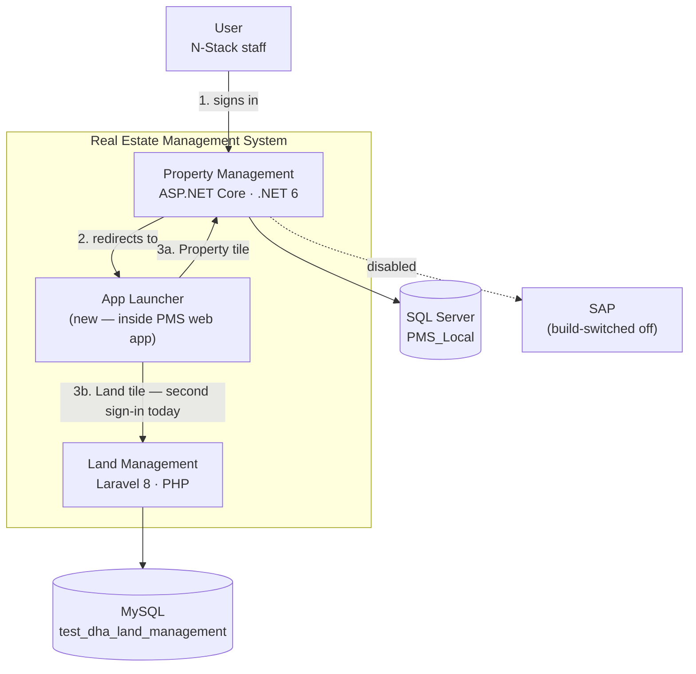
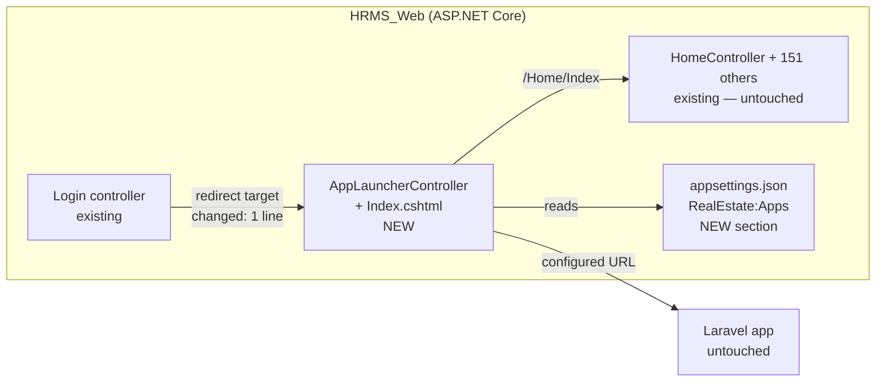

# Real Estate Management System — post-login app launcher

**Item:** REMS shell · **Status:** analysis complete, awaiting your review
**Analysed:** 2026-08-05, from source in both repositories. Nothing inferred.

You asked for one thing: after logging into PMS, show a screen — like Odoo's app selection panel —
where you pick **Land Management** or **Property Management**, and call the whole thing **Real
Estate Management System**. Nothing else changes.

That is the right first move. But discovery turned up one fact that changes what "combine" can
mean, and it has to be settled before any code is written.

---

## 1. The finding that shapes everything

**The two systems do not share a single line of technology.**

`test_Land_mgt` is not another .NET solution. It is a **Laravel 8 / PHP application on MySQL**.

| | Property Management (PMS) | Land Management (LMS) |
|:--|:--|:--|
| Path | `Pictures\PMS` | `Pictures\test_Land_mgt` |
| Stack | ASP.NET Core MVC, **.NET 6** | **Laravel 8**, PHP 7.3/8.0 |
| Database | **SQL Server** — `PMS_Local` | **MySQL** — `test_dha_land_management` |
| Auth | Custom: session + 3 JWT schemes, HMACSHA512 | Laravel Breeze, framework session |
| Identity table | `PMSUser` | `users` |
| Permissions | `PermissionForms` + `UserPermissionMapping` rows; the key **is the menu label string** | **~90 boolean columns on `users`** — one per form×action |
| Approval engine | Approval module, 5 screens | `approval_tree` / `approval_stage` / `approval_setup` — a **separate implementation** |
| Layout | `_Layout.cshtml` — **249 KB** hard-coded menu | `main.blade.php` — **277 KB** hard-coded menu |
| Scale | 152 controllers · 209 forms · 439 tables · 316 migrations | 34 controllers · 42 models · 109 views · 51 migrations · 23 route resources |
| Runs on this machine | ✅ `http://localhost:5217` | ❌ **cannot run — see §2** |

Two observations worth recording beyond this task:

- **Both systems have the same disease.** A quarter-megabyte hard-coded layout carrying the whole
  menu, in both. The `05-MODULE-ARCHITECTURE.md` diagnosis of PMS applies to LMS unchanged.
- **Both have their own approval engine**, built independently, doing the same job. If the two
  products ever genuinely merge, that is the duplication that matters — not the menu.

**Consequence:** "combine both solutions" cannot mean one codebase in this task, or this quarter.
Porting LMS into .NET is 34 controllers, 42 models and 109 views — a second re-engineering project
on the scale of the one already running. What *can* be built now, cheaply and reversibly, is a
**shell that makes them one product to the user**. That is what this plan covers.

---

## 2. Blocker: the Land app cannot run here

Checked on this machine:

| Tool | State |
|:--|:--|
| `php` | **not installed** — not on PATH |
| `composer` | **not installed** |
| `mysql` / MariaDB | **not installed** — no service present |
| XAMPP / WAMP / Laragon | **none present** |
| IIS (`W3SVC`) | running |

So today the Land tile can be *built* and *styled*, but its target cannot be opened. The launcher
must therefore treat an unreachable app as a first-class state, not a broken link — see REQ-5.

This is a dependency on you, not work I can do: **PHP 8 + Composer + MySQL** (XAMPP or Laragon is
the fastest route) before the Land half can be verified end to end.

---

## 3. Architecture — C4

### Level 1 · System context, as it would be after this task



The dashed second sign-in is the honest part of the picture. Without the work in ADR-002, the
launcher is a branded bookmark page — it looks like one system but does not behave like one.

### Level 2 · Containers, with the change isolated



**Everything new is additive.** Exactly one existing line of behaviour changes.

---

## 4. Requirements

| ID | User story |
|:--|:--|
| REQ-1 | As a user, after signing in I want to choose which application to work in, so that one login serves the whole department |
| REQ-2 | As a user, I want the product to present itself as *Real Estate Management System*, so that Land and Property read as one system |
| REQ-3 | As a user, I want to switch applications without signing out |
| REQ-4 | As an administrator, I want to add or rename an application without a code change |
| REQ-5 | As a user, I want an unavailable application to say so, rather than fail |
| REQ-6 | As an administrator, I want to control who sees which application |
| REQ-7 | As a user, I want a single sign-in to carry me into either application |

### Acceptance criteria

**REQ-1**
1. WHEN a user authenticates successfully, THE system SHALL present the launcher, not `/Home/Index`.
2. WHEN the launcher is requested without a valid session, THE system SHALL redirect to `/Login/Index`.
3. WHEN a user selects Property Management, THE system SHALL navigate to `/Home/Index` with the session intact.
4. THE launcher SHALL render in a single viewport at 1366×768 with no scrolling for up to 8 apps.

**REQ-2**
1. THE launcher SHALL display the title *Real Estate Management System*.
2. THE launcher SHALL NOT load `_Layout.cshtml` — it carries the 249 KB Property menu, which is wrong at this level.

**REQ-3**
1. THE system SHALL expose the launcher at a stable route `/apps`.
2. WHERE the switch-app control is enabled, THE Property shell SHALL link to `/apps` — see Q3.

**REQ-4**
1. THE system SHALL read the app list from configuration — key, name, description, icon, URL, permission, enabled.
2. WHEN an app is added to configuration, THE launcher SHALL render it with no recompilation of controller or view.

**REQ-5**
1. IF an app has no URL configured, THEN THE launcher SHALL render its tile disabled with the reason shown.
2. THE launcher SHALL NOT render a hyperlink that is known to be unresolvable.

**REQ-6**
1. WHERE an app declares a permission key, THE launcher SHALL render its tile only if the session's permission set contains it.
2. IF exactly one app is visible to a user, THEN THE system SHALL navigate straight to it — see Q4.

**REQ-7** *(deferred — ADR-002)*
1. WHEN a user with a linked Land account selects Land Management, THE system SHALL establish a Laravel session without a second credential prompt.

---

## 5. Options considered

### Option A — Launcher inside PMS; Land opens as a configured external link

New controller, new standalone view, new config section, **one changed line** in the login view.

- **Cost** ~1 day · **Risk** near zero · **Reversible** by reverting one line
- Does not need PHP installed to build or to ship
- **Weakness:** two sign-ins. Cosmetic unification only

### Option B — Option A plus signed-token SSO into Laravel

PMS mints a short-lived signed token; a new Laravel endpoint verifies it and opens a session.

- **Cost** +3–5 days · **Risk** medium — a new authentication path is a new attack surface
- **Needs** PHP installed, a shared secret, and a user-identity mapping (§6, ADR-002)
- This is where "combined" stops being a claim

### Option C — Both behind one origin via reverse proxy (YARP in .NET, or IIS ARR)

`rems.local/property` and `rems.local/land` — one host, one brand, cookies can be shared.

- **Cost** +2–3 days on top of A · **Risk** medium — PHP under IIS FastCGI, path rewriting in a
  277 KB Blade layout full of absolute URLs
- Best long-term shape; premature before A exists

### Option D — Port Land Management into .NET

34 controllers, 42 models, 109 views, 51 migrations, a second approval engine.

- **Cost** months · Explicitly outside "just this task"

---

## 6. Decisions

### ADR-001 · Build Option A now, shaped so B and C drop in

**Context.** You want the chooser now and nothing else changed. The stacks cannot be merged in this
task; the Land app cannot even run on this machine yet.

**Decision.** Build the launcher as an **additive shim inside HRMS_Web**, with the app list held as
**configuration data**, and the Land target as **a URL**. Option B replaces that URL with a
token-minting action; Option C replaces the absolute URL with a proxied path. Neither requires the
launcher to be rewritten.

**Consequences.**
- ✅ Exactly one existing line of behaviour changes; trivially reversible
- ✅ Ships without PHP installed
- ✅ App list as data honours locked decision **D13** (modules and areas are data, not code)
- ⚠️ Two sign-ins until REQ-7 is funded — must be stated plainly, not hidden
- ⚠️ Adds a screen that PMS task `#125` (app shell) must later absorb rather than duplicate

### ADR-002 · PMS is the identity authority; Land account linking is deferred

**Context.** `PMSUser` and `users` are unrelated tables in different engines with different hashes
(HMACSHA512 vs bcrypt). There is no shared user and no mapping between them.

**Decision.** For this task, **PMS owns the login**. The launcher is reached only with a valid PMS
session. Land keeps its own login until REQ-7 is separately approved. **No credential is copied,
synchronised, or replayed** — a Land password will never be stored or forwarded by PMS.

**Consequences.**
- ✅ No new authentication surface introduced now
- ⚠️ Second sign-in stands
- ⚠️ A `PMSUser` → `users` mapping table becomes a prerequisite for REQ-7. That is a real design
  task, not a lookup — see Q2

### ADR-003 · Rebrand at the launcher only

**Context.** `_Layout.cshtml` is 249 KB and its `<title>` is `N-Stack`. Renaming across both products
touches two giant layouts and the Laravel views.

**Decision.** The **launcher page** carries *Real Estate Management System*. The two apps keep their
current chrome for now. A full rebrand is queued behind PMS `#125`, where the layout is being
replaced anyway.

**Consequences.** ✅ No edit to either 250 KB layout · ⚠️ Branding is briefly inconsistent once you
are inside an app.

---

## 7. Design of the recommended option

### Components

| ID | Component | Type | Responsibility |
|:--|:--|:--|:--|
| C1 | `AppLauncherController` | Controller | Guard the session; project configured apps through the permission filter; render |
| C2 | `Views/AppLauncher/Index.cshtml` | View | Odoo-style tile grid. **Standalone — `Layout = null`** |
| C3 | `RealEstateAppOptions` | Options model | Typed binding for `RealEstate:Apps` |
| C4 | `RealEstate` section in `appsettings.json` | Config | The app registry |
| C5 | `wwwroot/css/launcher.css` | Asset | Tile grid styling, isolated from the PMS stylesheet |

### Configuration contract

```jsonc
"RealEstate": {
  "ProductName": "Real Estate Management System",
  "Apps": [
    {
      "Key": "property",
      "Name": "Property Management",
      "Description": "Plots, members, transfers, billing and approvals",
      "Icon": "bi-building",
      "Url": "/Home/Index",
      "Permission": null,          // null = visible to every signed-in user
      "Enabled": true
    },
    {
      "Key": "land",
      "Name": "Land Management",
      "Description": "Acquisition, sellers, exemptions, conveyance and registry",
      "Icon": "bi-map",
      "Url": "",                   // empty until the Laravel app is hosted — tile renders disabled
      "Permission": "Land Management",
      "Enabled": true
    }
  ]
}
```

`Url` empty ⇒ REQ-5 disabled state. This is why nothing breaks while PHP is missing.

### Data flow — sign-in to app

```
1. Browser        → POST /Login/LoginToPortal        credentials
2. Login          → PMSUser lookup, HMACSHA512 compare
3. Login          → Session: ID, EMP_CODE, FullName, Permissions[]   (unchanged)
4. Login view     → redirect "/apps"                 ← THE ONE CHANGED LINE
5. AppLauncher    → session ID present? no → /Login/Index
6. AppLauncher    → read RealEstate:Apps
7. AppLauncher    → filter: Enabled && (Permission == null || session Permissions contains it)
8. View           → render tiles; Url empty → disabled + reason
9. User clicks    → /Home/Index  (session intact)  |  Land URL (new sign-in today)
```

Steps 1–3 are untouched. The launcher reads the same `Permissions` session key the existing
`Html.UserHavePermission` helper reads — no new permission mechanism.

### Files

| File | Change | Reversal |
|:--|:--|:--|
| `Controllers/AppLauncherController.cs` | **new** | delete |
| `Views/AppLauncher/Index.cshtml` | **new** | delete |
| `Models/RealEstateAppOptions.cs` | **new** | delete |
| `wwwroot/css/launcher.css` | **new** | delete |
| `appsettings.json` | **+1 section** `RealEstate` | remove section |
| `Views/Login/Index.cshtml:690` | **1 line** — `url = "/Home/Index"` → `url = "/apps"` | restore the literal |
| `Views/Shared/_Layout.cshtml` | **1 anchor** — "Switch app" → `/apps`, in the header *(Q3: approved)* | delete the anchor |

Seven files. **Two** existing lines of behaviour. `HomeController`, all 152 controllers, the entire
249 KB menu block inside `_Layout.cshtml`, and every Land file: **untouched**.

### Security notes

- `/apps` **must** check the session and redirect when absent. PMS has a live defect here —
  `HomeController` carries no `[Authorize]` (task `#114`); the launcher must not copy that mistake.
- The Land URL comes from configuration and is rendered into an anchor. It must be validated as an
  absolute `http`/`https` URL or a site-relative path, so a bad config value cannot become script
  injection.
- `test_Land_mgt\.env` is **committed to that repository** with `APP_KEY` and DB settings. Same
  class of problem as PMS issue I2. Out of scope here; recorded so it is not lost.

---

## 8. Scope boundaries

**In scope now**
- Post-login launcher screen with two tiles
- REMS branding on that screen only
- App list as configuration
- Permission-filtered tiles
- Disabled state for an unconfigured app
- **One "Switch app" anchor in `_Layout.cshtml`** *(Q3: approved)*

**Explicitly out of scope**
- Single sign-on (REQ-7 — ADR-002; deferred by Q2, its own gated item)
- Any change to the Laravel application
- Any change to `main.blade.php`, or to either menu — including the 249 KB block in `_Layout.cshtml`
- Merging databases, users, or the two approval engines
- Porting Land Management to .NET
- **Merging the two repositories** — accepted by Q4 as **ADR-004 / `#147`**, blocked on git (`#13`)
- Reverse proxy / single origin
- Installing PHP, MySQL or Composer

---

## 9. Risks

| # | Risk | Impact | Likely | Mitigation |
|:--|:--|:--|:--|:--|
| L1 | Launcher reads as unified but forces a second login — feels unfinished | Med | **High** | State it on the tile; queue REQ-7 as a named decision, not a surprise |
| L2 | Land app cannot be demonstrated — no PHP here | Med | **High** | Disabled-tile state ships regardless; you install the stack when convenient |
| L3 | This screen is thrown away by `#125` | Low | Med | Config-driven registry is exactly what `#125` consumes; the shape survives |
| L4 | A future SSO handoff is built weakly and becomes an auth bypass | **High** | Low | ADR-002 keeps it out until designed; no credential ever forwarded |
| L5 | ~~"Combine" was meant literally — one codebase~~ | — | — | **Closed by Q1** — one front door confirmed |
| L6 | Editing the 249 KB `_Layout.cshtml` for the switch-app anchor breaks the menu | Med | Low | A single anchor in the header, nowhere near the menu block; verification step 9 checks the menu still renders |

---

## 10. Task breakdown

`PROJECT.md` `#138`–`#147`. Questions answered 2026-08-05 — `#138` and `#139` are closed.

| # | Task | Pri | Needs | Est. |
|:--|:--|:--|:--|:--|
| 138 | Your review — the gate | high | — | **done** |
| 139 | Q1–Q5 answered → §12 | high | 138 | **done** |
| 140 | `RealEstate` config section + typed options model | high | 139 | 2h |
| 141 | `AppLauncherController` — session guard, permission filter, `/apps` route | high | 140 | 3h |
| 142 | Launcher view + stylesheet — Odoo-style tiles, standalone layout | high | 141 | 4h |
| 143 | Redirect login to `/apps` — one changed line | high | 142 | 15m |
| 144 | `Land Management` permission key seeded into `PermissionForms` | med | 141 | 1h |
| 146 | "Switch app" anchor in `_Layout.cshtml` *(Q3)* | med | 141 | 30m |
| 145 | Manual verification pass — §11 | high | 143, 146 | 1h |
| 147 | **Merge the two repositories** *(Q4, ADR-004)* | med | **13** | own item |

**`#140`–`#146` ≈ 1.5 days.** `#147` is separate and blocked. Still deferred behind their own
gates: SSO (REQ-7), full rebrand, reverse proxy.

---

## 11. Verification

No test framework exists yet (PROJECT.md §10 — automated tests: 0), so this is a manual script.

1. `dotnet run --project HRMS_Web\HRMS_Web.csproj --urls http://localhost:5217`
2. Sign in as `admin` / `admin` → **lands on `/apps`**, titled *Real Estate Management System*
3. Two tiles render; Land shows disabled with a reason while `Url` is empty
4. Property tile → `/Home/Index`, still signed in, menu intact
5. Browse to `/apps` in a private window → redirected to `/Login/Index`
6. Remove the `Land Management` permission from a test user → its tile disappears
7. Set the Land `Url`, confirm the tile enables with no recompile
8. **"Switch app" in the Property header → back to `/apps`, still signed in**
9. **The `_Layout.cshtml` menu still renders in full** — the anchor touched the header, not the menu
10. Revert line 690 and the anchor → old behaviour returns exactly

---

## 12. Questions — answered 2026-08-05

| # | Question | Your answer | Effect |
|:--|:--|:--|:--|
| Q1 | Did "combine" mean one codebase? | **One front door over two apps** | Option A confirmed, **D15 locked**. No port, no merge of code or data |
| Q2 | Is a second sign-in acceptable for now? | **Yes — ship it, SSO later** | REQ-7 deferred to its own gated item. **D16 locked** |
| Q3 | May I add a "Switch app" link to `_Layout.cshtml`? | **Yes, one link** | New task `#146`. **Two** changed lines total, not one |
| Q4 | One repository or two? | **Merge into one** | **ADR-004** below and task `#147` — hard-blocked on git (`#13`, I1). Does not affect `#138`–`#146` |
| Q5 | Auto-navigate when only one app is visible? | *not asked — my call* | **No.** The launcher always renders. You asked for a selection panel; skipping it undermines the feature and hides the second app from anyone whose permissions later change |

### ADR-004 · Merge the two repositories — accepted, deferred

**Context.** You want one repository. Today they are two, in `Pictures\PMS` and
`Pictures\test_Land_mgt`, and **git is not installed on this machine** (`#13`, issue I1) — so
neither is under version control here at all.

**Decision.** Accepted in principle, **executed separately** as `#147`, once git exists. Target
shape:

```
RealEstate/
  property/   (was PMS)
  land/       (was test_Land_mgt)
```

**Consequences.**
- ✅ One repository, matching the single-product framing
- ✅ **Independent of `#138`–`#146`.** The launcher reaches Land by **URL, not file path**, so the
  merge changes nothing about how it works
- ⚠️ **Hard-blocked on `#13`.** Nothing can start until git is installed
- ⚠️ Both histories must be preserved — a naive copy-in discards them. Needs `git subtree` or a
  filtered import, planned properly, not improvised
- ⚠️ Paths in `tools/local-run/`, `HRMS.sln` and every doc shift by one directory level

---

## 13. Confirmed plan

Option A as specified, plus the switch-app link. **~1.5 days · seven files · two changed lines of
behaviour · fully reversible.** It gives you the Odoo-style front door, brands the product as Real
Estate Management System, and changes nothing else in either application.

Queued behind their own gates, in this order:

1. `#147` **Repository merge** — accepted (ADR-004), blocked on git
2. **SSO** (REQ-7) — the point at which the two stop being two systems to the person using them
3. Full rebrand of both shells — folded into `#125`
4. Reverse proxy / single origin — revisit once SSO exists

The honest summary, unchanged: **this task makes them look like one product. It does not make them
one product.** That was the deliberate choice, and it is the cheap, reversible half — the launcher
survives whatever comes next, because the app list is data and Land is reached by URL.
